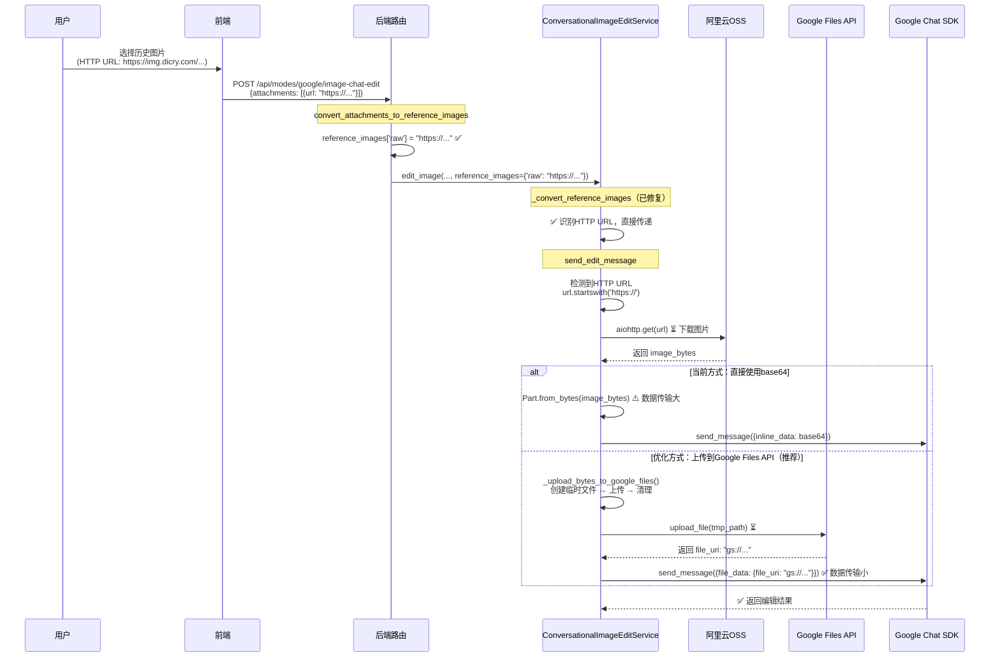

# Google提供商 - HTTP URL优化方案

> **适用范围**：本文档描述的是**Google提供商特有**的优化方案，涉及Google Files API的使用，仅适用于 `provider=google` 的场景。

## 背景

### 当前状态

- ✅ **Base64错误已修复**：`_convert_reference_images()` 已正确识别HTTP URL（第724-744行）
- ⚠️ **HTTP URL处理可优化**：当前下载后直接使用base64，可以优化为上传到Google Files API

### 优化目标

在 `image-chat-edit` 模式下，当使用HTTP URL（如复用历史图片的阿里云OSS URL）时：

**当前流程**：
1. 后端下载HTTP URL图片 → 得到 `image_bytes`
2. 直接使用 `Part.from_bytes()` 或转为base64传递给Chat SDK
3. ❌ 数据传输较大（base64比原始文件大约33%）

**优化后流程**：
1. 后端下载HTTP URL图片 → 得到 `image_bytes`
2. 利用临时文件上传到Google Files API → 得到 `file_uri`
3. ✅ 使用 `file_uri` 传递给Chat SDK（数据传输小）

---

## 完整流程分析

### 场景：复用图片（HTTP URL）



---

## Google提供商特有的处理逻辑

### 1. Google Files API（仅Google提供商）

**作用**：
- 将图片上传到Google存储，获得 `file_uri`（`gs://...` 格式）
- `file_uri` 在48小时内有效，可复用
- 比base64传输更高效（减少约33%的数据传输）

**使用场景**：
- **场景1（新上传）**：有File对象时，前端 `GoogleFileUploadPreprocessor` 上传到Google Files API
- **场景2（HTTP URL）**：后端下载后，可选择上传到Google Files API（本次优化）

**相关代码**：
- 前端：`frontend/hooks/handlers/PreprocessorRegistry.ts` - `GoogleFileUploadPreprocessor`
- 后端：`backend/app/services/gemini/file_handler.py` - `FileHandler`
- 参考实现：`backend/app/services/gemini/simple_image_edit_service.py` - `_upload_bytes_to_google_files()`

### 2. Google Chat SDK图片处理方式

**优先级**（按效率）：

1. **file_data（file_uri）** - 最高效
   - 格式：`Part(file_data=FileData(file_uri="gs://...", mime_type="image/png"))`
   - 优点：数据传输最小，无需在请求体中传输图片数据
   - 使用场景：已有file_uri时

2. **inline_data（base64）** - 当前方式
   - 格式：`Part.from_bytes(data=image_bytes, mime_type="image/png")`
   - 或：`Part(inline_data=Blob(data=image_bytes, mime_type="image/png"))`
   - 缺点：数据传输大（base64比原始文件大约33%）
   - 使用场景：没有file_uri时，或上传到Google Files API失败时

3. **HTTP URL** - ❌ 不支持
   - Google Chat SDK **不支持**直接使用HTTP URL
   - 对于阿里云OSS的URL，**必须下载后转换**

---

## 优化方案

### 目标

在 `ConversationalImageEditService.send_edit_message()` 中，当处理HTTP URL时：
1. 下载图片后，利用临时文件上传到Google Files API
2. 成功则使用 `file_uri`（更高效）
3. 失败则回退到base64（当前方式，不影响功能）

### 实施步骤

#### 步骤1：添加 `_upload_bytes_to_google_files()` 方法

**位置**：`backend/app/services/gemini/conversational_image_edit_service.py`

**参考实现**：`SimpleImageEditService._upload_bytes_to_google_files()` (第193-233行)

```python
async def _upload_bytes_to_google_files(
    self,
    image_bytes: bytes,
    mime_type: str
) -> str:
    """
    将字节数据上传到 Google Files API（Google提供商特有）
    
    Args:
        image_bytes: 图片字节数据
        mime_type: MIME 类型
        
    Returns:
        Google File URI (gs://...)
        
    Raises:
        ValueError: 上传失败
    """
    import tempfile
    import os
    import time
    
    # 根据MIME类型确定文件后缀
    suffix = '.png'
    if 'jpeg' in mime_type or 'jpg' in mime_type:
        suffix = '.jpg'
    elif 'webp' in mime_type:
        suffix = '.webp'
    
    # 创建临时文件
    with tempfile.NamedTemporaryFile(delete=False, suffix=suffix) as tmp_file:
        tmp_file.write(image_bytes)
        tmp_path = tmp_file.name
    
    try:
        # 上传文件到Google Files API
        file_info = await self.file_handler.upload_file(
            tmp_path,
            display_name=f"image_edit_{int(time.time())}",
            mime_type=mime_type
        )
        return file_info['uri']
    finally:
        # 清理临时文件
        if os.path.exists(tmp_path):
            try:
                os.unlink(tmp_path)
            except Exception:
                pass
```

#### 步骤2：优化 `send_edit_message()` 中的HTTP URL处理

**位置**：`backend/app/services/gemini/conversational_image_edit_service.py:386-424`

**当前代码**（第386-424行）：
```python
elif url.startswith('http://') or url.startswith('https://'):
    # HTTP URL：需要下载图片
    logger.info(f"[ConversationalImageEdit] 下载 HTTP URL 图片: {url[:60]}...")
    try:
        import aiohttp
        async with aiohttp.ClientSession() as session:
            async with session.get(url, timeout=aiohttp.ClientTimeout(total=30)) as response:
                if response.status == 200:
                    image_bytes = await response.read()
                    mime_type = ref_img.get('mimeType') or response.headers.get('Content-Type', 'image/png')
                    
                    if genai_types:
                        # 使用官方示例的方式：Part.from_bytes()
                        try:
                            message_parts.append(genai_types.Part.from_bytes(
                                data=image_bytes,
                                mime_type=mime_type
                            ))
                            logger.info(f"[ConversationalImageEdit] ✅ HTTP URL 下载成功，大小: {len(image_bytes)} bytes")
                        except AttributeError:
                            # 如果 from_bytes 不存在，回退到 inline_data 方式
                            message_parts.append(genai_types.Part(inline_data=genai_types.Blob(
                                data=image_bytes,
                                mime_type=mime_type
                            )))
                    else:
                        # 回退到字典格式
                        base64_str = base64.b64encode(image_bytes).decode('utf-8')
                        message_parts.append({
                            'inline_data': {
                                'mime_type': mime_type,
                                'data': base64_str
                            }
                        })
```

**修改后代码**：
```python
elif url.startswith('http://') or url.startswith('https://'):
    # HTTP URL：需要下载图片（Google Chat SDK不支持直接使用HTTP URL）
    logger.info(f"[ConversationalImageEdit] 下载 HTTP URL 图片: {url[:60]}...")
    try:
        import aiohttp
        async with aiohttp.ClientSession() as session:
            async with session.get(url, timeout=aiohttp.ClientTimeout(total=30)) as response:
                if response.status == 200:
                    image_bytes = await response.read()
                    mime_type = ref_img.get('mimeType') or response.headers.get('Content-Type', 'image/png')
                    
                    # ✅ 优化：尝试上传到Google Files API（Google提供商特有）
                    if self.file_handler:
                        try:
                            file_uri = await self._upload_bytes_to_google_files(
                                image_bytes,
                                mime_type
                            )
                            
                            if genai_types:
                                # 使用file_uri（更高效）
                                message_parts.append(genai_types.Part(file_data=genai_types.FileData(
                                    file_uri=file_uri,
                                    mime_type=mime_type
                                )))
                                logger.info(f"[ConversationalImageEdit] ✅ 已上传到Google Files API: {file_uri}")
                            else:
                                message_parts.append({
                                    'file_data': {
                                        'file_uri': file_uri,
                                        'mime_type': mime_type
                                    }
                                })
                            continue  # 成功上传，跳过base64回退
                        except Exception as e:
                            logger.warning(f"[ConversationalImageEdit] Google Files API上传失败，使用base64: {e}")
                    
                    # 回退到base64（如果上传失败或不支持）
                    if genai_types:
                        try:
                            message_parts.append(genai_types.Part.from_bytes(
                                data=image_bytes,
                                mime_type=mime_type
                            ))
                            logger.info(f"[ConversationalImageEdit] ✅ HTTP URL 下载成功，使用base64，大小: {len(image_bytes)} bytes")
                        except AttributeError:
                            base64_str = base64.b64encode(image_bytes).decode('utf-8')
                            message_parts.append(genai_types.Part(inline_data=genai_types.Blob(
                                data=image_bytes,
                                mime_type=mime_type
                            )))
                    else:
                        base64_str = base64.b64encode(image_bytes).decode('utf-8')
                        message_parts.append({
                            'inline_data': {
                                'mime_type': mime_type,
                                'data': base64_str
                            }
                        })
                else:
                    raise ValueError(f"HTTP {response.status}: Failed to download image from {url[:60]}...")
    except Exception as e:
        logger.error(f"[ConversationalImageEdit] ❌ HTTP URL 下载失败: {e}")
        raise ValueError(f"Failed to download image from URL: {str(e)}")
```

---

## 优化效果

### 数据传输对比

| 方式 | 数据传输大小 | 优点 | 缺点 |
|------|------------|------|------|
| **file_uri** | 最小（仅URI字符串，约50-100字节） | 数据传输小，请求体小 | 需要额外上传步骤，增加延迟 |
| **base64** | 较大（原始文件 × 1.33） | 实现简单，无需额外上传 | 数据传输大，请求体大 |

### 性能影响

- **上传延迟**：增加约100-500ms（取决于网络和文件大小）
- **数据传输减少**：约33%（base64比原始文件大约33%）
- **总体效果**：对于大文件（>1MB），优化效果明显；对于小文件（<100KB），可能得不偿失

### 建议

- **启用优化**：文件大小 > 500KB 时，优化效果明显
- **可选配置**：可以考虑添加配置项，允许用户选择是否启用此优化

---

## 文件修改清单

### 必需修改

- `backend/app/services/gemini/conversational_image_edit_service.py`
  - 添加 `_upload_bytes_to_google_files()` 方法（参考SimpleImageEditService实现）
  - 修改 `send_edit_message()` 中的HTTP URL处理逻辑（第386-424行）
  - 添加Google Files API上传逻辑

---

## 注意事项

### Google提供商特有

1. **Google Files API**：仅Google提供商支持，其他提供商没有此功能
2. **file_handler检查**：确保 `ConversationalImageEditService` 有 `file_handler` 实例
3. **file_uri格式**：`gs://...` 格式是Google Cloud Storage的URI格式

### 通用注意事项

1. **临时文件清理**：确保上传后清理临时文件（使用 `try-finally`）
2. **错误处理**：上传失败时要优雅降级到base64，不影响功能
3. **性能考虑**：上传会增加延迟，但对于大文件来说，减少数据传输的好处更大
4. **日志记录**：记录上传成功/失败，便于问题排查

### 兼容性

- **向后兼容**：如果上传失败，回退到base64，不影响现有功能
- **仅Google提供商**：此优化仅适用于Google提供商，不影响其他提供商

---

## 测试验证

### 测试场景

1. **场景1：上传成功**
   - 使用HTTP URL（阿里云OSS）
   - 验证：成功上传到Google Files API，使用file_uri
   - 检查日志：`✅ 已上传到Google Files API: gs://...`

2. **场景2：上传失败（降级）**
   - 模拟上传失败（如网络错误）
   - 验证：回退到base64，功能正常
   - 检查日志：`Google Files API上传失败，使用base64`

3. **场景3：小文件（可选跳过）**
   - 使用小文件（<100KB）
   - 验证：可以选择跳过上传，直接使用base64

### 验证要点

- ✅ HTTP URL下载正常
- ✅ 临时文件创建和清理正常
- ✅ Google Files API上传成功
- ✅ 上传失败时优雅降级到base64
- ✅ 日志记录完整

---

## 参考实现

- **SimpleImageEditService**：`backend/app/services/gemini/simple_image_edit_service.py:193-233`
  - 已有 `_upload_bytes_to_google_files()` 实现
  - 可以参考其实现方式

- **FileHandler**：`backend/app/services/gemini/file_handler.py:29-94`
  - Google Files API上传接口

- **官方示例**：`.kiro/specs/参考/generative-ai-main/generative-ai-main/gemini/nano-banana/nano_banana_recipes.ipynb`
  - Google SDK使用示例