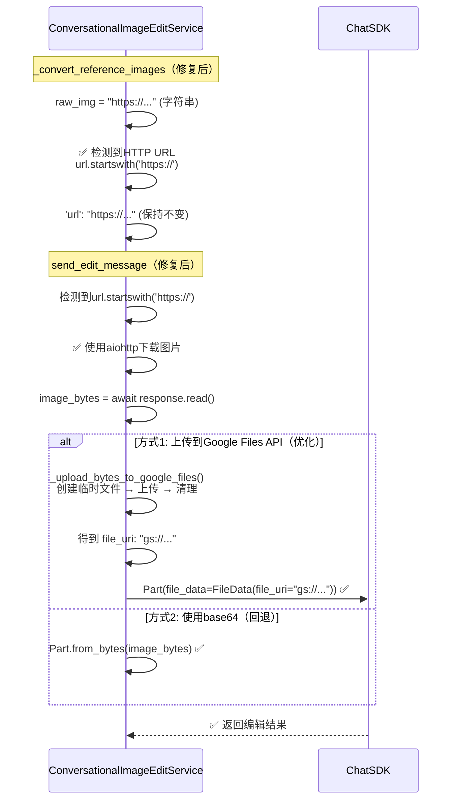

# Google提供商 - 图片编辑模式完整修复方案

> **注意**：本文档描述的问题和解决方案**仅适用于Google提供商**，因为涉及Google Files API和Chat SDK的特殊处理逻辑。

## 问题概述

### 错误信息
```
Invalid base64-encoded string: number of data characters (65) cannot be 1 more than a multiple of 4
```

### 问题场景
在 `image-chat-edit` 模式下，当复用历史图片（使用云URL）时，后端错误地将HTTP URL当作base64字符串处理，导致解码失败。

### 影响范围
- **提供商**：Google（`provider=google`）
- **模式**：`image-chat-edit`（对话式图片编辑）
- **场景**：复用历史图片时（使用阿里云OSS的HTTP URL）

---

## 完整流程分析

### 复用图片时的完整流程

```mermaid
sequenceDiagram
    participant User as 用户
    participant View as ImageEditView
    participant AttachUtils as attachmentUtils
    participant Handler as ImageEditHandler
    participant UnifiedClient as UnifiedProviderClient
    participant BackendRoute as 后端路由<br/>modes.py
    participant ImageCoordinator as ImageEditCoordinator
    participant ConversationalEdit as ConversationalImageEditService
    participant ChatSDK as Google Chat SDK

    User->>View: 在画布上选择历史图片<br/>(HTTP URL: https://img.dicry.com/...)
    View->>AttachUtils: prepareAttachmentForApi(imageUrl, messages, sessionId)
    
    Note over AttachUtils: 步骤1: 查找历史附件
    AttachUtils->>AttachUtils: findAttachmentByUrl(imageUrl, messages)
    AttachUtils-->>AttachUtils: ✅ 找到历史附件<br/>{id, url: "https://...", uploadStatus: "completed"}
    
    Note over AttachUtils: 步骤2: 查询后端获取最新云URL
    AttachUtils->>BackendRoute: tryFetchCloudUrl(sessionId, attachmentId, ...)
    BackendRoute-->>AttachUtils: ✅ 返回云URL: "https://img.dicry.com/uploads/xxx.png"
    
    Note over AttachUtils: 步骤3: 构建复用的Attachment
    AttachUtils->>AttachUtils: 创建 reusedAttachment<br/>{url: "https://...", uploadStatus: "completed"}<br/>⚠️ 没有File对象，没有fileUri
    AttachUtils-->>View: ✅ 返回Attachment
    
    View->>Handler: handleSend(prompt, attachments)
    Handler->>Handler: referenceImages.raw = attachment<br/>{url: "https://...", ...}
    
    Handler->>UnifiedClient: executeMode('image-chat-edit', ...)
    UnifiedClient->>BackendRoute: POST /api/modes/google/image-chat-edit<br/>{attachments: [{url: "https://..."}]}
    
    Note over BackendRoute: 路由层处理
    BackendRoute->>BackendRoute: convert_attachments_to_reference_images(attachments)
    Note over BackendRoute: 优先级: url > tempUrl > fileUri > base64Data<br/>提取: attachment.url = "https://..."
    BackendRoute->>BackendRoute: reference_images['raw'] = "https://..." (字符串)
    BackendRoute->>ImageCoordinator: edit_image(..., reference_images={'raw': "https://..."})
    
    Note over ImageCoordinator: 路由到对话式编辑
    ImageCoordinator->>ConversationalEdit: edit_image(..., reference_images={'raw': "https://..."})
    
    Note over ConversationalEdit: ⚠️ 问题所在
    ConversationalEdit->>ConversationalEdit: _convert_reference_images(reference_images)
    Note over ConversationalEdit: raw_img = "https://..." (字符串类型)
    Note over ConversationalEdit: ❌ 错误: 假设所有非data:开头的<br/>字符串都是base64，添加前缀
    ConversationalEdit->>ConversationalEdit: 'url': "data:image/png;base64,https://..." ❌ 错误转换！
    
    ConversationalEdit->>ConversationalEdit: send_edit_message(..., reference_images_list)
    Note over ConversationalEdit: 处理图片URL
    ConversationalEdit->>ConversationalEdit: 匹配data: URL格式<br/>提取base64部分: "https://..."
    ConversationalEdit->>ConversationalEdit: base64.b64decode("https://...") ❌ 错误
    ConversationalEdit-->>BackendRoute: ❌ ValueError: Invalid base64-encoded string
```

---

## 三种场景对比（Google提供商特有）

### 场景1：上传附件（新上传）- 使用Google Files API

**特点**：
- 用户上传新文件，有File对象
- `GoogleFileUploadPreprocessor` 上传到Google Files API（**仅Google提供商**）
- 得到 `fileUri`（48小时有效）

**流程**：
1. 前端：`processUserAttachments` 检测到File对象
2. 预处理：`GoogleFileUploadPreprocessor`（**仅Google提供商**）上传到Google Files API → 得到 `fileUri`
3. 后端：`convert_attachments_to_reference_images` 提取 `fileUri`
4. `_convert_reference_images` 检测到 `googleFileUri` → 直接使用（优先级最高）
5. `send_edit_message` 使用 `file_data`（file_uri），**无需下载**

**优点**：
- ✅ 数据传输小（file_uri比base64小得多）
- ✅ 无需后端下载
- ✅ 48小时内可复用

**注意**：这是**Google提供商特有**的功能，其他提供商没有Google Files API。

### 场景2：复用附件（历史复用）- 需要下载和转换

**特点**：
- 从历史消息中复用，已有云URL（阿里云OSS）
- 只有HTTP URL，**没有File对象**，**没有fileUri**
- `GoogleFileUploadPreprocessor` **跳过**（因为没有File对象）

**当前流程（错误）**：
1. 前端：复用历史附件，获取云URL（阿里云OSS）：`"https://img.dicry.com/..."`
2. `GoogleFileUploadPreprocessor`：检查 `attachment.file` 不存在 → **跳过上传**
3. 后端：`convert_attachments_to_reference_images` 提取 `url`（HTTP URL字符串）
4. ❌ **错误**：`_convert_reference_images` 将HTTP URL错误地转换为 `"data:image/png;base64,https://..."`
5. ❌ **错误**：`send_edit_message` 尝试解码HTTP URL作为base64 → 报错

**修复后流程（正确）**：
1. 前端：复用历史附件，获取云URL
2. 后端：`convert_attachments_to_reference_images` 提取 `url`（HTTP URL字符串）
3. ✅ `_convert_reference_images` 识别HTTP URL，**直接传递**
4. ✅ `send_edit_message` 检测HTTP URL → **下载图片** → **转换为base64或上传到Google Files API**

**注意**：阿里云URL需要下载后才能在Google Chat SDK中使用（因为Chat SDK需要文件对象或base64）。

### 场景3：使用云URL（直接URL）- 需要下载和转换

**特点**：
- 直接使用HTTP URL，无需上传
- 后端需要下载图片后处理

**流程**：
1. 前端：直接传递HTTP URL
2. 后端：`_convert_reference_images` 识别HTTP URL
3. `send_edit_message` 下载图片 → 转换为base64或上传到Google Files API

---

## Google提供商特有的处理逻辑

### 1. Google Files API（仅Google提供商）

**作用**：
- 将图片上传到Google存储，获得 `file_uri`（`gs://...` 格式）
- `file_uri` 在48小时内有效，可复用
- 比base64传输更高效

**使用场景**：
- **场景1（新上传）**：有File对象时，`GoogleFileUploadPreprocessor` 上传到Google Files API
- **场景2/3（HTTP URL）**：下载后，可选择上传到Google Files API（优化）

**位置**：
- 前端：`frontend/hooks/handlers/PreprocessorRegistry.ts` - `GoogleFileUploadPreprocessor`
- 后端：`backend/app/services/gemini/file_handler.py` - `FileHandler`
- 后端：`backend/app/services/gemini/simple_image_edit_service.py` - `_upload_bytes_to_google_files()`

### 2. Google Chat SDK（仅Google提供商）

**图片处理方式**（按优先级）：

1. **file_data（file_uri）** - 使用Google Files API URI
   - 格式：`Part(file_data=FileData(file_uri="gs://...", mime_type="image/png"))`
   - 优点：数据传输小，无需下载
   - 使用场景：已有file_uri时

2. **inline_data（base64）** - 使用Base64数据
   - 格式：`Part(inline_data=Blob(data=image_bytes, mime_type="image/png"))`
   - 或：`Part.from_bytes(data=image_bytes, mime_type="image/png")`
   - 使用场景：没有file_uri时，或上传到Google Files API失败时

3. **HTTP URL** - ❌ **不支持**
   - Google Chat SDK **不支持**直接使用HTTP URL（与官方示例不同）
   - 官方示例中的 `Part.from_uri(file_uri="https://...")` 可能只支持Google Cloud Storage的HTTP URL
   - 对于阿里云OSS的URL，**必须下载后转换**

---

## 问题根因

### 错误代码

**位置**：`backend/app/services/gemini/conversational_image_edit_service.py:724-729`

```python
if isinstance(raw_img, str):
    # ❌ 错误假设：所有非data:开头的字符串都是base64
    reference_images_list.append({
        'url': f"data:image/png;base64,{raw_img}" if not raw_img.startswith('data:') else raw_img,
        'mimeType': 'image/png'
    })
```

**问题**：
- 假设所有非 `data:` 开头的字符串都是base64数据
- HTTP URL `"https://img.dicry.com/..."` 被错误地转换为 `"data:image/png;base64,https://..."`
- 在 `send_edit_message` 中，代码尝试从data URL中提取base64部分
- 提取到的是 `"https://..."`（65个字符），被当作base64解码 → **错误**

---

## 修复方案

### 修复1：修复base64错误（必需）

**位置**：`backend/app/services/gemini/conversational_image_edit_service.py:711-768`

**修改 `_convert_reference_images()` 方法**：

```python
if isinstance(raw_img, str):
    # ✅ 先判断是否是HTTP URL
    if raw_img.startswith('http://') or raw_img.startswith('https://'):
        # HTTP URL：直接使用，send_edit_message 会下载
        reference_images_list.append({
            'url': raw_img,
            'mimeType': 'image/png'
        })
    elif raw_img.startswith('data:'):
        # Data URL：直接使用
        reference_images_list.append({
            'url': raw_img,
            'mimeType': 'image/png'
        })
    else:
        # 其他字符串（可能是base64）：添加data URL前缀
        reference_images_list.append({
            'url': f"data:image/png;base64,{raw_img}",
            'mimeType': 'image/png'
        })
```

### 修复2：优化HTTP URL处理（推荐，仅Google提供商）

**位置**：`backend/app/services/gemini/conversational_image_edit_service.py:386-424`

**优化思路**：
- 下载HTTP URL图片后，利用临时文件上传到Google Files API
- 成功则使用 `file_uri`（更高效）
- 失败则回退到base64（当前方式）

**添加方法 `_upload_bytes_to_google_files()`**：

```python
async def _upload_bytes_to_google_files(
    self,
    image_bytes: bytes,
    mime_type: str
) -> str:
    """将字节数据上传到 Google Files API（Google提供商特有）"""
    # 创建临时文件
    import tempfile
    import os
    import time
    
    suffix = '.png'
    if 'jpeg' in mime_type or 'jpg' in mime_type:
        suffix = '.jpg'
    elif 'webp' in mime_type:
        suffix = '.webp'
    
    with tempfile.NamedTemporaryFile(delete=False, suffix=suffix) as tmp_file:
        tmp_file.write(image_bytes)
        tmp_path = tmp_file.name
    
    try:
        # 上传文件到Google Files API
        file_info = await self.file_handler.upload_file(
            tmp_path,
            display_name=f"image_edit_{int(time.time())}",
            mime_type=mime_type
        )
        return file_info['uri']
    finally:
        # 清理临时文件
        if os.path.exists(tmp_path):
            try:
                os.unlink(tmp_path)
            except Exception:
                pass
```

**修改 `send_edit_message()` 中的HTTP URL处理**：

```python
elif url.startswith('http://') or url.startswith('https://'):
    # HTTP URL：需要下载图片（Google Chat SDK不支持直接使用HTTP URL）
    logger.info(f"[ConversationalImageEdit] 下载 HTTP URL 图片: {url[:60]}...")
    try:
        import aiohttp
        async with aiohttp.ClientSession() as session:
            async with session.get(url, timeout=aiohttp.ClientTimeout(total=30)) as response:
                if response.status == 200:
                    image_bytes = await response.read()
                    mime_type = ref_img.get('mimeType') or response.headers.get('Content-Type', 'image/png')
                    
                    # ✅ 优化：尝试上传到Google Files API（Google提供商特有）
                    if self.file_handler:
                        try:
                            file_uri = await self._upload_bytes_to_google_files(
                                image_bytes,
                                mime_type
                            )
                            
                            if genai_types:
                                # 使用file_uri（更高效）
                                message_parts.append(genai_types.Part(file_data=genai_types.FileData(
                                    file_uri=file_uri,
                                    mime_type=mime_type
                                )))
                                logger.info(f"[ConversationalImageEdit] ✅ 已上传到Google Files API: {file_uri}")
                            else:
                                message_parts.append({
                                    'file_data': {
                                        'file_uri': file_uri,
                                        'mime_type': mime_type
                                    }
                                })
                            continue  # 成功上传，跳过base64回退
                        except Exception as e:
                            logger.warning(f"[ConversationalImageEdit] Google Files API上传失败，使用base64: {e}")
                    
                    # 回退到base64（如果上传失败或不支持）
                    if genai_types:
                        try:
                            message_parts.append(genai_types.Part.from_bytes(
                                data=image_bytes,
                                mime_type=mime_type
                            ))
                            logger.info(f"[ConversationalImageEdit] ✅ HTTP URL 下载成功，使用base64，大小: {len(image_bytes)} bytes")
                        except AttributeError:
                            base64_str = base64.b64encode(image_bytes).decode('utf-8')
                            message_parts.append(genai_types.Part(inline_data=genai_types.Blob(
                                data=image_bytes,
                                mime_type=mime_type
                            )))
                    else:
                        base64_str = base64.b64encode(image_bytes).decode('utf-8')
                        message_parts.append({
                            'inline_data': {
                                'mime_type': mime_type,
                                'data': base64_str
                            }
                        })
                else:
                    raise ValueError(f"HTTP {response.status}: Failed to download image from {url[:60]}...")
    except Exception as e:
        logger.error(f"[ConversationalImageEdit] ❌ HTTP URL 下载失败: {e}")
        raise ValueError(f"Failed to download image from URL: {str(e)}")
```

---

## 修复后的完整流程

### 修复后的流程（复用图片时）



---

## 实施步骤

### 步骤1：修复base64错误（必需）

1. 修改 `backend/app/services/gemini/conversational_image_edit_service.py`
   - 修改 `_convert_reference_images()` 方法（第724-729行）
   - 添加HTTP URL检测逻辑

### 步骤2：优化HTTP URL处理（推荐，仅Google提供商）

1. 添加 `_upload_bytes_to_google_files()` 方法
   - 参考 `SimpleImageEditService._upload_bytes_to_google_files()`
   - 创建临时文件、上传、清理

2. 修改 `send_edit_message()` 中的HTTP URL处理逻辑
   - 下载后尝试上传到Google Files API
   - 成功则使用file_uri，失败则回退到base64

### 步骤3：测试验证

1. 测试场景2（复用图片）：确认HTTP URL正确处理
2. 测试场景1（新上传）：确认Google Files API正常工作
3. 测试场景3（直接URL）：确认直接URL处理正常

---

## 文件修改清单

### 必需修改

- `backend/app/services/gemini/conversational_image_edit_service.py`
  - 修改 `_convert_reference_images()` 方法（第724-729行）
  - 添加HTTP URL检测逻辑

### 推荐修改（仅Google提供商）

- `backend/app/services/gemini/conversational_image_edit_service.py`
  - 添加 `_upload_bytes_to_google_files()` 方法
  - 修改 `send_edit_message()` 中的HTTP URL处理逻辑（第386-424行）
  - 添加Google Files API上传逻辑

---

## 注意事项

### Google提供商特有

1. **Google Files API**：仅Google提供商支持，其他提供商没有此功能
2. **Google Chat SDK**：仅Google提供商使用，处理方式与其他提供商不同
3. **file_uri格式**：`gs://...` 格式是Google Cloud Storage的URI格式

### 通用注意事项

1. **临时文件清理**：确保上传后清理临时文件
2. **错误处理**：上传失败时要优雅降级到base64
3. **file_handler检查**：确保ConversationalImageEditService有file_handler实例
4. **性能考虑**：上传会增加延迟，但对于大文件来说，减少数据传输的好处更大

### 兼容性

- **修复1（base64错误）**：必需，影响所有场景
- **修复2（HTTP URL优化）**：推荐，仅Google提供商，不影响其他提供商

---

## 验证要点

修复后，前端发送HTTP URL时：

1. ✅ `convert_attachments_to_reference_images()` 将HTTP URL设置为 `reference_images['raw']`
2. ✅ `_convert_reference_images()` 识别HTTP URL，**直接传递**，不添加base64前缀
3. ✅ `send_edit_message()` 正确处理HTTP URL，后端会下载图片
4. ✅ （可选）下载后上传到Google Files API，使用file_uri（更高效）
5. ✅ （可选）如果上传失败，回退到base64（不影响功能）

---

## 参考文档

- Google官方示例：`.kiro/specs/参考/generative-ai-main/generative-ai-main/gemini/nano-banana/nano_banana_recipes.ipynb`
- SimpleImageEditService实现：`backend/app/services/gemini/simple_image_edit_service.py:193-233`
- FileHandler实现：`backend/app/services/gemini/file_handler.py:29-94`