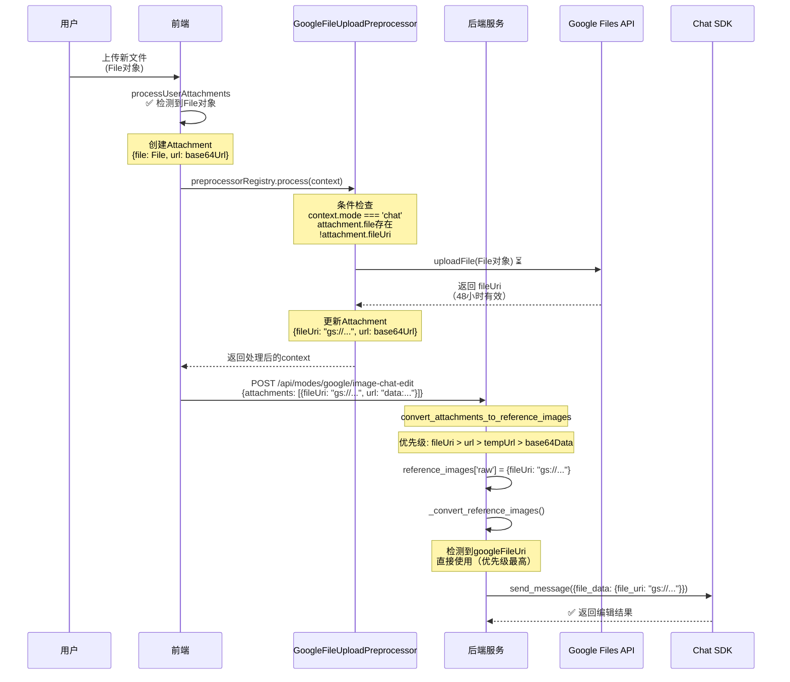
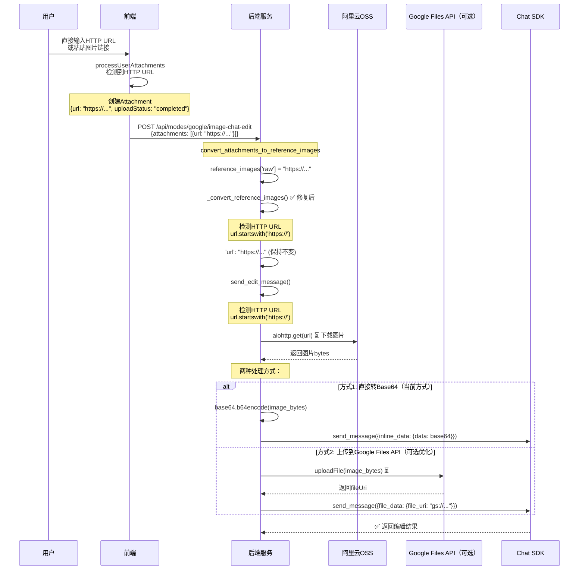

# 图片处理不同场景完整分析

## 场景分类

根据图片来源和状态，有三种主要场景：

1. **上传附件**（新上传）：用户上传新文件，有File对象
2. **复用附件**（历史复用）：从历史消息中复用，已有云URL（阿里云）
3. **使用云URL**（直接URL）：直接使用HTTP URL，无需上传

## 场景1：上传附件（新上传）

### 流程概览



### 关键点

**前端**:
- `processUserAttachments` 检测到File对象
- 创建Attachment时包含File对象和base64 URL（用于UI显示）
- `GoogleFileUploadPreprocessor` 只处理 `mode === 'chat'` 的场景（其他模式不处理）
- 上传成功后，Attachment包含 `fileUri`（Google Files API URI）

**后端**:
- `convert_attachments_to_reference_images` 提取 `fileUri`（如果存在）
- `_convert_reference_images` 优先使用 `googleFileUri`
- `send_edit_message` 直接使用 `file_data`（file_uri），无需下载

**优点**:
- ✅ 使用Google Files API，数据传输小
- ✅ fileUri在48小时内有效，可复用
- ✅ 后端无需下载文件

## 场景2：复用附件（历史复用）

### 流程概览

```mermaid
sequenceDiagram
    participant User as 用户
    participant Frontend as 前端
    participant Preprocessor as GoogleFileUploadPreprocessor
    participant Backend as 后端服务
    participant AliyunOSS as 阿里云OSS
    participant ChatSDK as Chat SDK

    User->>Frontend: 选择历史图片<br/>(画布上的activeImageUrl)
    Frontend->>Frontend: processUserAttachments<br/>✅ CONTINUITY LOGIC触发
    
    Note over Frontend: prepareAttachmentForApi
    Frontend->>Frontend: findAttachmentByUrl()<br/>✅ 找到历史附件
    Frontend->>Backend: tryFetchCloudUrl() ⏳<br/>查询后端获取云URL
    Backend-->>Frontend: 返回 HTTP URL<br/>"https://img.dicry.com/..."
    
    Note over Frontend: 创建复用的Attachment<br/>{url: "https://...", uploadStatus: "completed"}<br/>⚠️ 没有File对象，没有fileUri
    Frontend->>Preprocessor: preprocessorRegistry.process(context)
    
    Note over Preprocessor: 条件检查<br/>attachment.file不存在<br/>❌ 跳过上传
    Preprocessor-->>Frontend: 返回原样（无fileUri）
    
    Frontend->>Backend: POST /api/modes/google/image-chat-edit<br/>{attachments: [{url: "https://img.dicry.com/..."}]}
    
    Note over Backend: convert_attachments_to_reference_images
    Note over Backend: 提取: attachment.url = "https://..."
    Backend->>Backend: reference_images['raw'] = "https://..." (字符串)
    
    Backend->>Backend: _convert_reference_images() ❌ 错误
    Note over Backend: ⚠️ 问题: 假设所有非data:开头的<br/>字符串都是base64
    Backend->>Backend: 'url': "data:image/png;base64,https://..." ❌
    
    Backend->>Backend: send_edit_message()
    Backend->>Backend: 匹配data: URL格式<br/>提取base64部分: "https://..."
    Backend->>Backend: base64.b64decode("https://...") ❌<br/>报错: Invalid base64
    
    Note over Backend: ✅ 正确流程应该是：
    Backend->>Backend: 检测到HTTP URL<br/>url.startswith('https://')
    Backend->>AliyunOSS: aiohttp.get(url) ⏳ 下载图片
    AliyunOSS-->>Backend: 返回图片bytes
    Backend->>ChatSDK: send_message({inline_data: {data: base64}}) ✅
    ChatSDK-->>Backend: ✅ 返回编辑结果
```

### 关键点

**前端**:
- `prepareAttachmentForApi` 从历史中查找附件
- 获取云URL（阿里云OSS）：`"https://img.dicry.com/..."`
- 创建复用的Attachment：**只有URL，没有File对象，没有fileUri**
- `GoogleFileUploadPreprocessor` 检查：`attachment.file` 不存在 → **跳过上传**

**后端**:
- `convert_attachments_to_reference_images` 提取 `url`（HTTP URL字符串）
- ❌ **问题**: `_convert_reference_images` 错误地将HTTP URL当作base64处理
- ✅ **应该**: 检测HTTP URL，在后端下载图片，转换为base64或上传到Google Files API

**当前问题**:
- ❌ `_convert_reference_images` 没有正确识别HTTP URL
- ❌ 导致base64解码错误

**修复后流程**:
- ✅ 后端识别HTTP URL
- ✅ 下载图片（从阿里云OSS）
- ✅ 转换为base64或上传到Google Files API
- ✅ 传递给Chat SDK

## 场景3：使用云URL（直接URL）

### 流程概览



### 关键点

**前端**:
- 直接使用HTTP URL创建Attachment
- 无需File对象，无需预处理

**后端**:
- ✅ **修复后**: `_convert_reference_images` 正确识别HTTP URL
- ✅ **修复后**: `send_edit_message` 下载HTTP URL图片
- **两种传递方式**:
  1. **Base64方式**（当前）: 下载后转base64，使用 `inline_data`
  2. **Google Files API方式**（可选优化）: 下载后上传到Google Files API，使用 `file_data`

**优缺点对比**:

| 方式 | 优点 | 缺点 |
|------|------|------|
| **Base64** | 实现简单，无需额外上传 | 数据传输大，请求体较大 |
| **Google Files API** | 数据传输小，请求体小 | 需要额外上传步骤，增加延迟 |

## 处理优先级总结

### 前端优先级

1. **File对象存在** → `GoogleFileUploadPreprocessor` 上传到Google Files API → 得到 `fileUri`
2. **HTTP URL存在** → 直接传递URL（后端会下载）
3. **Base64 URL** → 直接传递Base64数据

### 后端优先级（`_convert_reference_images`）

1. **googleFileUri**（最高优先级）→ 直接使用，无需下载
2. **HTTP URL** → 检测后保持不变，`send_edit_message` 中下载
3. **Base64 Data URL** → 提取base64部分
4. **base64Data字段** → 直接使用

### 后端优先级（`send_edit_message`）

1. **file_data（googleFileUri）** → 直接使用
2. **inline_data（base64）** → 提取base64并解码
3. **HTTP URL** → 下载后转换为base64或上传到Google Files API

## 修复方案总结

### 问题1：`_convert_reference_images` 错误处理HTTP URL

**位置**: `backend/app/services/gemini/conversational_image_edit_service.py:724-729`

**修复**:
```python
if isinstance(raw_img, str):
    # ✅ 先判断是否是HTTP URL
    if raw_img.startswith('http://') or raw_img.startswith('https://'):
        # HTTP URL：直接使用，后端会下载
        reference_images_list.append({
            'url': raw_img,
            'mimeType': 'image/png'
        })
    elif raw_img.startswith('data:'):
        # Data URL：直接使用
        reference_images_list.append({
            'url': raw_img,
            'mimeType': 'image/png'
        })
    else:
        # 其他字符串（可能是base64）：添加data URL前缀
        reference_images_list.append({
            'url': f"data:image/png;base64,{raw_img}",
            'mimeType': 'image/png'
        })
```

### 问题2：复用图片时的优化（可选）

**优化点**:
- 前端：复用图片时立即显示用户消息（不等待预处理）
- 后端：可以考虑缓存已下载的图片，避免重复下载（未来优化）

## 完整修复计划

1. ✅ **修复base64错误**（必需）
   - 修复 `_convert_reference_images` 中的HTTP URL识别

2. ⚠️ **优化用户体验**（可选）
   - 复用图片时立即显示用户消息
   - 跳过不必要的预处理（如果没有File对象）

3. ⚠️ **后端优化**（可选，未来）
   - 考虑将HTTP URL图片上传到Google Files API（减少数据传输）
   - 缓存已下载的图片（避免重复下载）