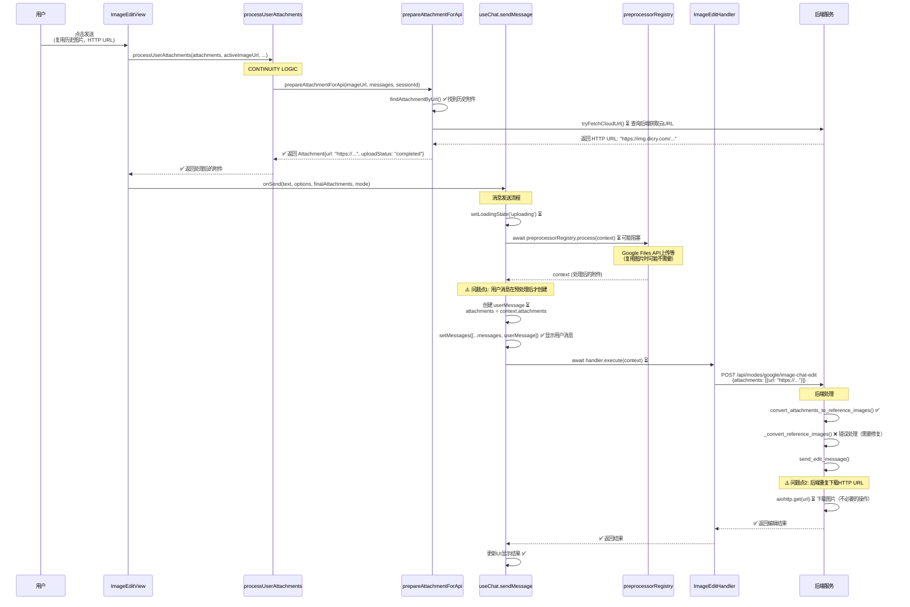

# 复用图片时的阻塞问题分析与优化方案

## 当前流程分析

### 完整流程（复用图片时）



## 问题分析

### 问题1：用户消息显示延迟（阻塞）

**位置**: `frontend/hooks/useChat.ts:119-136`

**当前流程**:
1. 第120行：`setLoadingState('uploading')`
2. 第121行：`await preprocessorRegistry.process(context)` ⏳ **阻塞等待预处理**
3. 第123-136行：创建并显示用户消息 ✅

**问题**:
- 用户消息在 `preprocessorRegistry.process()` **之后**才创建和显示
- 如果预处理中有任何阻塞操作（即使是复用图片），用户消息不会立即显示
- 用户体验差：点击发送后需要等待才能看到自己的消息

**影响**:
- 复用图片时，虽然不需要上传新文件，但可能还是要等待 `preprocessorRegistry.process()`
- 用户感觉"卡顿"，实际上可能是在等待不必要的处理

### 问题2：后端重复下载HTTP URL（不必要的操作）

**位置**: `backend/app/services/gemini/conversational_image_edit_service.py:386-424`

**当前流程**:
- 前端已经获取了HTTP URL（云存储URL）
- 后端收到HTTP URL后，仍然会使用 `aiohttp` 下载图片
- 这是不必要的：如果是云存储URL，后端可以：
  1. 直接使用URL（如果Chat SDK支持）
  2. 或者从数据库中获取已缓存的图片信息

**问题**:
- 重复的网络请求（前端已经知道URL，后端还要下载）
- 增加延迟（下载时间）
- 浪费带宽

### 问题3：重复的附件处理逻辑

**位置**: 
- `prepareAttachmentForApi` 中调用 `tryFetchCloudUrl`
- `processUserAttachments` 中也可能调用 `tryFetchCloudUrl`

**问题**:
- 可能存在重复的后端查询
- 逻辑分散，难以优化

## 优化方案

### 优化1：立即显示用户消息（非阻塞）

**方案**: 在 `preprocessorRegistry.process()` **之前**创建用户消息，立即显示

**修改位置**: `frontend/hooks/useChat.ts`

**修改方案**:
```typescript
// 当前代码（第119-136行）
// 4. Preprocess (文件上传等)
setLoadingState('uploading');
context = await preprocessorRegistry.process(context);  // ⏳ 阻塞

// 5. Create Optimistic User Message (使用处理后的 attachments)
const userMessage: Message = { ... };

// ✅ 优化后
// 4. Create Optimistic User Message (立即显示，不等待预处理)
const userMessage: Message = {
  id: userMessageId,
  role: Role.USER,
  content: text,
  attachments: attachments,  // 使用原始附件（用户看到的是原始状态）
  timestamp: Date.now(),
  mode: mode,
};

const updatedMessages = [...messages, userMessage];
setMessages(updatedMessages);  // ✅ 立即显示
setLoadingState('uploading');

// 5. Preprocess (文件上传等) - 异步执行，不阻塞UI
context = await preprocessorRegistry.process(context);

// 6. 更新用户消息（如果预处理修改了附件）
if (context.attachments !== attachments) {
  setMessages(prev => prev.map(msg => 
    msg.id === userMessageId 
      ? { ...msg, attachments: context.attachments }
      : msg
  ));
}
```

**优点**:
- 用户消息立即显示，不等待预处理
- 如果预处理修改了附件，异步更新即可
- 更好的用户体验

### 优化2：复用图片时跳过预处理（如果可能）

**方案**: 如果附件已经是完成的HTTP URL，跳过不必要的预处理

**修改位置**: `frontend/hooks/handlers/preprocessors` 或 `frontend/hooks/useChat.ts`

**检查条件**:
```typescript
// 检查是否所有附件都已完成上传（HTTP URL）
const allAttachmentsCompleted = attachments.every(att => 
  att.uploadStatus === 'completed' && isHttpUrl(att.url)
);

if (allAttachmentsCompleted) {
  // 跳过预处理（如果是Google Files API上传等）
  console.log('[useChat] 所有附件已完成，跳过预处理');
} else {
  context = await preprocessorRegistry.process(context);
}
```

### 优化3：后端避免重复下载（如果URL已在数据库）

**方案**: 检查图片是否已经在数据库/缓存中，避免重复下载

**修改位置**: `backend/app/services/gemini/conversational_image_edit_service.py:send_edit_message`

**优化思路**:
1. 检查URL是否在 `message_attachments` 表中
2. 如果存在且已上传，可以使用已缓存的信息
3. 或者直接使用URL（如果Chat SDK支持）

**注意**: 这个优化需要确认Chat SDK是否支持直接使用HTTP URL，还是必须下载为bytes。

### 优化4：统一附件处理逻辑

**方案**: 优化 `prepareAttachmentForApi` 和 `processUserAttachments`，避免重复查询

**修改位置**: `frontend/hooks/handlers/attachmentUtils.ts`

**优化思路**:
- 缓存查询结果
- 合并重复的逻辑
- 只在必要时查询后端

## 优先级建议

1. **优化1（立即显示用户消息）** - 🔥 **高优先级**
   - 显著改善用户体验
   - 实现简单，风险低
   - 立即生效

2. **优化2（跳过预处理）** - 🔥 **高优先级**
   - 减少不必要的等待
   - 实现简单

3. **优化3（后端避免重复下载）** - ⚠️ **中优先级**
   - 需要确认Chat SDK能力
   - 可能涉及架构调整

4. **优化4（统一附件处理）** - ⚠️ **低优先级**
   - 代码优化，不直接影响用户体验

## 实施建议

### 第一步：修复base64错误
- 修复 `_convert_reference_images()` 中的HTTP URL处理错误

### 第二步：优化用户体验（优化1和2）
- 立即显示用户消息
- 复用图片时跳过不必要的预处理

### 第三步：后端优化（优化3）
- 根据实际需求和Chat SDK能力决定是否实施