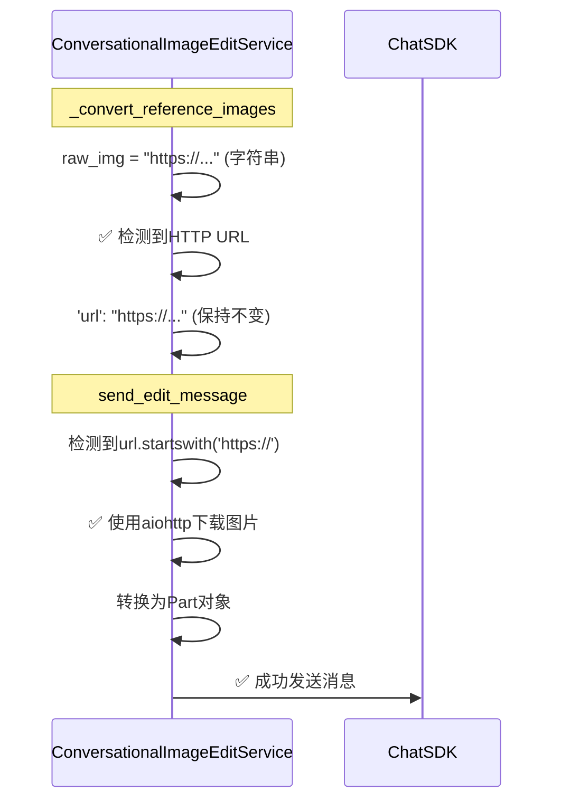

# 复用图片时（HTTP URL）的完整流程

## 流程图

```mermaid
sequenceDiagram
    participant User as 用户
    participant View as ImageEditView
    participant AttachUtils as attachmentUtils<br/>prepareAttachmentForApi
    participant Handler as ImageEditHandler
    participant LLMService as llmService
    participant UnifiedClient as UnifiedProviderClient
    participant BackendRoute as 后端路由<br/>modes.py
    participant ImageCoordinator as ImageEditCoordinator
    participant ConversationalEdit as ConversationalImageEditService
    participant ChatSDK as Chat SDK

    User->>View: 在画布上选择历史图片<br/>(HTTP URL: https://img.dicry.com/...)
    View->>AttachUtils: prepareAttachmentForApi(imageUrl, messages, sessionId)
    
    Note over AttachUtils: 步骤1: 查找历史附件
    AttachUtils->>AttachUtils: findAttachmentByUrl(imageUrl, messages)
    AttachUtils-->>AttachUtils: ✅ 找到历史附件<br/>{id, url: "https://...", uploadStatus: "completed"}
    
    Note over AttachUtils: 步骤2: 查询后端获取最新云URL
    AttachUtils->>AttachUtils: tryFetchCloudUrl(sessionId, attachmentId, ...)
    AttachUtils-->>AttachUtils: ✅ 返回云URL: "https://img.dicry.com/uploads/xxx.png"
    
    Note over AttachUtils: 步骤3: 构建复用的Attachment
    AttachUtils->>AttachUtils: 创建 reusedAttachment<br/>{url: "https://...", uploadStatus: "completed"}
    Note over AttachUtils: ✅ 识别为HTTP URL<br/>不设置base64Data
    AttachUtils-->>View: ✅ 返回Attachment<br/>{url: "https://...", uploadStatus: "completed"}
    
    View->>Handler: handleSend(prompt, attachments)
    Handler->>Handler: 处理第一个附件作为raw
    Note over Handler: ✅ 检测到HTTP URL<br/>直接使用，不转换base64
    Handler->>Handler: referenceImages.raw = attachment<br/>{url: "https://...", ...}
    
    Handler->>LLMService: editImage(prompt, referenceImages, mode, options)
    LLMService->>UnifiedClient: executeMode('image-chat-edit', modelId, prompt, attachments, options)
    
    Note over UnifiedClient: 构建请求体
    UnifiedClient->>UnifiedClient: 将referenceImages转换为attachments数组<br/>attachments = [{url: "https://...", ...}]
    UnifiedClient->>BackendRoute: POST /api/modes/google/image-chat-edit<br/>{attachments: [{url: "https://..."}]}
    
    Note over BackendRoute: 路由层处理
    BackendRoute->>BackendRoute: convert_attachments_to_reference_images(attachments)
    Note over BackendRoute: 优先级: url > tempUrl > fileUri > base64Data<br/>提取: attachment.url = "https://..."
    BackendRoute->>BackendRoute: reference_images['raw'] = "https://..." (字符串)
    BackendRoute->>ImageCoordinator: edit_image(..., reference_images={'raw': "https://..."})
    
    Note over ImageCoordinator: 路由到对话式编辑
    ImageCoordinator->>ConversationalEdit: edit_image(..., reference_images={'raw': "https://..."})
    
    Note over ConversationalEdit: ⚠️ 问题所在
    ConversationalEdit->>ConversationalEdit: _convert_reference_images(reference_images)
    Note over ConversationalEdit: raw_img = "https://..." (字符串类型)
    Note over ConversationalEdit: ❌ 错误: 假设所有非data:开头的<br/>字符串都是base64，添加前缀
    ConversationalEdit->>ConversationalEdit: 'url': "data:image/png;base64,https://..."<br/>❌ 错误转换！
    
    ConversationalEdit->>ConversationalEdit: send_edit_message(..., reference_images_list)
    Note over ConversationalEdit: 处理图片URL
    ConversationalEdit->>ConversationalEdit: 匹配data: URL格式<br/>提取base64部分: "https://..."
    ConversationalEdit->>ConversationalEdit: base64.b64decode("https://...")<br/>❌ 错误: 尝试解码HTTP URL作为base64
    ConversationalEdit-->>BackendRoute: ❌ ValueError: Invalid base64-encoded string<br/>number of data characters (65) cannot be 1 more than a multiple of 4
```

## 关键节点说明

### 1. 前端 - prepareAttachmentForApi (✅ 正确)

**位置**: `frontend/hooks/handlers/attachmentUtils.ts:653-712`

**流程**:
- 从历史消息中查找附件
- 查询后端获取最新云URL
- 创建复用的Attachment对象
- **关键**: HTTP URL时，**不设置base64Data**，直接传递URL

```typescript
// ✅ 正确逻辑
if (isHttpUrl(finalUrl)) {
  console.log('[prepareAttachmentForApi] ✅ HTTP URL，直接传递（后端会自己下载）');
  // 不设置base64Data
}
```

### 2. 后端路由 - convert_attachments_to_reference_images (✅ 正确)

**位置**: `backend/app/routers/core/modes.py:102-145`

**流程**:
- 从Attachment中提取数据，优先级: `url > tempUrl > fileUri > base64Data`
- HTTP URL被正确提取为字符串: `reference_images['raw'] = "https://..."`

### 3. ConversationalImageEditService - _convert_reference_images (❌ 错误)

**位置**: `backend/app/services/gemini/conversational_image_edit_service.py:711-768`

**问题代码**:
```python
if isinstance(raw_img, str):
    # ❌ 错误假设：所有非data:开头的字符串都是base64
    reference_images_list.append({
        'url': f"data:image/png;base64,{raw_img}" if not raw_img.startswith('data:') else raw_img,
        'mimeType': 'image/png'
    })
```

**错误原因**:
- HTTP URL `"https://img.dicry.com/..."` 被错误地转换为 `"data:image/png;base64,https://img.dicry.com/..."`
- 然后在 `send_edit_message()` 中，代码尝试从data URL中提取base64部分
- 提取到的是 `"https://..."`（65个字符），被当作base64解码，导致错误

### 4. send_edit_message - 处理图片 (✅ 逻辑正确，但输入错误)

**位置**: `backend/app/services/gemini/conversational_image_edit_service.py:355-424`

**正确逻辑**:
- 如果URL是 `data:` 开头 → 提取base64部分并解码
- 如果URL是 `http://` 或 `https://` 开头 → 下载图片

**但由于第3步的错误，收到的是**: `"data:image/png;base64,https://..."`，导致错误

## 修复方案

修复 `_convert_reference_images()` 方法，在字符串处理时先判断HTTP URL:

```python
if isinstance(raw_img, str):
    # ✅ 先判断是否是HTTP URL
    if raw_img.startswith('http://') or raw_img.startswith('https://'):
        # HTTP URL：直接使用，后端会下载
        reference_images_list.append({
            'url': raw_img,
            'mimeType': 'image/png'
        })
    elif raw_img.startswith('data:'):
        # Data URL：直接使用
        reference_images_list.append({
            'url': raw_img,
            'mimeType': 'image/png'
        })
    else:
        # 其他字符串（可能是base64）：添加data URL前缀
        reference_images_list.append({
            'url': f"data:image/png;base64,{raw_img}",
            'mimeType': 'image/png'
        })
```

## 修复后的正确流程

