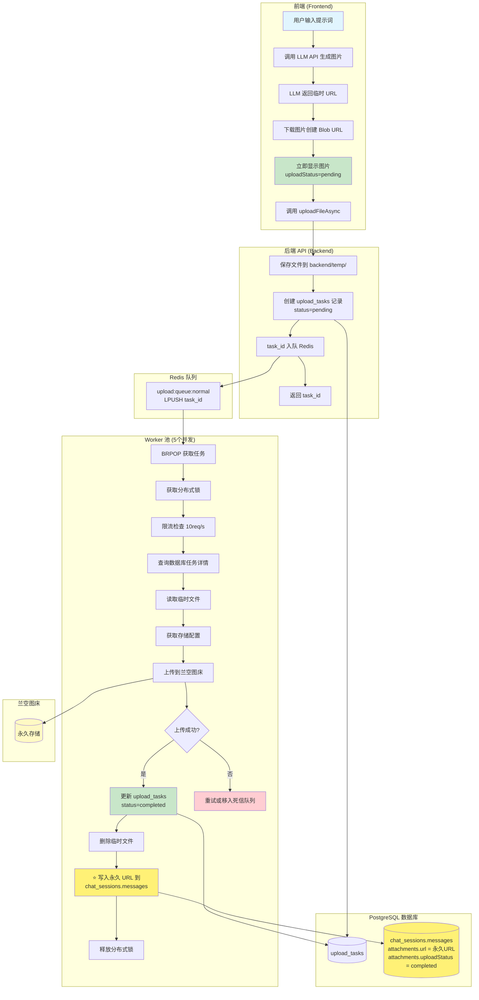
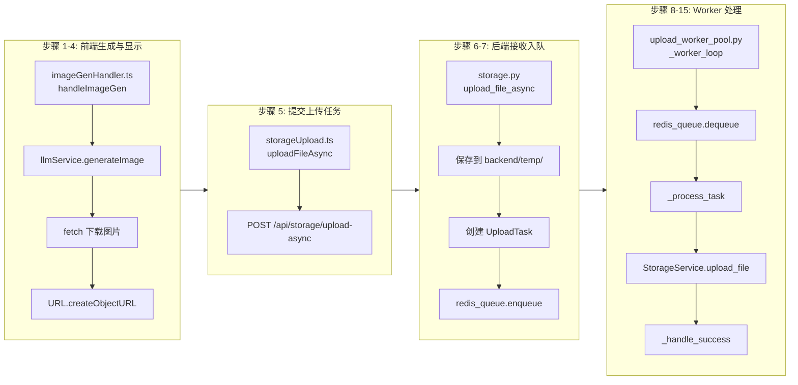
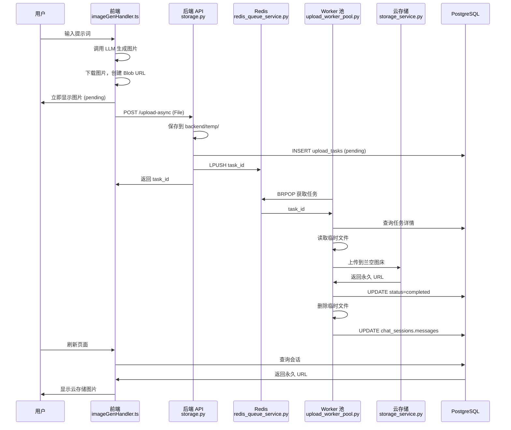
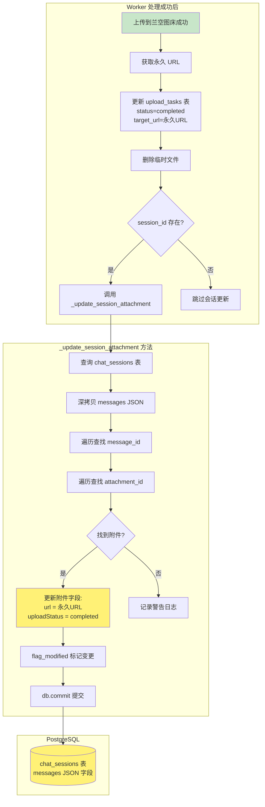
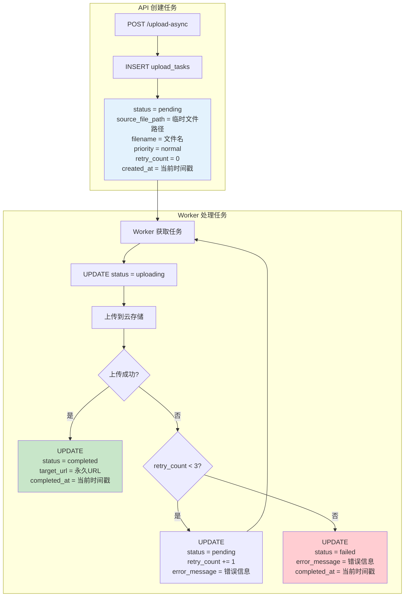
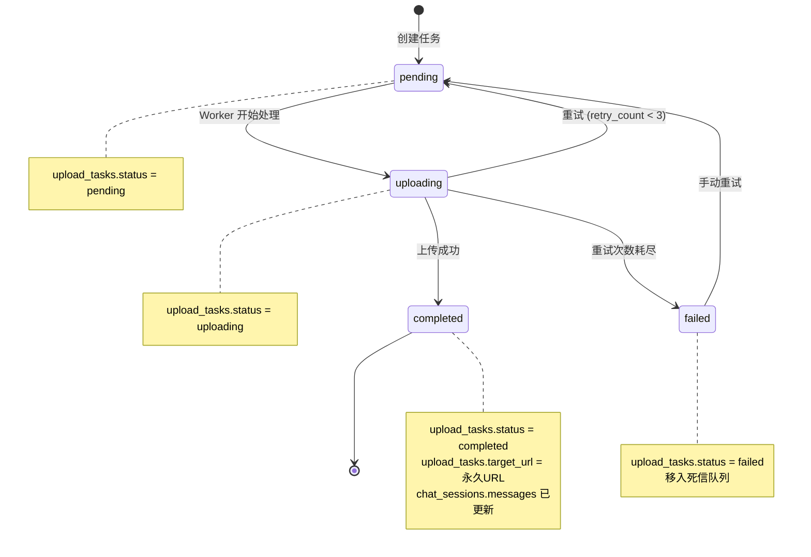

# 图片生成模式（Gen）完整数据流程

## 1. 流程图



---

## 2. 详细步骤与文件对应



---

## 3. 文件路径清单

### 前端文件

| 步骤 | 文件路径 | 函数/方法 |
|------|----------|-----------|
| 1-4 | `D:\gemini-main\gemini-main\frontend\hooks\handlers\imageGenHandler.ts` | `handleImageGen()` |
| 5 | `D:\gemini-main\gemini-main\frontend\services\storage\storageUpload.ts` | `uploadFileAsync()` |

### 后端文件

| 步骤 | 文件路径 | 函数/方法 |
|------|----------|-----------|
| 6-7 | `D:\gemini-main\gemini-main\backend\app\routers\storage.py` | `upload_file_async()` |
| 7 | `D:\gemini-main\gemini-main\backend\app\services\redis_queue_service.py` | `enqueue()` |
| 8-15 | `D:\gemini-main\gemini-main\backend\app\services\upload_worker_pool.py` | `_worker_loop()`, `_process_task()` |
| 13 | `D:\gemini-main\gemini-main\backend\app\services\storage_service.py` | `upload_file()` |

### 数据模型

| 文件路径 | 说明 |
|----------|------|
| `D:\gemini-main\gemini-main\backend\app\models\db_models.py` | `UploadTask`, `ChatSession` 模型 |

### 临时文件目录

| 路径 | 说明 |
|------|------|
| `D:\gemini-main\gemini-main\backend\temp\` | 上传前的临时文件存储 |

---

## 4. 数据流转图



---

## 5. 永久 URL 写入数据库流程（关键步骤）

这是整个流程中最关键的一步：Worker 上传成功后，需要将云存储的永久 URL 写入 `chat_sessions.messages` 表中。



### 5.1 数据库表结构

**`chat_sessions` 表的 `messages` 字段结构：**

```json
{
  "messages": [
    {
      "id": "msg-xxx",
      "role": "model",
      "content": "这是生成的图片",
      "attachments": [
        {
          "id": "att-xxx",
          "type": "image",
          "url": "https://cdn.lsky.pro/xxx.png",  // ⭐ 永久 URL（上传成功后更新）
          "uploadStatus": "completed",             // ⭐ 状态（pending → completed）
          "filename": "generated-1234567890.png"
        }
      ]
    }
  ]
}
```

### 5.2 关键代码位置

**文件**: `D:\gemini-main\gemini-main\backend\app\services\upload_worker_pool.py`

```python
# 第 290-330 行：_update_session_attachment 方法
async def _update_session_attachment(
    self, db, session_id: str, message_id: str, attachment_id: str, url: str, worker_name: str
):
    """更新会话附件"""
    from sqlalchemy.orm.attributes import flag_modified
    import copy

    session = db.query(ChatSession).filter(ChatSession.id == session_id).first()
    messages = copy.deepcopy(session.messages or [])
    
    for msg in messages:
        if msg.get('id') == message_id and msg.get('attachments'):
            for att in msg['attachments']:
                if att.get('id') == attachment_id:
                    att['url'] = url                    # ⭐ 写入永久 URL
                    att['uploadStatus'] = 'completed'  # ⭐ 更新状态
                    break
    
    session.messages = messages
    flag_modified(session, 'messages')  # ⭐ 标记 JSON 字段已修改
    db.commit()                          # ⭐ 提交到数据库
```

### 5.3 为什么需要 `flag_modified`？

SQLAlchemy 的 JSON 字段在原地修改时**不会自动检测变化**。必须使用以下方式之一：

1. **`flag_modified(session, 'messages')`** - 手动标记字段已修改
2. **重新赋值** - `session.messages = new_messages`

本项目同时使用了两种方式确保更新生效。

---

## 6. upload_tasks 表更新流程

Worker 处理任务时，会多次更新 `upload_tasks` 表的状态和字段。



### 6.1 upload_tasks 表结构

| 字段 | 类型 | 说明 |
|------|------|------|
| `id` | VARCHAR | 任务 ID（UUID） |
| `session_id` | VARCHAR | 关联的会话 ID |
| `message_id` | VARCHAR | 关联的消息 ID |
| `attachment_id` | VARCHAR | 关联的附件 ID |
| `source_file_path` | VARCHAR | 临时文件路径（`backend/temp/upload_xxx.png`） |
| `source_url` | VARCHAR | 源 URL（从 URL 下载时使用） |
| `filename` | VARCHAR | 原始文件名 |
| `storage_id` | VARCHAR | 云存储配置 ID |
| `priority` | VARCHAR | 优先级（`high`/`normal`/`low`） |
| `status` | VARCHAR | 状态（`pending`/`uploading`/`completed`/`failed`） |
| `target_url` | VARCHAR | ⭐ 云存储永久 URL（上传成功后填入） |
| `error_message` | VARCHAR | 错误信息（失败时填入） |
| `retry_count` | INTEGER | 重试次数 |
| `created_at` | BIGINT | 创建时间戳（毫秒） |
| `completed_at` | BIGINT | 完成时间戳（毫秒） |

### 6.2 状态变更时机

| 状态 | 触发时机 | 更新字段 |
|------|----------|----------|
| `pending` | API 创建任务 | `id`, `session_id`, `message_id`, `attachment_id`, `source_file_path`, `filename`, `priority`, `created_at` |
| `uploading` | Worker 开始处理 | `status` |
| `completed` | 上传成功 | `status`, `target_url`, `completed_at` |
| `failed` | 重试次数耗尽 | `status`, `error_message`, `completed_at` |
| `pending`（重试） | 上传失败但未达最大重试 | `status`, `retry_count`, `error_message` |

### 6.3 关键代码位置

**文件**: `D:\gemini-main\gemini-main\backend\app\services\upload_worker_pool.py`

```python
# 第 230-250 行：_handle_success 方法
async def _handle_success(self, db, task: UploadTask, url: str, worker_name: str):
    now = int(datetime.now().timestamp() * 1000)
    
    # ⭐ 更新 upload_tasks 表
    task.status = 'completed'
    task.target_url = url           # 永久 URL
    task.completed_at = now
    db.commit()
    
    # 删除临时文件
    if task.source_file_path and os.path.exists(task.source_file_path):
        os.remove(task.source_file_path)
    
    # 更新 chat_sessions.messages
    if task.session_id and task.message_id and task.attachment_id:
        await self._update_session_attachment(...)

# 第 260-300 行：_handle_failure 方法
async def _handle_failure(self, db, task_id: str, error: str, worker_name: str):
    task = db.query(UploadTask).filter(UploadTask.id == task_id).first()
    
    retry_count = (task.retry_count or 0) + 1
    task.retry_count = retry_count
    task.error_message = f"{error} (重试 {retry_count}/{self.max_retries})"
    
    if retry_count < self.max_retries:
        # 重试
        task.status = 'pending'
        db.commit()
        await redis_queue.enqueue(task_id, 'low')
    else:
        # 最终失败
        task.status = 'failed'
        task.completed_at = int(datetime.now().timestamp() * 1000)
        db.commit()
        await redis_queue.move_to_dead_letter(task_id)
```

---

## 7. 状态流转图



---

## 8. 关键代码位置

### 8.1 前端：图片生成处理

**文件**: `D:\gemini-main\gemini-main\frontend\hooks\handlers\imageGenHandler.ts`

```typescript
// 第 30-50 行：调用 LLM 生成图片
const results = await llmService.generateImage(text, attachments);

// 第 52-70 行：下载图片创建 Blob URL
const response = await fetch(res.url);
const blob = await response.blob();
displayUrl = URL.createObjectURL(blob);

// 第 85-110 行：提交上传任务到 Redis 队列
const result = await storageUpload.uploadFileAsync(file, {
  sessionId: context.sessionId,
  messageId: context.modelMessageId,
  attachmentId: r.id
});
```

### 8.2 前端：上传服务

**文件**: `D:\gemini-main\gemini-main\frontend\services\storage\storageUpload.ts`

```typescript
// 第 280-320 行：异步上传方法
async uploadFileAsync(file: File, options: {...}): Promise<{taskId, status}> {
  const response = await fetch(`/api/storage/upload-async?${params}`, {
    method: 'POST',
    body: formData,
  });
}
```

### 8.3 后端：上传 API

**文件**: `D:\gemini-main\gemini-main\backend\app\routers\storage.py`

```python
# 第 450-520 行：异步上传端点
@router.post("/upload-async")
async def upload_file_async(...):
    # 保存到 backend/temp/
    temp_path = os.path.join(TEMP_DIR, f"upload_{task_id}_{file.filename}")
    
    # 创建数据库记录
    task = UploadTask(...)
    db.add(task)
    
    # 入队 Redis
    queue_position = await redis_queue.enqueue(task_id, priority)
```

### 8.4 后端：Redis 队列服务

**文件**: `D:\gemini-main\gemini-main\backend\app\services\redis_queue_service.py`

```python
# 第 50-80 行：入队方法
async def enqueue(self, task_id: str, priority: str = "normal") -> int:
    await self._redis.lpush(queue_key, task_id)

# 第 85-100 行：出队方法
async def dequeue(self, timeout: int = 5) -> Optional[str]:
    result = await self._redis.brpop([QUEUE_HIGH, QUEUE_NORMAL, QUEUE_LOW], timeout)
```

### 8.5 后端：Worker 池

**文件**: `D:\gemini-main\gemini-main\backend\app\services\upload_worker_pool.py`

```python
# 第 100-160 行：Worker 主循环
async def _worker_loop(self, worker_id: int):
    task_id = await redis_queue.dequeue(timeout=5)
    await self._process_task(task_id, worker_name)

# 第 170-270 行：处理单个任务
async def _process_task(self, task_id: str, worker_name: str):
    content = await self._get_file_content(task)
    result = await StorageService.upload_file(...)
    await self._handle_success(db, task, url, worker_name)
```

---

## 9. 配置文件

| 文件路径 | 说明 |
|----------|------|
| `D:\gemini-main\gemini-main\backend\.env` | Redis 连接配置、Worker 数量等 |
| `D:\gemini-main\gemini-main\backend\app\core\config.py` | 配置类定义 |

### 关键配置项

```bash
# D:\gemini-main\gemini-main\backend\.env
REDIS_HOST=192.168.50.175
REDIS_PORT=6379
REDIS_PASSWORD=941378
UPLOAD_QUEUE_WORKERS=5
UPLOAD_QUEUE_MAX_RETRIES=3
UPLOAD_QUEUE_RATE_LIMIT=10
```
