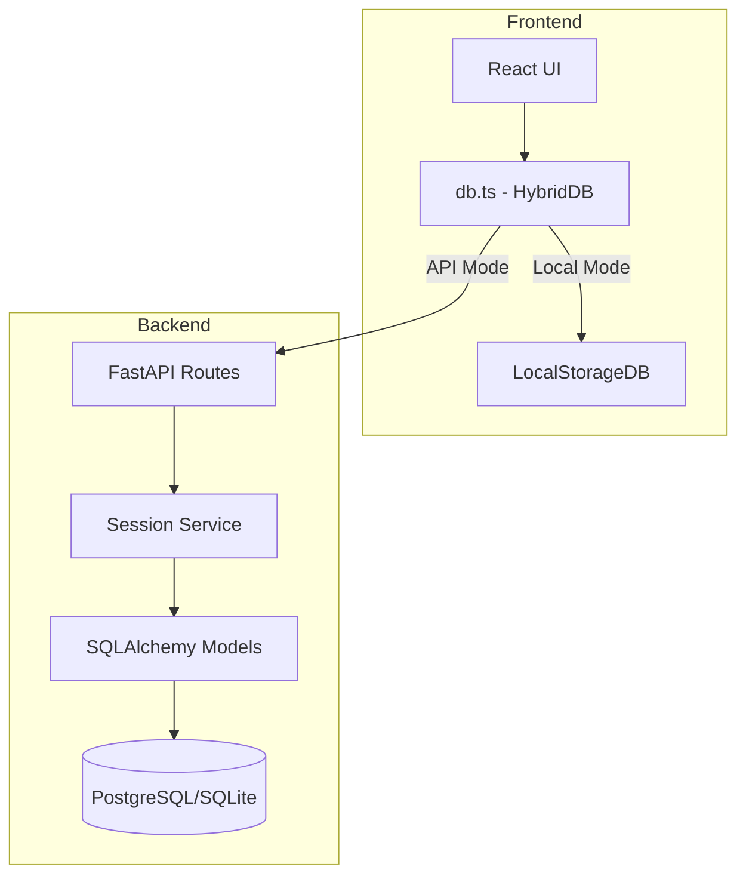
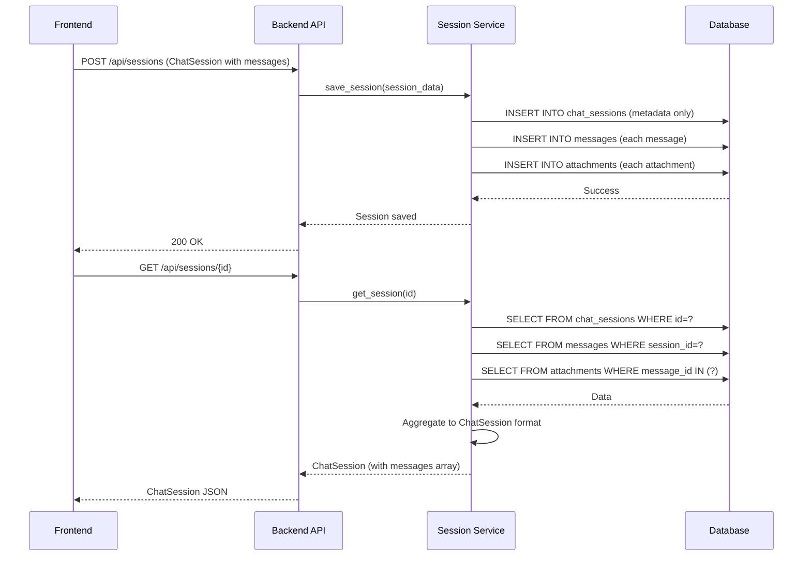
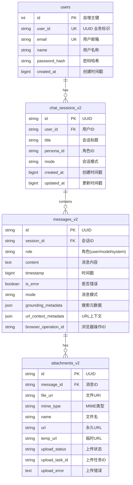

# Design Document: Database Normalization

## Overview

本设计文档描述了聊天数据库存储结构的规范化重构方案。核心目标是将当前嵌套在 `chat_sessions.messages` JSON 字段中的消息和附件数据拆分为独立的关系型表，实现数据规范化存储，支持多用户隔离，并保持 API 向后兼容。

### 设计目标

1. **数据规范化**: 消息和附件独立存储，避免 JSON 无限膨胀
2. **多用户支持**: 所有数据通过 `user_id` 隔离
3. **高效查询**: 支持分页、索引查询
4. **向后兼容**: 现有 API 接口保持兼容
5. **数据完整性**: 外键约束确保关联一致性

## Architecture

### 系统架构图



### 数据流



## Components and Interfaces

### 1. 数据库模型层 (backend/app/models/db_models.py)

#### User 模型
```python
class User(Base):
    __tablename__ = "users"
    
    id = Column(Integer, primary_key=True, autoincrement=True)
    user_id = Column(String(36), unique=True, index=True, nullable=False)  # UUID
    email = Column(String(255), unique=True, index=True, nullable=False)
    name = Column(String(100), nullable=False)
    password_hash = Column(String(255), nullable=False)
    created_at = Column(BigInteger, nullable=False)
    
    # Relationships
    sessions = relationship("ChatSessionV2", back_populates="user", cascade="all, delete-orphan")
```

#### ChatSessionV2 模型（重构后）
```python
class ChatSessionV2(Base):
    __tablename__ = "chat_sessions_v2"
    
    id = Column(String(36), primary_key=True, index=True)  # UUID
    user_id = Column(String(36), ForeignKey("users.user_id", ondelete="CASCADE"), nullable=False, index=True)
    title = Column(String(255), nullable=False)
    persona_id = Column(String(36), nullable=True)
    mode = Column(String(50), nullable=True)
    created_at = Column(BigInteger, nullable=False)
    updated_at = Column(BigInteger, nullable=False)
    
    # Relationships
    user = relationship("User", back_populates="sessions")
    messages = relationship("MessageV2", back_populates="session", cascade="all, delete-orphan", order_by="MessageV2.timestamp")
```

#### MessageV2 模型
```python
class MessageV2(Base):
    __tablename__ = "messages_v2"
    
    id = Column(String(36), primary_key=True, index=True)  # UUID
    session_id = Column(String(36), ForeignKey("chat_sessions_v2.id", ondelete="CASCADE"), nullable=False, index=True)
    role = Column(String(20), nullable=False)  # user, model, system
    content = Column(Text, nullable=False)
    timestamp = Column(BigInteger, nullable=False, index=True)
    is_error = Column(Boolean, default=False)
    mode = Column(String(50), nullable=True)
    grounding_metadata = Column(JSON, nullable=True)
    url_context_metadata = Column(JSON, nullable=True)
    browser_operation_id = Column(String(36), nullable=True)
    
    # Relationships
    session = relationship("ChatSessionV2", back_populates="messages")
    attachments = relationship("AttachmentV2", back_populates="message", cascade="all, delete-orphan")
```

#### AttachmentV2 模型
```python
class AttachmentV2(Base):
    __tablename__ = "attachments_v2"
    
    id = Column(String(36), primary_key=True, index=True)  # UUID
    message_id = Column(String(36), ForeignKey("messages_v2.id", ondelete="CASCADE"), nullable=False, index=True)
    file_uri = Column(String(500), nullable=True)
    mime_type = Column(String(100), nullable=False)
    name = Column(String(255), nullable=False)
    url = Column(String(500), nullable=True)
    temp_url = Column(String(500), nullable=True)
    upload_status = Column(String(20), default='pending')  # pending, uploading, completed, failed
    upload_task_id = Column(String(36), nullable=True)
    upload_error = Column(Text, nullable=True)
    
    # Relationships
    message = relationship("MessageV2", back_populates="attachments")
```

### 2. 服务层接口 (backend/app/services/session_service.py)

```python
class SessionService:
    """会话服务 - 处理会话的 CRUD 操作和数据聚合"""
    
    async def get_sessions_by_user(self, user_id: str, limit: int = 50, offset: int = 0) -> List[dict]:
        """获取用户的会话列表（仅元数据）"""
        pass
    
    async def get_session_with_messages(self, session_id: str, user_id: str) -> dict:
        """获取完整会话（包含消息和附件）"""
        pass
    
    async def save_session(self, session_data: dict, user_id: str) -> dict:
        """保存会话（拆分存储消息和附件）"""
        pass
    
    async def delete_session(self, session_id: str, user_id: str) -> bool:
        """删除会话（级联删除消息和附件）"""
        pass
    
    async def add_message(self, session_id: str, message_data: dict) -> dict:
        """添加单条消息到会话"""
        pass
    
    async def get_messages_paginated(self, session_id: str, limit: int = 50, before_timestamp: int = None) -> List[dict]:
        """分页获取消息"""
        pass
    
    async def get_recent_messages(self, session_id: str, count: int = 20) -> List[dict]:
        """获取最近 N 条消息（用于 AI 上下文）"""
        pass
```

### 3. API 路由层 (backend/app/routers/sessions.py)

```python
# 保持向后兼容的 API 接口

@router.get("/sessions")
async def get_sessions(user_id: str = "default") -> List[ChatSessionResponse]:
    """获取会话列表 - 返回聚合后的完整格式"""
    pass

@router.get("/sessions/{session_id}")
async def get_session(session_id: str, user_id: str = "default") -> ChatSessionResponse:
    """获取单个会话 - 包含所有消息和附件"""
    pass

@router.post("/sessions")
async def save_session(session: ChatSessionRequest, user_id: str = "default") -> dict:
    """保存会话 - 接受完整格式，拆分存储"""
    pass

@router.delete("/sessions/{session_id}")
async def delete_session(session_id: str, user_id: str = "default") -> dict:
    """删除会话 - 级联删除"""
    pass

# 新增的细粒度 API（可选）
@router.post("/sessions/{session_id}/messages")
async def add_message(session_id: str, message: MessageRequest) -> dict:
    """添加单条消息"""
    pass

@router.get("/sessions/{session_id}/messages")
async def get_messages(session_id: str, limit: int = 50, before: int = None) -> List[MessageResponse]:
    """分页获取消息"""
    pass
```

### 4. 前端数据库适配层 (frontend/services/db.ts)

```typescript
// LocalStorageDB 更新 - 分离存储
class LocalStorageDB {
    // 会话元数据
    async getSessions(): Promise<ChatSession[]> {
        const sessions = this.get<SessionMetadata[]>('flux_sessions_v2', []);
        // 聚合消息数据返回完整格式
        return sessions.map(s => this.aggregateSession(s));
    }
    
    // 消息独立存储
    async getMessages(sessionId: string): Promise<Message[]> {
        const allMessages = this.get<StoredMessage[]>('flux_messages', []);
        return allMessages
            .filter(m => m.sessionId === sessionId)
            .sort((a, b) => a.timestamp - b.timestamp);
    }
    
    async saveMessage(sessionId: string, message: Message): Promise<void> {
        const messages = this.get<StoredMessage[]>('flux_messages', []);
        messages.push({ ...message, sessionId });
        this.set('flux_messages', messages);
    }
    
    // 附件独立存储
    async getAttachments(messageId: string): Promise<Attachment[]> {
        const allAttachments = this.get<StoredAttachment[]>('flux_attachments', []);
        return allAttachments.filter(a => a.messageId === messageId);
    }
}
```

## Data Models

### 数据库 ER 图



### 索引设计

| 表名 | 索引名 | 字段 | 类型 | 用途 |
|------|--------|------|------|------|
| users | ix_users_user_id | user_id | UNIQUE | 业务标识查询 |
| users | ix_users_email | email | UNIQUE | 登录验证 |
| chat_sessions_v2 | ix_sessions_user_id | user_id | INDEX | 用户会话列表 |
| chat_sessions_v2 | ix_sessions_created | created_at | INDEX | 时间排序 |
| messages_v2 | ix_messages_session | session_id | INDEX | 会话消息查询 |
| messages_v2 | ix_messages_timestamp | timestamp | INDEX | 时间排序/分页 |
| attachments_v2 | ix_attachments_message | message_id | INDEX | 消息附件查询 |


## Correctness Properties

*A property is a characteristic or behavior that should hold true across all valid executions of a system-essentially, a formal statement about what the system should do. Properties serve as the bridge between human-readable specifications and machine-verifiable correctness guarantees.*

基于验收标准分析，以下是经过去重和合并后的核心正确性属性：

### Property 1: 消息存储独立性
*For any* 会话和消息数据，当存储新消息时，Message_Table 应创建独立记录，且该记录的 `session_id` 正确关联到对应会话。
**Validates: Requirements 1.1**

### Property 2: 消息删除隔离性
*For any* 包含多条消息的会话，当删除其中一条消息时，同会话的其他消息应保持不变。
**Validates: Requirements 1.3**

### Property 3: 消息更新隔离性
*For any* 包含多条消息的会话，当更新其中一条消息的内容时，同会话的其他消息应保持不变。
**Validates: Requirements 1.4**

### Property 4: 附件存储关联性
*For any* 消息和附件数据，当存储新附件时，Attachment_Table 应创建独立记录，且该记录的 `message_id` 正确关联到对应消息。
**Validates: Requirements 2.1**

### Property 5: 消息删除级联附件
*For any* 带有附件的消息，当删除该消息时，所有关联的附件记录应被自动删除。
**Validates: Requirements 2.3, 8.4**

### Property 6: 会话删除级联
*For any* 包含消息和附件的会话，当删除该会话时，所有关联的消息和附件记录应被自动删除。
**Validates: Requirements 3.3, 8.3**

### Property 7: 分页查询正确性
*For any* 包含 N 条消息的会话，使用 LIMIT L 和 OFFSET O 查询时，应返回正确数量的消息（min(L, N-O)），且按 timestamp 正确排序。
**Validates: Requirements 1.2, 4.1, 4.2, 9.1**

### Property 8: 消息计数准确性
*For any* 会话，按 `session_id` 统计的消息数量应等于该会话实际包含的消息数。
**Validates: Requirements 4.3**

### Property 9: API 向后兼容 - 会话列表
*For any* 用户的会话数据，GET /api/sessions 返回的格式应与旧版 API 兼容（包含 id、title、messages、createdAt 等字段）。
**Validates: Requirements 5.1**

### Property 10: API 向后兼容 - 会话保存
*For any* 旧格式的会话数据（包含嵌套 messages 数组），POST /api/sessions 应正确拆分并存储到规范化表中。
**Validates: Requirements 5.2**

### Property 11: API 向后兼容 - 会话获取
*For any* 已存储的会话，GET /api/sessions/{id} 应返回聚合后的完整会话数据（包含从 Message_Table 聚合的消息列表）。
**Validates: Requirements 5.3**

### Property 12: 迁移数据完整性
*For any* 旧格式的会话数据（JSON messages 字段），迁移后新表中的消息数量应等于原 JSON 数组长度，且内容一致。
**Validates: Requirements 6.1**

### Property 13: LocalStorage 消息过滤
*For any* 包含多个会话消息的 LocalStorage，按 sessionId 查询应只返回该会话的消息。
**Validates: Requirements 7.2**

### Property 14: 外键约束 - 消息创建
*For any* 不存在的 session_id，尝试创建消息时应被拒绝。
**Validates: Requirements 8.1**

### Property 15: 外键约束 - 附件创建
*For any* 不存在的 message_id，尝试创建附件时应被拒绝。
**Validates: Requirements 8.2**

### Property 16: 消息附件完整加载
*For any* 带有附件的消息，加载消息时应同时返回所有关联的附件数据。
**Validates: Requirements 9.2**

### Property 17: AI 上下文顺序
*For any* 会话的历史消息，组装为 AI 上下文时应按 timestamp 升序排列。
**Validates: Requirements 9.3**

### Property 18: 用户数据隔离
*For any* 多用户场景，查询会话列表时应只返回当前用户的会话，不包含其他用户的数据。
**Validates: Requirements 10.2, 10.3, 10.4**

### Property 19: 用户 ID 唯一性
*For any* 新创建的用户，生成的 user_id 应是唯一的 UUID 格式。
**Validates: Requirements 10.6**

### Property 20: 登录验证正确性
*For any* 邮箱和密码组合，登录 API 应正确验证：正确凭证返回用户信息，错误凭证返回错误。
**Validates: Requirements 11.1, 11.2**

## Error Handling

### 数据库层错误处理

| 错误类型 | 触发条件 | 处理方式 |
|---------|---------|---------|
| ForeignKeyViolation | 创建消息/附件时关联的父记录不存在 | 返回 400 错误，提示关联记录不存在 |
| UniqueViolation | 创建用户时邮箱已存在 | 返回 409 错误，提示邮箱已被使用 |
| NotFound | 查询/删除不存在的记录 | 返回 404 错误 |
| DatabaseError | 数据库连接失败或查询超时 | 返回 500 错误，记录日志 |

### 迁移工具错误处理

```python
class MigrationError(Exception):
    """迁移错误基类"""
    pass

class SessionMigrationError(MigrationError):
    """单个会话迁移失败"""
    def __init__(self, session_id: str, reason: str):
        self.session_id = session_id
        self.reason = reason
        super().__init__(f"Failed to migrate session {session_id}: {reason}")

# 迁移流程
async def migrate_sessions():
    failed_sessions = []
    success_count = 0
    
    for session in old_sessions:
        try:
            async with db.transaction():
                await migrate_single_session(session)
                success_count += 1
        except Exception as e:
            failed_sessions.append({
                "session_id": session.id,
                "error": str(e)
            })
            # 事务自动回滚
    
    return {
        "success": success_count,
        "failed": len(failed_sessions),
        "failed_sessions": failed_sessions
    }
```

### API 层错误响应格式

```json
{
    "error": {
        "code": "FOREIGN_KEY_VIOLATION",
        "message": "Session with id 'xxx' does not exist",
        "details": {
            "field": "session_id",
            "value": "xxx"
        }
    }
}
```

## Testing Strategy

### 测试框架选择

- **后端**: pytest + pytest-asyncio + hypothesis (Property-Based Testing)
- **前端**: vitest + fast-check (Property-Based Testing)

### 单元测试

单元测试覆盖以下场景：

1. **模型层测试**
   - User 模型的 CRUD 操作
   - ChatSessionV2 模型的 CRUD 操作
   - MessageV2 模型的 CRUD 操作
   - AttachmentV2 模型的 CRUD 操作

2. **服务层测试**
   - SessionService 的会话聚合逻辑
   - 分页查询逻辑
   - 数据格式转换

3. **API 层测试**
   - 端点响应格式验证
   - 错误处理验证

### Property-Based Testing

使用 hypothesis (Python) 和 fast-check (TypeScript) 进行属性测试：

```python
# 后端属性测试示例
from hypothesis import given, strategies as st

@given(
    session_id=st.uuids().map(str),
    messages=st.lists(st.builds(Message, content=st.text(min_size=1)), min_size=1, max_size=100)
)
def test_message_count_accuracy(session_id, messages):
    """Property 8: 消息计数准确性"""
    # 创建会话和消息
    # 验证计数等于实际数量
    pass

@given(
    messages=st.lists(st.builds(Message, timestamp=st.integers()), min_size=2, max_size=50)
)
def test_message_ordering(messages):
    """Property 7: 分页查询正确性 - 排序部分"""
    # 存储乱序消息
    # 查询并验证按 timestamp 排序
    pass
```

```typescript
// 前端属性测试示例
import * as fc from 'fast-check';

test('Property 13: LocalStorage 消息过滤', () => {
    fc.assert(
        fc.property(
            fc.array(fc.record({
                id: fc.uuid(),
                sessionId: fc.uuid(),
                content: fc.string()
            }), { minLength: 1, maxLength: 50 }),
            fc.uuid(),
            (messages, targetSessionId) => {
                // 存储消息
                // 按 sessionId 查询
                // 验证只返回目标会话的消息
            }
        )
    );
});
```

### 测试标注格式

每个属性测试必须使用以下格式标注：

```python
# **Feature: database-normalization, Property 8: 消息计数准确性**
# **Validates: Requirements 4.3**
def test_property_8_message_count_accuracy():
    pass
```

### 测试配置

- 每个属性测试运行最少 100 次迭代
- 使用固定种子以便复现失败用例
- 配置示例：

```python
# pytest.ini
[pytest]
hypothesis_settings = {
    "max_examples": 100,
    "database": "hypothesis_db"
}
```

```typescript
// vitest.config.ts
export default {
    test: {
        globals: true,
        environment: 'node'
    }
};
```

