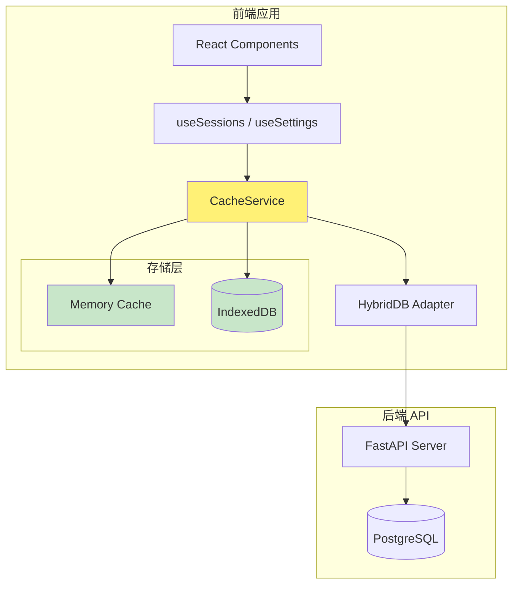
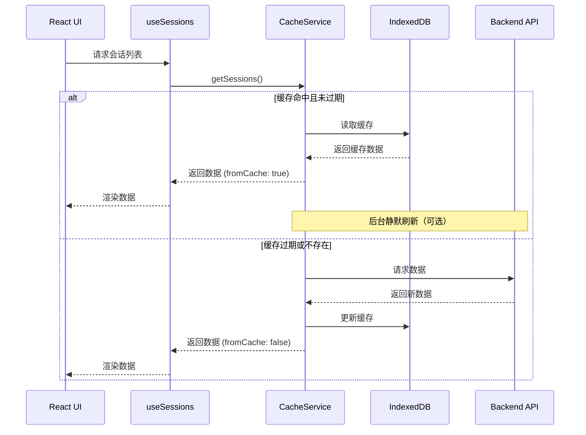

# Design Document: Frontend UI Cache

## Overview

本设计实现一个前端智能缓存层，通过 IndexedDB 持久化存储和内存缓存相结合的方式，为应用提供 12 小时有效期的数据缓存。缓存系统采用 **Stale-While-Revalidate** 策略，在保证用户体验的同时确保数据最终一致性。

### 核心设计原则

1. **缓存优先** - 优先返回缓存数据，后台异步刷新
2. **写穿透** - 写操作同时更新缓存和后端
3. **优雅降级** - IndexedDB 不可用时降级到内存缓存
4. **可观测性** - 提供缓存状态指示器

## Architecture



### 数据流



## Components and Interfaces

### 1. CacheService

核心缓存服务，管理所有缓存操作。

```typescript
// frontend/services/cacheService.ts

interface CacheEntry<T> {
  data: T;
  timestamp: number;      // 缓存时间戳
  version: number;        // 数据版本号
  accessCount: number;    // 访问次数（用于 LRU）
  lastAccess: number;     // 最后访问时间
}

interface CacheConfig {
  defaultTTL: number;     // 默认 TTL（毫秒）
  maxEntries: number;     // 最大缓存条目数
  enablePersistence: boolean;  // 是否启用持久化
}

interface CacheResult<T> {
  data: T;
  fromCache: boolean;
  isStale: boolean;
  timestamp: number;
}

class CacheService {
  private memoryCache: Map<string, CacheEntry<any>>;
  private config: CacheConfig;
  private idbAvailable: boolean;
  
  // 核心方法
  async get<T>(key: string, fetcher: () => Promise<T>, ttl?: number): Promise<CacheResult<T>>;
  async set<T>(key: string, data: T): Promise<void>;
  async invalidate(key: string): Promise<void>;
  async invalidatePattern(pattern: RegExp): Promise<void>;
  async refresh<T>(key: string, fetcher: () => Promise<T>): Promise<CacheResult<T>>;
  
  // 配置方法
  setTTL(dataType: string, ttl: number): void;
  getTTL(dataType: string): number;
  
  // 状态方法
  getCacheStatus(key: string): CacheStatus;
  getStats(): CacheStats;
  
  // 清理方法
  async cleanup(): Promise<void>;
  async clear(): Promise<void>;
}
```

### 2. IndexedDB Adapter

IndexedDB 持久化适配器。

```typescript
// frontend/services/idbCacheAdapter.ts

interface IDBCacheAdapter {
  // 数据库操作
  async init(): Promise<void>;
  async get<T>(key: string): Promise<CacheEntry<T> | null>;
  async set<T>(key: string, entry: CacheEntry<T>): Promise<void>;
  async delete(key: string): Promise<void>;
  async clear(): Promise<void>;
  
  // 批量操作
  async getAll(): Promise<Map<string, CacheEntry<any>>>;
  async deleteOldest(count: number): Promise<void>;
  
  // 状态检查
  isAvailable(): boolean;
  getStorageUsage(): Promise<{ used: number; quota: number }>;
}
```

### 3. CachedDB Wrapper

包装现有 HybridDB，添加缓存层。

```typescript
// frontend/services/cachedDb.ts

class CachedDB {
  private cache: CacheService;
  private db: HybridDB;
  
  // 会话操作（带缓存）
  async getSessions(): Promise<CacheResult<ChatSession[]>>;
  async saveSession(session: ChatSession): Promise<void>;
  async deleteSession(id: string): Promise<void>;
  
  // 配置操作（带缓存）
  async getProfiles(): Promise<CacheResult<ConfigProfile[]>>;
  async saveProfile(profile: ConfigProfile): Promise<void>;
  async deleteProfile(id: string): Promise<void>;
  
  // 角色操作（带缓存）
  async getPersonas(): Promise<CacheResult<Persona[]>>;
  async savePersonas(personas: Persona[]): Promise<void>;
  
  // 强制刷新
  async refreshSessions(): Promise<CacheResult<ChatSession[]>>;
  async refreshProfiles(): Promise<CacheResult<ConfigProfile[]>>;
  async refreshPersonas(): Promise<CacheResult<Persona[]>>;
}
```

### 4. Cache Status Hook

React Hook 用于获取缓存状态。

```typescript
// frontend/hooks/useCacheStatus.ts

interface CacheStatusInfo {
  isFromCache: boolean;
  isStale: boolean;
  isRefreshing: boolean;
  lastUpdated: number | null;
  error: Error | null;
}

function useCacheStatus(key: string): CacheStatusInfo;
```

### 5. Cache Indicator Component

UI 组件显示缓存状态。

```typescript
// frontend/components/common/CacheIndicator.tsx

interface CacheIndicatorProps {
  status: CacheStatusInfo;
  onRefresh?: () => void;
  showTimestamp?: boolean;
}

function CacheIndicator(props: CacheIndicatorProps): JSX.Element;
```

## Data Models

### CacheEntry Schema

```typescript
interface CacheEntry<T> {
  key: string;           // 缓存键
  data: T;               // 缓存数据
  timestamp: number;     // 创建/更新时间戳（毫秒）
  version: number;       // 数据版本号（递增）
  ttl: number;           // 生存时间（毫秒）
  accessCount: number;   // 访问计数
  lastAccess: number;    // 最后访问时间戳
  size: number;          // 数据大小（字节，估算）
}
```

### Cache Keys

| 数据类型 | 缓存键 | 默认 TTL |
|---------|--------|----------|
| 会话列表 | `sessions` | 12 小时 |
| 单个会话 | `session:{id}` | 12 小时 |
| 配置档案 | `profiles` | 12 小时 |
| 角色列表 | `personas` | 24 小时 |
| 存储配置 | `storage_configs` | 12 小时 |

### IndexedDB Schema

```typescript
// 数据库名称: flux_cache
// 版本: 1

interface CacheStore {
  // Object Store: cache_entries
  // Key Path: key
  // Indexes: timestamp, lastAccess
}
```

## Correctness Properties

*A property is a characteristic or behavior that should hold true across all valid executions of a system-essentially, a formal statement about what the system should do. Properties serve as the bridge between human-readable specifications and machine-verifiable correctness guarantees.*

### Property 1: Cache Hit Returns Data Without API Call

*For any* cache key with a valid (non-expired) cache entry, calling `get()` should return the cached data without invoking the fetcher function.

**Validates: Requirements 1.1, 1.2**

### Property 2: Expired Cache Triggers Refresh

*For any* cache key with an expired cache entry (timestamp + TTL < current time), calling `get()` should invoke the fetcher function and update the cache.

**Validates: Requirements 1.3**

### Property 3: Write-Through Cache Consistency

*For any* write operation (save/update), the cache should immediately reflect the change, and subsequent reads should return the updated data.

**Validates: Requirements 2.1, 2.2, 2.4**

### Property 4: Delete Removes From Cache

*For any* delete operation, the deleted item should not exist in the cache after the operation completes.

**Validates: Requirements 2.3**

### Property 5: TTL Validation on Restore

*For any* cache entry restored from IndexedDB, the TTL should be validated against the current time before the data is used.

**Validates: Requirements 3.3**

### Property 6: Force Refresh Bypasses Cache

*For any* force refresh operation, the fetcher function should always be called regardless of cache state, and the cache should be updated with fresh data.

**Validates: Requirements 4.1, 4.2**

### Property 7: Default TTL Fallback

*For any* data type without a custom TTL configuration, the default 12-hour TTL should be applied.

**Validates: Requirements 5.2**

### Property 8: LRU Cleanup Preserves Frequently Accessed

*For any* cache cleanup operation, entries with higher `accessCount` should be retained over entries with lower `accessCount`.

**Validates: Requirements 6.2**

## Error Handling

### IndexedDB Errors

| 错误类型 | 处理策略 |
|---------|---------|
| `QuotaExceededError` | 执行 LRU 清理，删除最旧条目 |
| `InvalidStateError` | 降级到内存缓存 |
| `NotFoundError` | 返回 null，触发 API 请求 |
| `AbortError` | 重试一次，失败则降级 |

### API Errors

| 错误类型 | 处理策略 |
|---------|---------|
| 网络超时 | 返回缓存数据（如有），标记为 stale |
| 服务器错误 | 返回缓存数据（如有），显示错误提示 |
| 认证失败 | 清除缓存，重定向到登录 |

## Testing Strategy

### Unit Tests

- CacheService 核心方法测试
- TTL 计算和过期检测测试
- IndexedDB 适配器测试（使用 fake-indexeddb）
- LRU 清理算法测试

### Property-Based Tests

使用 `fast-check` 库进行属性测试：

1. **缓存一致性属性** - 写入后立即读取应返回相同数据
2. **TTL 过期属性** - 过期数据应触发刷新
3. **LRU 清理属性** - 清理后保留的条目应是访问频率最高的

### Integration Tests

- 与 HybridDB 集成测试
- 浏览器存储限制测试
- 跨标签页同步测试（可选）

