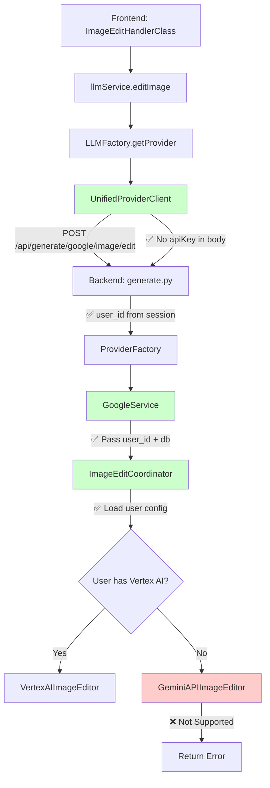

# Design Document - Google Image Editing Implementation

## Overview

本设计文档描述了 Google 图像编辑功能的实现方案，基于 Google GenAI SDK 的 `edit_image` API。

**设计目标**：
- 实现完整的图像编辑功能（支持 6 种参考图像类型）
- 优先使用 Vertex AI，回退到 Gemini API
- 遵循与 `imagen_coordinator.py` 相同的模块化架构
- 安全地处理用户凭证和配置

**设计原则**：
- 模块化：每个功能单独文件，主文件协调
- 安全优先：敏感凭证仅在后端处理
- 配置优先级：数据库 > 环境变量
- 向后兼容：不破坏现有功能

---

## Architecture

### Target Architecture



**说明**：
- 🟢 绿色：安全且功能完整
- 🔴 红色：Gemini API 不支持图像编辑

---

## Components and Interfaces

### 1. Backend Components

#### 1.1 ImageEditCoordinator (New)

**文件**：`backend/app/services/gemini/image_edit_coordinator.py`

**职责**：
- 加载用户配置（数据库 > 环境变量）
- 选择合适的编辑器（Vertex AI / Gemini API）
- 缓存编辑器实例
- 提供统一的编辑接口

**接口定义**：
```python
class ImageEditCoordinator:
    """
    Coordinates between Gemini API and Vertex AI implementations for image editing.
    
    Similar to ImagenCoordinator but for edit_image API.
    """
    
    def __init__(self, user_id: Optional[str] = None, db: Optional[Session] = None):
        """
        Initialize coordinator with configuration.
        
        Args:
            user_id: User ID for loading user-specific configuration
            db: Database session for loading user configuration
        """
        pass
    
    def get_editor(self) -> BaseImageEditor:
        """
        Get the appropriate image editor based on configuration.
        
        Returns:
            BaseImageEditor instance (Vertex AI or Gemini API)
        
        Raises:
            ConfigurationError: If configuration is invalid
        """
        pass
    
    def _load_config(self) -> Dict[str, Any]:
        """
        Load configuration from database (user-specific) or environment variables (fallback).
        
        Priority:
        1. User database configuration (ImagenConfig table)
        2. Environment variables
        
        Returns:
            Configuration dictionary
        """
        pass
    
    def _create_vertex_ai_editor(self) -> 'VertexAIImageEditor':
        """Create Vertex AI editor instance."""
        pass
    
    def _create_gemini_api_editor(self) -> 'GeminiAPIImageEditor':
        """Create Gemini API editor instance (returns not supported error)."""
        pass
    
    def get_current_api_mode(self) -> str:
        """Get the current API mode ('gemini_api' or 'vertex_ai')."""
        pass
    
    def get_capabilities(self) -> Dict[str, Any]:
        """Get capabilities of the current API mode."""
        pass
    
    def reload_config(self) -> None:
        """Reload configuration and clear editor cache."""
        pass
```

#### 1.2 BaseImageEditor (New)

**文件**：`backend/app/services/gemini/image_edit_base.py`

**职责**：
- 定义图像编辑器的抽象接口
- 提供参数验证方法

**接口定义**：
```python
from abc import ABC, abstractmethod
from typing import Dict, Any, List, Optional

class BaseImageEditor(ABC):
    """
    Abstract base class for image editors.
    
    Defines the interface that all image editors must implement.
    """
    
    @abstractmethod
    async def edit_image(
        self,
        prompt: str,
        model: str,
        reference_images: Dict[str, Any],
        **kwargs
    ) -> List[Dict[str, Any]]:
        """
        Edit images based on prompt and reference images.
        
        Args:
            prompt: Text description of the edit
            model: Model to use
            reference_images: Dictionary of reference images by type
                - raw: Base image to edit
                - mask: Mask image (optional)
                - control: Control image (optional)
                - style: Style reference image (optional)
                - subject: Subject reference image (optional)
                - content: Content reference image (optional)
            **kwargs: Additional parameters
        
        Returns:
            List of edited images
        """
        pass
    
    @abstractmethod
    def validate_parameters(self, **kwargs) -> None:
        """
        Validate parameters specific to this editor.
        
        Raises:
            ParameterValidationError: If parameters are invalid
        """
        pass
    
    @abstractmethod
    def get_capabilities(self) -> Dict[str, Any]:
        """
        Get capabilities of this editor.
        
        Returns:
            Capabilities dictionary
        """
        pass
    
    @abstractmethod
    def get_supported_models(self) -> List[str]:
        """
        Get list of supported models.
        
        Returns:
            List of model IDs
        """
        pass
```

#### 1.3 VertexAIImageEditor (New)

**文件**：`backend/app/services/gemini/image_edit_vertex_ai.py`

**职责**：
- 实现 Vertex AI 图像编辑功能
- 处理 6 种参考图像类型
- 处理编辑配置参数

**接口定义**：
```python
class VertexAIImageEditor(BaseImageEditor):
    """
    Image editor using Vertex AI.
    
    Supports:
    - 6 reference image types (raw, mask, control, style, subject, content)
    - Edit modes: inpainting-insert, inpainting-remove, outpainting, product-image
    - Full EditImageConfig parameters
    """
    
    def __init__(
        self,
        project_id: str,
        location: str,
        credentials_json: str
    ):
        """
        Initialize Vertex AI image editor.
        
        Args:
            project_id: Google Cloud project ID
            location: Vertex AI location/region (e.g., 'us-central1')
            credentials_json: Service account credentials JSON content
        """
        pass
    
    async def edit_image(
        self,
        prompt: str,
        model: str,
        reference_images: Dict[str, Any],
        **kwargs
    ) -> List[Dict[str, Any]]:
        """
        Edit images using Vertex AI.
        
        Supported parameters:
        - edit_mode: 'inpainting-insert', 'inpainting-remove', 'outpainting', 'product-image'
        - number_of_images: 1-4
        - aspect_ratio: '1:1', '3:4', '4:3', '9:16', '16:9'
        - guidance_scale: 0-100
        - output_mime_type: 'image/png', 'image/jpeg'
        - safety_filter_level: 'block_most', 'block_some', 'block_few', 'block_fewest'
        - person_generation: 'dont_allow', 'allow_adult', 'allow_all'
        
        Args:
            prompt: Text description of the edit
            model: Model to use (e.g., 'imagen-3.0-generate-001')
            reference_images: Dictionary of reference images
            **kwargs: Additional parameters
        
        Returns:
            List of edited images
        """
        pass
    
    def _build_config(self, **kwargs) -> 'genai_types.EditImageConfig':
        """Build Vertex AI EditImageConfig from parameters."""
        pass
    
    def _build_reference_images(
        self,
        reference_images: Dict[str, Any]
    ) -> List['genai_types.ReferenceImage']:
        """
        Build list of ReferenceImage objects from dictionary.
        
        Args:
            reference_images: Dictionary with keys: raw, mask, control, style, subject, content
        
        Returns:
            List of ReferenceImage objects
        """
        pass
    
    def _process_response(
        self,
        response,
        **kwargs
    ) -> List[Dict[str, Any]]:
        """Process Vertex AI response and extract images."""
        pass
```

#### 1.4 GeminiAPIImageEditor (New)

**文件**：`backend/app/services/gemini/image_edit_gemini_api.py`

**职责**：
- 提供 Gemini API 编辑器接口（但返回不支持错误）
- 保持架构一致性

**接口定义**：
```python
class GeminiAPIImageEditor(BaseImageEditor):
    """
    Image editor using Gemini API.
    
    Note: Gemini API does NOT support image editing.
    This class exists for architectural consistency and returns
    a clear error message.
    """
    
    def __init__(self, api_key: str):
        """
        Initialize Gemini API image editor.
        
        Args:
            api_key: Gemini API key
        """
        pass
    
    async def edit_image(
        self,
        prompt: str,
        model: str,
        reference_images: Dict[str, Any],
        **kwargs
    ) -> List[Dict[str, Any]]:
        """
        Attempt to edit images using Gemini API.
        
        Always raises NotSupportedError because Gemini API
        does not support image editing.
        
        Raises:
            NotSupportedError: Always raised
        """
        raise NotSupportedError(
            "Image editing is only supported in Vertex AI mode. "
            "Please configure Vertex AI credentials in settings."
        )
    
    def validate_parameters(self, **kwargs) -> None:
        """No validation needed since operation is not supported."""
        pass
    
    def get_capabilities(self) -> Dict[str, Any]:
        """
        Get Gemini API capabilities.
        
        Returns:
            Capabilities indicating no support for editing
        """
        return {
            'api_type': 'gemini_api',
            'supports_editing': False,
            'error_message': 'Image editing requires Vertex AI'
        }
    
    def get_supported_models(self) -> List[str]:
        """Return empty list since editing is not supported."""
        return []
```

#### 1.5 GoogleService (Modified)

**文件**：`backend/app/services/gemini/google_service.py`

**修改内容**：
```python
class GoogleService(BaseProviderService):
    def __init__(
        self, 
        api_key: str,
        user_id: Optional[str] = None,
        db: Optional[Session] = None
    ):
        super().__init__(api_key)
        
        # Existing generators
        self.image_generator = ImageGenerator(
            api_key=api_key,
            user_id=user_id,
            db=db
        )
        
        # ✅ New: Image edit coordinator
        self.image_edit_coordinator = ImageEditCoordinator(
            user_id=user_id,
            db=db
        )
        
        self.user_id = user_id
        self.db = db
    
    # ✅ New method
    async def edit_image(
        self,
        prompt: str,
        model: str,
        reference_images: Dict[str, Any],
        **kwargs
    ) -> List[Dict[str, Any]]:
        """
        Edit images using Google Imagen.
        
        Args:
            prompt: Text description of the edit
            model: Model to use
            reference_images: Dictionary of reference images
            **kwargs: Additional parameters
        
        Returns:
            List of edited images
        
        Raises:
            NotSupportedError: If Gemini API mode is used
        """
        editor = self.image_edit_coordinator.get_editor()
        return await editor.edit_image(
            prompt=prompt,
            model=model,
            reference_images=reference_images,
            **kwargs
        )
```

#### 1.6 Generate Router (Modified)

**文件**：`backend/app/routers/generate.py`

**修改内容**：
```python
# ✅ New request model
class ImageEditRequest(BaseModel):
    """图像编辑请求模型"""
    modelId: str = Field(..., description="模型 ID")
    prompt: str = Field(..., description="编辑提示词")
    referenceImages: Dict[str, Any] = Field(..., description="参考图片")
    options: Dict[str, Any] = Field(default={}, description="编辑选项")
    
    class Config:
        schema_extra = {
            "example": {
                "modelId": "imagen-3.0-generate-001",
                "prompt": "Add a sunset background",
                "referenceImages": {
                    "raw": {
                        "url": "data:image/jpeg;base64,...",
                        "mimeType": "image/jpeg"
                    },
                    "mask": {
                        "url": "data:image/png;base64,...",
                        "mimeType": "image/png"
                    }
                },
                "options": {
                    "edit_mode": "inpainting-insert",
                    "number_of_images": 1
                }
            }
        }

# ✅ New endpoint
@router.post("/{provider}/image/edit")
async def edit_image(
    provider: str,
    request_body: ImageEditRequest,
    user_id: str = Depends(require_user_id),
    db: Session = Depends(get_db)
):
    """
    Edit images using provider's image editing API.
    
    Currently only supports Google (Vertex AI mode).
    
    Args:
        provider: Provider ID ('google')
        request_body: Image edit request
        user_id: User ID from session
        db: Database session
    
    Returns:
        List of edited images
    
    Raises:
        HTTPException: If provider is not supported or editing fails
    """
    if provider != 'google':
        raise HTTPException(
            status_code=400,
            detail=f"Image editing is not supported for provider: {provider}"
        )
    
    try:
        # Get API key from database or environment
        api_key = await get_api_key(provider, None, user_id, db)
        
        if not api_key:
            raise HTTPException(
                status_code=400,
                detail="No API key configured. Please configure your API key in settings."
            )
        
        # Create service with user context
        service = ProviderFactory.get_service(
            provider, 
            api_key,
            user_id=user_id,
            db=db
        )
        
        # Call edit_image method
        result = await service.edit_image(
            prompt=request_body.prompt,
            model=request_body.modelId,
            reference_images=request_body.referenceImages,
            **request_body.options
        )
        
        return {
            "images": result,
            "metadata": {
                "model": request_body.modelId,
                "prompt": request_body.prompt,
                "timestamp": datetime.utcnow().isoformat(),
                "api_mode": service.image_edit_coordinator.get_current_api_mode()
            }
        }
        
    except NotSupportedError as e:
        raise HTTPException(status_code=400, detail=str(e))
    except Exception as e:
        logger.error(f"Image editing failed: {e}")
        raise HTTPException(status_code=500, detail=str(e))
```

---

### 2. Frontend Components

#### 2.1 UnifiedProviderClient (Modified)

**文件**：`frontend/services/providers/UnifiedProviderClient.ts`

**修改内容**：
```typescript
// ✅ New method
async editImage(
    modelId: string,
    prompt: string,
    referenceImages: Record<string, Attachment>,
    options: ChatOptions
): Promise<ImageGenerationResult[]> {
    const requestBody = {
        modelId,
        prompt,
        referenceImages,
        options
    };
    
    const response = await fetch(`/api/generate/${this.id}/image/edit`, {
        method: 'POST',
        headers: { 'Content-Type': 'application/json' },
        credentials: 'include',  // Send session cookie
        body: JSON.stringify(requestBody)
    });
    
    if (!response.ok) {
        const error = await response.json();
        throw new Error(error.detail || 'Image editing failed');
    }
    
    return await response.json();
}
```

#### 2.2 llmService (Modified)

**文件**：`frontend/services/llmService.ts`

**修改内容**：
```typescript
// ✅ New method
export async function editImage(
    providerId: string,
    modelId: string,
    prompt: string,
    referenceImages: Record<string, Attachment>,
    options: ChatOptions
): Promise<ImageGenerationResult[]> {
    const provider = LLMFactory.getProvider(providerId);
    
    if (!provider.editImage) {
        throw new Error(`Provider ${providerId} does not support image editing`);
    }
    
    return await provider.editImage(modelId, prompt, referenceImages, options);
}
```

---

## Data Models

### 1. Request/Response Models

#### ImageEditRequest (Backend)

```python
class ImageEditRequest(BaseModel):
    """图像编辑请求模型"""
    modelId: str = Field(..., description="模型 ID")
    prompt: str = Field(..., description="编辑提示词")
    referenceImages: Dict[str, Any] = Field(..., description="参考图片")
    options: Dict[str, Any] = Field(default={}, description="编辑选项")
```

#### ReferenceImages Structure

```python
{
    "raw": {  # Required: Base image to edit
        "url": "data:image/jpeg;base64,...",
        "mimeType": "image/jpeg"
    },
    "mask": {  # Optional: Mask for inpainting
        "url": "data:image/png;base64,...",
        "mimeType": "image/png"
    },
    "control": {  # Optional: Control image
        "url": "data:image/png;base64,...",
        "mimeType": "image/png"
    },
    "style": {  # Optional: Style reference
        "url": "data:image/jpeg;base64,...",
        "mimeType": "image/jpeg"
    },
    "subject": {  # Optional: Subject reference
        "url": "data:image/jpeg;base64,...",
        "mimeType": "image/jpeg"
    },
    "content": {  # Optional: Content reference
        "url": "data:image/jpeg;base64,...",
        "mimeType": "image/jpeg"
    }
}
```

#### EditImageConfig Parameters

```python
{
    "edit_mode": "inpainting-insert",  # or 'inpainting-remove', 'outpainting', 'product-image'
    "number_of_images": 1,  # 1-4
    "aspect_ratio": "1:1",  # '1:1', '3:4', '4:3', '9:16', '16:9'
    "guidance_scale": 50,  # 0-100
    "output_mime_type": "image/jpeg",  # 'image/png', 'image/jpeg'
    "safety_filter_level": "block_some",  # 'block_most', 'block_some', 'block_few', 'block_fewest'
    "person_generation": "allow_adult"  # 'dont_allow', 'allow_adult', 'allow_all'
}
```

---

## Error Handling

### 1. NotSupportedError

```python
class NotSupportedError(Exception):
    """Raised when an operation is not supported by the current API mode."""
    pass
```

### 2. Error Responses

```json
{
    "detail": "Image editing is only supported in Vertex AI mode. Please configure Vertex AI credentials in settings.",
    "error_code": "NOT_SUPPORTED",
    "timestamp": "2026-01-09T12:00:00Z"
}
```

---

## Implementation Notes

### 1. Configuration Reuse

Image editing uses the same configuration as image generation:
- Same `ImagenConfig` database table
- Same priority: Database > Environment variables
- Same Vertex AI credentials

### 2. Reference Image Processing

```python
def _build_reference_images(
    self,
    reference_images: Dict[str, Any]
) -> List['genai_types.ReferenceImage']:
    """
    Build list of ReferenceImage objects from dictionary.
    
    Supported types:
    - raw: Base image (required)
    - mask: Mask image (optional)
    - control: Control image (optional)
    - style: Style reference (optional)
    - subject: Subject reference (optional)
    - content: Content reference (optional)
    """
    result = []
    
    # Process each reference image type
    for ref_type, ref_data in reference_images.items():
        if ref_type not in ['raw', 'mask', 'control', 'style', 'subject', 'content']:
            logger.warning(f"Unknown reference image type: {ref_type}")
            continue
        
        # Decode base64 image
        image_bytes = decode_base64_image(ref_data['url'])
        
        # Create ReferenceImage object
        ref_image = genai_types.ReferenceImage(
            reference_type=ref_type,
            reference_image=genai_types.Image(image_bytes=image_bytes)
        )
        
        result.append(ref_image)
    
    return result
```

### 3. Monitoring and Logging

```python
# ImageEditCoordinator
logger.info(f"[ImageEditCoordinator] User {user_id}: Using {api_mode} for image editing")
logger.warning(f"[ImageEditCoordinator] User {user_id}: Vertex AI config incomplete, cannot edit images")

# Generate Router
logger.info(f"Image editing request: user={user_id}, model={model_id}, api_mode={api_mode}")
logger.error(f"Image editing failed: user={user_id}, error={error}")
```

---

## Summary

本设计文档提供了 Google 图像编辑功能的完整实现方案：

**核心特性**：
1. ✅ 支持 6 种参考图像类型
2. ✅ 优先使用 Vertex AI
3. ✅ Gemini API 返回清晰的不支持错误
4. ✅ 遵循模块化架构模式
5. ✅ 安全地处理用户凭证

**架构模式**：
- 与 `imagen_coordinator.py` 保持一致
- 每个功能单独文件
- 主协调器负责组装
- 配置优先级：数据库 > 环境变量

**下一步**：
创建 tasks.md 文档，列出具体的实现任务。
