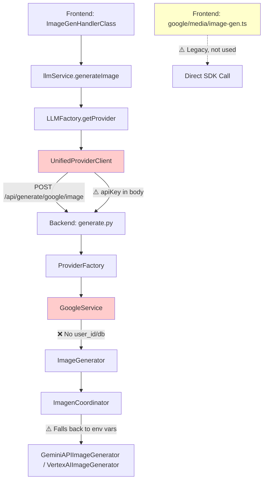
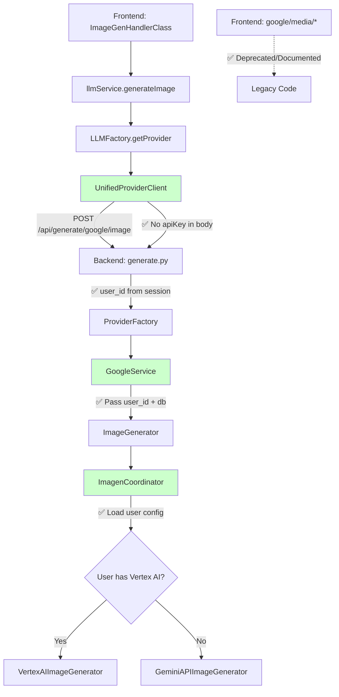

# Design Document - Google Provider Image Generation Flow Optimization

## Overview

本设计文档描述了 Google 提供商图片生成流程的优化方案，旨在解决以下核心问题：
1. API Key 在前端暴露的安全风险
2. Vertex AI 用户配置未被应用到图片生成
3. 前端遗留 SDK 代码造成的理解成本

**设计目标**：
- 统一调用流程，所有功能通过后端 API
- 消除前端 API Key 暴露
- 支持用户级 Vertex AI 配置
- 清理遗留代码，降低维护成本

**设计原则**：
- 向后兼容：不破坏现有功能
- 安全优先：敏感凭证仅在后端处理
- 模块化：保持清晰的职责边界
- 可测试：每个组件可独立测试

---

## Architecture

### Current Architecture (As-Is)



**问题标注**：
- 🔴 红色：安全问题（API Key 暴露）
- 🟡 黄色：功能缺失（Vertex AI 未应用）
- 🟠 橙色：遗留代码（理解成本）

### Target Architecture (To-Be)



**改进标注**：
- 🟢 绿色：已修复的问题
- ✅ 勾选：新增的功能

---

## Components and Interfaces

### 1. Frontend Components

#### 1.1 UnifiedProviderClient (Modified)

**职责**：统一的提供商客户端，调用后端 API

**修改内容**：
```typescript
// Before (有安全问题)
async generateImage(
    modelId: string,
    prompt: string,
    referenceImages: Attachment[],
    options: ChatOptions,
    apiKey: string,  // ❌ 暴露 API Key
    baseUrl: string
): Promise<ImageGenerationResult[]> {
    const requestBody = {
        modelId,
        prompt,
        referenceImages,
        options,
        apiKey  // ❌ 在请求体中传递
    };
}

// After (安全)
async generateImage(
    modelId: string,
    prompt: string,
    referenceImages: Attachment[],
    options: ChatOptions
    // ✅ 移除 apiKey 参数
): Promise<ImageGenerationResult[]> {
    const requestBody = {
        modelId,
        prompt,
        referenceImages,
        options
        // ✅ 不再传递 apiKey
    };
    
    // ✅ 依赖后端 session 和数据库凭证
    const response = await fetch(`/api/generate/${this.id}/image`, {
        method: 'POST',
        headers: { 'Content-Type': 'application/json' },
        credentials: 'include',  // ✅ 发送 session cookie
        body: JSON.stringify(requestBody)
    });
}
```

**接口定义**：
```typescript
interface ImageGenerationRequest {
    modelId: string;
    prompt: string;
    referenceImages: Attachment[];
    options: ChatOptions;
    // apiKey 已移除
}

interface ImageGenerationResult {
    images: GeneratedImage[];
    metadata: {
        model: string;
        prompt: string;
        timestamp: string;
    };
}
```

#### 1.2 Legacy Code Handling

**文件**：`frontend/services/providers/google/media/image-gen.ts`

**处理方案**：
1. 添加文件头部注释标注为 Legacy
2. 如果功能仍需要，迁移到后端 API
3. 如果不再使用，标记为 deprecated

```typescript
/**
 * @deprecated This file contains legacy direct SDK calls.
 * 
 * Main image generation flow now uses UnifiedProviderClient → Backend API.
 * 
 * This file is kept for:
 * - Virtual Try-On specific features
 * - Special image editing scenarios
 * 
 * DO NOT use for standard image generation.
 * 
 * @see UnifiedProviderClient for the current implementation
 */
```

---

### 2. Backend Components

#### 2.1 Generate Router (Modified)

**文件**：`backend/app/routers/generate.py`

**修改内容**：
```python
# Before
@router.post("/{provider}/image")
async def generate_image(
    provider: str,
    request_body: ImageGenerateRequest,
    user_id: str = Depends(require_user_id),
    db: Session = Depends(get_db)
):
    # ❌ 从请求体获取 API Key
    api_key = await get_api_key(provider, request_body.apiKey, user_id, db)
    
    # ❌ 未传递 user_id 和 db
    service = ProviderFactory.get_service(provider, api_key)

# After
@router.post("/{provider}/image")
async def generate_image(
    provider: str,
    request_body: ImageGenerateRequest,
    user_id: str = Depends(require_user_id),
    db: Session = Depends(get_db)
):
    # ✅ 从数据库或环境变量获取 API Key
    api_key = await get_api_key(provider, None, user_id, db)
    
    # ✅ 传递 user_id 和 db 用于 Vertex AI 配置
    service = ProviderFactory.get_service(
        provider, 
        api_key,
        user_id=user_id,  # ✅ 新增
        db=db             # ✅ 新增
    )
```

**接口定义**：
```python
class ImageGenerateRequest(BaseModel):
    modelId: str
    prompt: str
    referenceImages: List[Attachment] = []
    options: Dict[str, Any] = {}
    # apiKey 字段已移除
```


#### 2.2 ProviderFactory (Modified)

**文件**：`backend/app/services/provider_factory.py`

**修改内容**：
```python
# Before
@staticmethod
def get_service(provider: str, api_key: str) -> BaseProviderService:
    if provider == 'google':
        return GoogleService(api_key=api_key)  # ❌ 缺少参数

# After
@staticmethod
def get_service(
    provider: str, 
    api_key: str,
    user_id: Optional[str] = None,  # ✅ 新增
    db: Optional[Session] = None    # ✅ 新增
) -> BaseProviderService:
    if provider == 'google':
        return GoogleService(
            api_key=api_key,
            user_id=user_id,  # ✅ 传递
            db=db             # ✅ 传递
        )
```

#### 2.3 GoogleService (Modified)

**文件**：`backend/app/services/gemini/google_service.py`

**修改内容**：
```python
# Before
class GoogleService(BaseProviderService):
    def __init__(self, api_key: str):
        super().__init__(api_key)
        self.image_generator = ImageGenerator(api_key=api_key)  # ❌ 缺少参数

# After
class GoogleService(BaseProviderService):
    def __init__(
        self, 
        api_key: str,
        user_id: Optional[str] = None,  # ✅ 新增
        db: Optional[Session] = None    # ✅ 新增
    ):
        super().__init__(api_key)
        self.image_generator = ImageGenerator(
            api_key=api_key,
            user_id=user_id,  # ✅ 传递
            db=db             # ✅ 传递
        )
        self.user_id = user_id
        self.db = db
```

#### 2.4 ImageGenerator (Existing, No Change)

**文件**：`backend/app/services/gemini/image_generator.py`

**现有实现**（已支持 user_id 和 db）：
```python
class ImageGenerator:
    def __init__(
        self, 
        api_key: str = None,
        user_id: str = None,  # ✅ 已支持
        db: Session = None    # ✅ 已支持
    ):
        self._coordinator = ImagenCoordinator(
            user_id=user_id,
            db=db
        )
```

**说明**：ImageGenerator 已经支持 user_id 和 db 参数，无需修改。

#### 2.5 ImagenCoordinator (Existing, No Change)

**文件**：`backend/app/services/gemini/imagen_coordinator.py`

**现有实现**（已支持用户配置）：
```python
class ImagenCoordinator:
    def __init__(self, user_id: str = None, db: Session = None):
        self._user_id = user_id
        self._db = db
        self._config = self._load_config()
    
    def _load_config(self) -> Dict[str, Any]:
        config = {}
        
        # ✅ 优先级 1: 用户数据库配置
        if self._user_id and self._db:
            user_config = self._db.query(ImagenConfig).filter(
                ImagenConfig.user_id == self._user_id
            ).first()
            
            if user_config:
                config['api_mode'] = user_config.api_mode
                config['vertex_ai_project_id'] = user_config.vertex_ai_project_id
                config['vertex_ai_location'] = user_config.vertex_ai_location
                config['vertex_ai_credentials_json'] = decrypt_data(...)
        
        # ✅ 优先级 2: 环境变量
        if not config:
            config['api_mode'] = os.getenv('GOOGLE_API_MODE', 'gemini_api')
            config['vertex_ai_project_id'] = os.getenv('VERTEX_AI_PROJECT_ID')
            # ...
        
        return config
    
    def create_generator(self):
        if self._config['api_mode'] == 'vertex_ai':
            return VertexAIImageGenerator(self._config)
        else:
            return GeminiAPIImageGenerator(self._config)
```

**说明**：ImagenCoordinator 已经实现了完整的配置加载逻辑，无需修改。

---

## Data Models

### 1. Request/Response Models

#### ImageGenerateRequest (Modified)

```python
class ImageGenerateRequest(BaseModel):
    """图片生成请求模型"""
    modelId: str = Field(..., description="模型 ID，如 imagen-3.0-generate-001")
    prompt: str = Field(..., description="生成提示词")
    referenceImages: List[Attachment] = Field(default=[], description="参考图片")
    options: Dict[str, Any] = Field(default={}, description="生成选项")
    
    # ✅ 移除 apiKey 字段
    # apiKey: Optional[str] = None  # ❌ 已删除
    
    class Config:
        schema_extra = {
            "example": {
                "modelId": "imagen-3.0-generate-001",
                "prompt": "A beautiful sunset over mountains",
                "referenceImages": [],
                "options": {
                    "number_of_images": 1,
                    "aspect_ratio": "1:1"
                }
            }
        }
```

#### ImageGenerateResponse

```python
class ImageGenerateResponse(BaseModel):
    """图片生成响应模型"""
    images: List[GeneratedImage]
    metadata: ImageMetadata
    
class GeneratedImage(BaseModel):
    """生成的图片"""
    url: str
    mimeType: str
    size: Optional[int] = None
    
class ImageMetadata(BaseModel):
    """图片元数据"""
    model: str
    prompt: str
    timestamp: str
    api_mode: str  # 'gemini_api' or 'vertex_ai'
```

### 2. Database Models

#### ImagenConfig (Existing)

```python
class ImagenConfig(Base):
    """Imagen 配置表（已存在）"""
    __tablename__ = "imagen_configs"
    
    id = Column(Integer, primary_key=True)
    user_id = Column(String, ForeignKey("users.id"))
    api_mode = Column(String)  # 'gemini_api' or 'vertex_ai'
    vertex_ai_project_id = Column(String)
    vertex_ai_location = Column(String)
    vertex_ai_credentials_json = Column(Text)  # 加密存储
    created_at = Column(DateTime)
    updated_at = Column(DateTime)
```

---

## Correctness Properties

*A property is a characteristic or behavior that should hold true across all valid executions of a system—essentially, a formal statement about what the system should do. Properties serve as the bridge between human-readable specifications and machine-verifiable correctness guarantees.*

### Property Reflection

在分析验收标准后，我识别出以下可测试的属性：

**可测试属性**：
1. 调用路径验证（1.1）- 验证所有请求都通过后端 API
2. Prompt 传递验证（2.2）- 验证 prompt 正确传递到后端
3. Vertex AI 配置应用（2.3）- 验证配置正确影响 API 选择
4. 向后兼容性（3.3）- 验证修改不破坏现有功能

**属性合并分析**：
- 属性 1 和属性 2 可以合并：它们都在验证请求的正确传递
- 属性 3 独立：专门验证配置逻辑
- 属性 4 独立：验证兼容性

**最终属性列表**（3个核心属性）：
1. **请求路由和数据传递** - 合并 1.1 和 2.2
2. **Vertex AI 配置应用** - 对应 2.3
3. **向后兼容性** - 对应 3.3

---

### Property 1: 请求路由和数据完整性

*For any* 图片生成请求，系统应该通过后端 API 路由，并且 prompt 应该完整传递到后端 SDK。

**详细说明**：
- 前端调用 `UnifiedProviderClient.generateImage()`
- 请求通过 `POST /api/generate/google/image` 发送到后端
- 后端接收到的 `request_body.prompt` 应该与前端发送的 prompt 一致
- 后端调用 `service.generate_image(prompt=...)` 时应该使用接收到的 prompt

**测试策略**：
- 生成随机的 prompt 字符串
- 调用前端 API
- 在后端拦截请求，验证 prompt 字段存在且正确
- 验证后端调用 SDK 时使用了正确的 prompt

**Validates: Requirements 1.1, 2.2**

---

### Property 2: Vertex AI 配置优先级

*For any* 用户，如果数据库中存在有效的 Vertex AI 配置（project_id + credentials），系统应该使用 Vertex AI SDK；否则应该回退到 Gemini API SDK。

**详细说明**：
- 当 `ImagenCoordinator` 初始化时传入 `user_id` 和 `db`
- 如果数据库中存在该用户的 `ImagenConfig` 且 `api_mode='vertex_ai'`
- 且 `vertex_ai_project_id` 和 `vertex_ai_credentials_json` 都存在
- 则应该创建 `VertexAIImageGenerator`
- 否则应该创建 `GeminiAPIImageGenerator`

**测试策略**：
- 创建测试用户 A，配置完整的 Vertex AI 设置
- 创建测试用户 B，只配置 Gemini API Key
- 用户 A 生成图片时，验证使用了 Vertex AI SDK
- 用户 B 生成图片时，验证使用了 Gemini API SDK
- 验证配置加载的优先级：数据库 > 环境变量

**Validates: Requirements 2.3**

---

### Property 3: API 安全性（无前端密钥暴露）

*For any* 图片生成请求，前端不应该在请求体中包含 `apiKey` 字段，所有认证应该通过后端 session 和数据库凭证完成。

**详细说明**：
- 前端调用 `UnifiedProviderClient.generateImage()` 时不传递 `apiKey` 参数
- 请求体中不应该包含 `apiKey` 字段
- 后端通过 `require_user_id` 依赖注入获取用户 ID
- 后端从数据库或环境变量获取 API Key
- 前端无法访问任何 API Key

**测试策略**：
- 拦截前端发送的请求
- 验证请求体中不包含 `apiKey` 字段
- 验证后端能够从数据库获取凭证
- 验证后端能够成功调用 Google SDK

**Validates: Requirements 2.1 (间接), 3.1**

---

### Property 4: 向后兼容性

*For any* 现有的图片生成功能，修改后的系统应该保持相同的输入输出接口和行为。

**详细说明**：
- 前端 API 接口保持不变（除了移除 apiKey 参数）
- 后端 API 端点保持不变 (`/api/generate/google/image`)
- 响应格式保持不变
- 现有的图片生成功能（聊天、视频、语音）不受影响

**测试策略**：
- 使用现有的集成测试套件
- 验证所有现有测试仍然通过
- 验证响应格式与之前一致
- 验证错误处理行为一致

**Validates: Requirements 3.3**

---

## Error Handling

### 1. Frontend Error Handling

#### 1.1 Network Errors

```typescript
async generateImage(...): Promise<ImageGenerationResult[]> {
    try {
        const response = await fetch(`/api/generate/${this.id}/image`, {
            method: 'POST',
            headers: { 'Content-Type': 'application/json' },
            credentials: 'include',
            body: JSON.stringify(requestBody)
        });
        
        if (!response.ok) {
            const error = await response.json();
            throw new Error(error.detail || 'Image generation failed');
        }
        
        return await response.json();
    } catch (error) {
        if (error instanceof TypeError) {
            // 网络错误
            throw new Error('Network error: Unable to connect to server');
        }
        throw error;
    }
}
```

#### 1.2 Authentication Errors

```typescript
// 401 Unauthorized - Session 过期
if (response.status === 401) {
    throw new Error('Authentication required. Please log in again.');
}

// 403 Forbidden - 权限不足
if (response.status === 403) {
    throw new Error('You do not have permission to generate images.');
}
```

---

### 2. Backend Error Handling

#### 2.1 Configuration Errors

```python
async def generate_image(...):
    try:
        # 获取 API Key
        api_key = await get_api_key(provider, None, user_id, db)
        
        if not api_key:
            raise HTTPException(
                status_code=400,
                detail="No API key configured. Please configure your API key in settings."
            )
        
        # 创建服务
        service = ProviderFactory.get_service(provider, api_key, user_id, db)
        
    except ValueError as e:
        raise HTTPException(status_code=400, detail=str(e))
    except Exception as e:
        logger.error(f"Configuration error: {e}")
        raise HTTPException(status_code=500, detail="Configuration error")
```

#### 2.2 Vertex AI Configuration Errors

```python
class ImagenCoordinator:
    def _load_config(self) -> Dict[str, Any]:
        config = {}
        
        if self._user_id and self._db:
            user_config = self._db.query(ImagenConfig).filter(
                ImagenConfig.user_id == self._user_id
            ).first()
            
            if user_config and user_config.api_mode == 'vertex_ai':
                # 验证 Vertex AI 配置完整性
                if not user_config.vertex_ai_project_id:
                    logger.warning(f"User {self._user_id}: Missing Vertex AI project_id, falling back to Gemini API")
                    config['api_mode'] = 'gemini_api'
                elif not user_config.vertex_ai_credentials_json:
                    logger.warning(f"User {self._user_id}: Missing Vertex AI credentials, falling back to Gemini API")
                    config['api_mode'] = 'gemini_api'
                else:
                    # 配置完整，使用 Vertex AI
                    config['api_mode'] = 'vertex_ai'
                    config['vertex_ai_project_id'] = user_config.vertex_ai_project_id
                    config['vertex_ai_location'] = user_config.vertex_ai_location
                    config['vertex_ai_credentials_json'] = decrypt_data(...)
        
        # 回退到环境变量
        if not config:
            config['api_mode'] = os.getenv('GOOGLE_API_MODE', 'gemini_api')
            # ...
        
        return config
```

#### 2.3 SDK Errors

```python
async def generate_image(self, prompt: str, model: str, **kwargs):
    try:
        result = await self.image_generator.generate(
            prompt=prompt,
            model=model,
            **kwargs
        )
        return result
        
    except GoogleAPIError as e:
        # Google SDK 错误
        logger.error(f"Google API error: {e}")
        raise HTTPException(
            status_code=502,
            detail=f"Google API error: {str(e)}"
        )
    except Exception as e:
        # 未知错误
        logger.error(f"Unexpected error: {e}")
        raise HTTPException(
            status_code=500,
            detail="Internal server error"
        )
```

---

### 3. Error Response Format

**统一错误响应格式**：
```json
{
    "detail": "Error message",
    "error_code": "ERROR_CODE",
    "timestamp": "2026-01-09T12:00:00Z"
}
```

**错误代码定义**：
- `NO_API_KEY`: 未配置 API Key
- `INVALID_CONFIG`: 配置无效
- `VERTEX_AI_ERROR`: Vertex AI 错误
- `GEMINI_API_ERROR`: Gemini API 错误
- `NETWORK_ERROR`: 网络错误
- `AUTH_ERROR`: 认证错误

---

## Testing Strategy

### 1. Unit Tests

#### 1.1 Frontend Unit Tests

**测试文件**：`frontend/services/providers/UnifiedProviderClient.test.ts`

**测试用例**：
```typescript
describe('UnifiedProviderClient', () => {
    describe('generateImage', () => {
        it('should not include apiKey in request body', async () => {
            const client = new UnifiedProviderClient('google');
            const fetchSpy = jest.spyOn(global, 'fetch');
            
            await client.generateImage(
                'imagen-3.0-generate-001',
                'A beautiful sunset',
                [],
                {}
            );
            
            const requestBody = JSON.parse(fetchSpy.mock.calls[0][1].body);
            expect(requestBody).not.toHaveProperty('apiKey');
        });
        
        it('should include credentials in request', async () => {
            const client = new UnifiedProviderClient('google');
            const fetchSpy = jest.spyOn(global, 'fetch');
            
            await client.generateImage(...);
            
            const requestOptions = fetchSpy.mock.calls[0][1];
            expect(requestOptions.credentials).toBe('include');
        });
        
        it('should handle network errors', async () => {
            jest.spyOn(global, 'fetch').mockRejectedValue(new TypeError('Network error'));
            
            const client = new UnifiedProviderClient('google');
            
            await expect(client.generateImage(...)).rejects.toThrow('Network error');
        });
    });
});
```

#### 1.2 Backend Unit Tests

**测试文件**：`backend/tests/unit/test_google_service.py`

**测试用例**：
```python
class TestGoogleService:
    def test_initialization_with_user_context(self):
        """测试 GoogleService 正确传递 user_id 和 db"""
        service = GoogleService(
            api_key="test_key",
            user_id="user123",
            db=mock_db
        )
        
        assert service.user_id == "user123"
        assert service.db == mock_db
        assert service.image_generator._coordinator._user_id == "user123"
    
    def test_image_generator_receives_user_context(self):
        """测试 ImageGenerator 接收到 user_id 和 db"""
        service = GoogleService(
            api_key="test_key",
            user_id="user123",
            db=mock_db
        )
        
        assert service.image_generator._coordinator._user_id == "user123"
        assert service.image_generator._coordinator._db == mock_db
```

**测试文件**：`backend/tests/unit/test_imagen_coordinator.py`

**测试用例**：
```python
class TestImagenCoordinator:
    def test_load_vertex_ai_config_from_database(self):
        """测试从数据库加载 Vertex AI 配置"""
        # 创建测试用户配置
        user_config = ImagenConfig(
            user_id="user123",
            api_mode="vertex_ai",
            vertex_ai_project_id="test-project",
            vertex_ai_location="us-central1",
            vertex_ai_credentials_json=encrypt_data(...)
        )
        mock_db.add(user_config)
        
        coordinator = ImagenCoordinator(user_id="user123", db=mock_db)
        config = coordinator._config
        
        assert config['api_mode'] == 'vertex_ai'
        assert config['vertex_ai_project_id'] == 'test-project'
    
    def test_fallback_to_gemini_api_when_no_vertex_config(self):
        """测试当没有 Vertex AI 配置时回退到 Gemini API"""
        coordinator = ImagenCoordinator(user_id="user456", db=mock_db)
        config = coordinator._config
        
        assert config['api_mode'] == 'gemini_api'
    
    def test_fallback_when_vertex_config_incomplete(self):
        """测试当 Vertex AI 配置不完整时回退"""
        user_config = ImagenConfig(
            user_id="user789",
            api_mode="vertex_ai",
            vertex_ai_project_id="test-project",
            # 缺少 credentials
        )
        mock_db.add(user_config)
        
        coordinator = ImagenCoordinator(user_id="user789", db=mock_db)
        config = coordinator._config
        
        assert config['api_mode'] == 'gemini_api'  # 回退
```

---

### 2. Property-Based Tests

**测试框架**：Hypothesis (Python), fast-check (TypeScript)

**配置**：每个属性测试运行 100 次迭代

#### 2.1 Property 1: 请求路由和数据完整性

**测试文件**：`backend/tests/property/test_image_generation_flow.py`

```python
from hypothesis import given, strategies as st

@given(
    prompt=st.text(min_size=1, max_size=1000),
    model_id=st.sampled_from(['imagen-3.0-generate-001', 'imagen-3.0-generate-002'])
)
def test_prompt_integrity_through_backend(prompt, model_id):
    """
    Feature: google-image-gen-flow-analysis, Property 1: 请求路由和数据完整性
    
    For any prompt and model_id, the prompt should be correctly passed
    from frontend to backend SDK without modification.
    """
    # 模拟前端请求
    request_body = {
        'modelId': model_id,
        'prompt': prompt,
        'referenceImages': [],
        'options': {}
    }
    
    # 调用后端 API
    response = client.post('/api/generate/google/image', json=request_body)
    
    # 验证后端接收到正确的 prompt
    assert response.status_code == 200
    
    # 验证后端调用 SDK 时使用了正确的 prompt
    # (通过 mock 或日志验证)
    assert mock_sdk.generate_images.called
    call_args = mock_sdk.generate_images.call_args
    assert call_args.kwargs['prompt'] == prompt
```


#### 2.2 Property 2: Vertex AI 配置优先级

**测试文件**：`backend/tests/property/test_vertex_ai_config.py`

```python
from hypothesis import given, strategies as st

@given(
    has_vertex_config=st.booleans(),
    project_id=st.text(min_size=1, max_size=50) if has_vertex_config else st.none(),
    credentials=st.text(min_size=10) if has_vertex_config else st.none()
)
def test_vertex_ai_config_priority(has_vertex_config, project_id, credentials):
    """
    Feature: google-image-gen-flow-analysis, Property 2: Vertex AI 配置优先级
    
    For any user, if they have valid Vertex AI configuration, the system
    should use Vertex AI SDK; otherwise, it should fall back to Gemini API.
    """
    # 创建测试用户
    user_id = f"test_user_{uuid.uuid4()}"
    
    if has_vertex_config:
        # 创建 Vertex AI 配置
        config = ImagenConfig(
            user_id=user_id,
            api_mode='vertex_ai',
            vertex_ai_project_id=project_id,
            vertex_ai_location='us-central1',
            vertex_ai_credentials_json=encrypt_data(credentials)
        )
        db.add(config)
        db.commit()
    
    # 创建 ImagenCoordinator
    coordinator = ImagenCoordinator(user_id=user_id, db=db)
    generator = coordinator.create_generator()
    
    # 验证使用了正确的 SDK
    if has_vertex_config and project_id and credentials:
        assert isinstance(generator, VertexAIImageGenerator)
    else:
        assert isinstance(generator, GeminiAPIImageGenerator)
```

#### 2.3 Property 3: API 安全性

**测试文件**：`frontend/tests/property/test_api_security.test.ts`

```typescript
import fc from 'fast-check';

describe('Property 3: API Security', () => {
    it('should never include apiKey in request body', () => {
        /**
         * Feature: google-image-gen-flow-analysis, Property 3: API 安全性
         * 
         * For any image generation request, the frontend should not include
         * apiKey in the request body.
         */
        fc.assert(
            fc.property(
                fc.string({ minLength: 1, maxLength: 1000 }), // prompt
                fc.constantFrom('imagen-3.0-generate-001', 'imagen-3.0-generate-002'), // modelId
                async (prompt, modelId) => {
                    const fetchSpy = jest.spyOn(global, 'fetch');
                    
                    const client = new UnifiedProviderClient('google');
                    await client.generateImage(modelId, prompt, [], {});
                    
                    const requestBody = JSON.parse(fetchSpy.mock.calls[0][1].body);
                    
                    // 验证请求体中不包含 apiKey
                    expect(requestBody).not.toHaveProperty('apiKey');
                    expect(Object.keys(requestBody)).not.toContain('apiKey');
                }
            ),
            { numRuns: 100 }
        );
    });
});
```

#### 2.4 Property 4: 向后兼容性

**测试文件**：`backend/tests/property/test_backward_compatibility.py`

```python
from hypothesis import given, strategies as st

@given(
    prompt=st.text(min_size=1, max_size=1000),
    model_id=st.sampled_from(['imagen-3.0-generate-001', 'imagen-3.0-generate-002']),
    num_images=st.integers(min_value=1, max_value=4)
)
def test_backward_compatibility(prompt, model_id, num_images):
    """
    Feature: google-image-gen-flow-analysis, Property 4: 向后兼容性
    
    For any valid image generation request, the modified system should
    maintain the same input/output interface and behavior.
    """
    # 构造请求
    request_body = {
        'modelId': model_id,
        'prompt': prompt,
        'referenceImages': [],
        'options': {
            'number_of_images': num_images
        }
    }
    
    # 调用 API
    response = client.post('/api/generate/google/image', json=request_body)
    
    # 验证响应格式
    assert response.status_code == 200
    data = response.json()
    
    # 验证响应结构与之前一致
    assert 'images' in data
    assert 'metadata' in data
    assert isinstance(data['images'], list)
    assert len(data['images']) == num_images
    
    # 验证每个图片对象的结构
    for image in data['images']:
        assert 'url' in image
        assert 'mimeType' in image
```

---

### 3. Integration Tests

#### 3.1 End-to-End Flow Test

**测试文件**：`backend/tests/integration/test_image_generation_e2e.py`

```python
class TestImageGenerationE2E:
    def test_complete_flow_with_vertex_ai(self):
        """测试完整的 Vertex AI 流程"""
        # 1. 创建用户和配置
        user = create_test_user()
        config = create_vertex_ai_config(user.id)
        
        # 2. 登录获取 session
        session = login_user(user)
        
        # 3. 发送图片生成请求
        response = client.post(
            '/api/generate/google/image',
            json={
                'modelId': 'imagen-3.0-generate-001',
                'prompt': 'A beautiful sunset',
                'referenceImages': [],
                'options': {}
            },
            cookies={'session': session}
        )
        
        # 4. 验证响应
        assert response.status_code == 200
        data = response.json()
        assert len(data['images']) > 0
        assert data['metadata']['api_mode'] == 'vertex_ai'
    
    def test_complete_flow_with_gemini_api(self):
        """测试完整的 Gemini API 流程"""
        # 1. 创建用户（无 Vertex AI 配置）
        user = create_test_user()
        
        # 2. 登录获取 session
        session = login_user(user)
        
        # 3. 发送图片生成请求
        response = client.post(
            '/api/generate/google/image',
            json={
                'modelId': 'imagen-3.0-generate-001',
                'prompt': 'A beautiful sunset',
                'referenceImages': [],
                'options': {}
            },
            cookies={'session': session}
        )
        
        # 4. 验证响应
        assert response.status_code == 200
        data = response.json()
        assert len(data['images']) > 0
        assert data['metadata']['api_mode'] == 'gemini_api'
    
    def test_fallback_when_vertex_ai_fails(self):
        """测试 Vertex AI 失败时的回退逻辑"""
        # 1. 创建用户和无效的 Vertex AI 配置
        user = create_test_user()
        config = create_invalid_vertex_ai_config(user.id)
        
        # 2. 发送请求
        session = login_user(user)
        response = client.post(
            '/api/generate/google/image',
            json={
                'modelId': 'imagen-3.0-generate-001',
                'prompt': 'A beautiful sunset',
                'referenceImages': [],
                'options': {}
            },
            cookies={'session': session}
        )
        
        # 3. 验证回退到 Gemini API
        assert response.status_code == 200
        data = response.json()
        assert data['metadata']['api_mode'] == 'gemini_api'
```

---

### 4. Test Coverage Goals

| 组件 | 单元测试覆盖率 | 集成测试覆盖率 |
|------|--------------|--------------|
| UnifiedProviderClient | > 90% | > 80% |
| Generate Router | > 85% | > 90% |
| GoogleService | > 90% | > 85% |
| ImageGenerator | > 85% | > 80% |
| ImagenCoordinator | > 95% | > 90% |

**总体目标**：
- 后端代码覆盖率 > 85%
- 前端代码覆盖率 > 75%
- 所有核心路径 100% 覆盖

---

## Implementation Notes

### 1. Migration Strategy

**阶段 1：后端修改（无破坏性）**
1. 修改 `ProviderFactory.get_service()` 添加可选参数
2. 修改 `GoogleService.__init__()` 添加可选参数
3. 修改 `generate.py` 传递 user_id 和 db
4. 测试验证 Vertex AI 配置生效

**阶段 2：前端修改（破坏性）**
1. 修改 `UnifiedProviderClient.generateImage()` 移除 apiKey 参数
2. 更新所有调用点
3. 测试验证功能正常

**阶段 3：清理遗留代码**
1. 标注 `google/media/image-gen.ts` 为 legacy
2. 迁移特殊功能到后端 API（如果需要）
3. 更新文档

### 2. Rollback Plan

如果出现问题，可以快速回滚：

**回滚步骤**：
1. 恢复 `UnifiedProviderClient.generateImage()` 的 apiKey 参数
2. 恢复前端调用点
3. 后端保持兼容（可选参数不影响）

**回滚时间**：< 30 分钟

### 3. Monitoring and Logging

**关键日志点**：
```python
# ImagenCoordinator
logger.info(f"User {user_id}: Using {api_mode} for image generation")
logger.warning(f"User {user_id}: Vertex AI config incomplete, falling back to Gemini API")

# Generate Router
logger.info(f"Image generation request: user={user_id}, model={model_id}, api_mode={api_mode}")
logger.error(f"Image generation failed: user={user_id}, error={error}")
```

**监控指标**：
- Vertex AI 使用率
- Gemini API 使用率
- 回退次数
- 错误率
- 响应时间

---

## Summary

本设计文档提供了 Google 提供商图片生成流程优化的完整方案：

**核心改进**：
1. ✅ 消除前端 API Key 暴露
2. ✅ 支持用户级 Vertex AI 配置
3. ✅ 清理遗留代码
4. ✅ 保持向后兼容

**实施策略**：
- 分阶段实施，降低风险
- 完整的测试覆盖
- 快速回滚能力
- 详细的监控和日志

**下一步**：
创建 tasks.md 文档，列出具体的实现任务。

