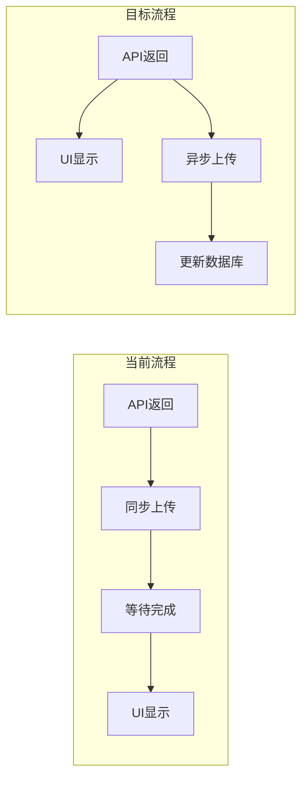
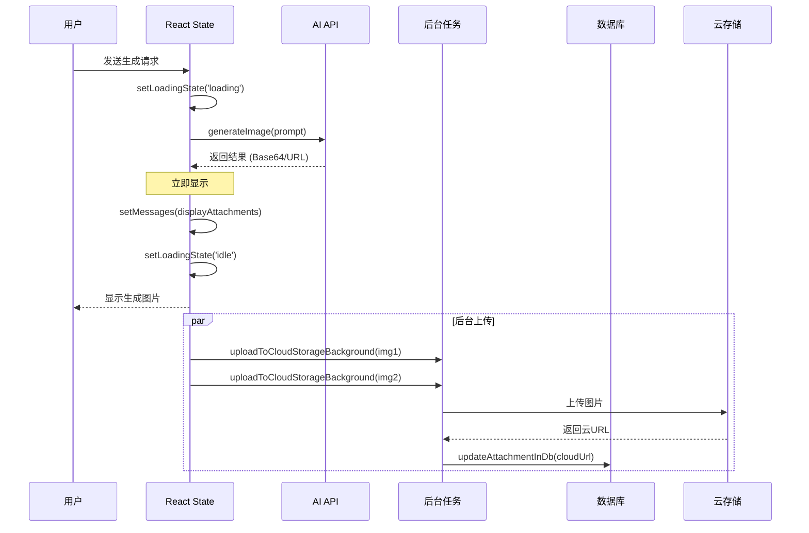
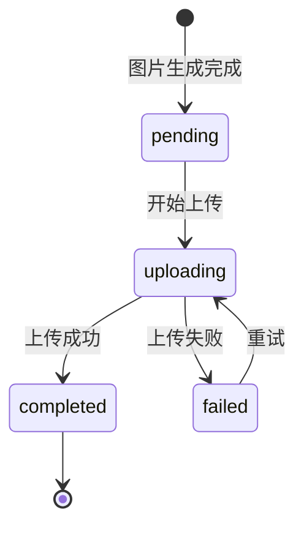

# Design Document: Non-Blocking Image Generation Display

## Overview

本设计文档描述如何重构图片生成模式（`image-gen`、`image-edit`、`image-outpainting`）的处理流程，实现"先显示、后上传"的非阻塞架构。核心思想是将 UI 显示和云存储上传解耦，让用户在 AI API 返回结果后立即看到生成的图片，同时在后台异步完成云存储上传。

## Architecture

### 当前架构（阻塞式）

```
用户发送 → API调用 → [等待上传1] → [等待上传2] → [等待上传N] → UI显示
                     ↑_____________阻塞区域_____________↑
```

### 目标架构（非阻塞式）

```
用户发送 → API调用 → UI显示（本地URL）
                  ↘
                    后台上传 → 更新数据库（云URL）
```

### 流程对比



## Components and Interfaces

### 1. 修改文件清单

| 文件路径 | 修改类型 | 说明 |
|----------|----------|------|
| `frontend/hooks/useChat.ts` | 重构 | 分离显示逻辑和上传逻辑 |
| `frontend/hooks/handlers/attachmentUtils.ts` | 新增函数 | 添加后台上传回调机制 |

### 2. 核心接口变更

#### 2.1 新增：后台上传函数

```typescript
/**
 * 异步上传图片到云存储（不阻塞，完成后回调更新数据库）
 */
export const uploadToCloudStorageBackground = (
  imageSource: string | File,
  filename: string,
  onComplete: (cloudUrl: string) => void,
  onError?: (error: Error) => void
): void => {
  // 立即返回，不等待
  uploadToCloudStorageSync(imageSource, filename)
    .then(cloudUrl => {
      if (cloudUrl) {
        onComplete(cloudUrl);
      } else {
        onError?.(new Error('Upload failed'));
      }
    })
    .catch(error => {
      onError?.(error);
    });
};
```

#### 2.2 修改：useChat 中的 image-gen 处理逻辑

```typescript
// 伪代码展示核心变更
if (mode === 'image-gen' || mode === 'image-edit') {
  const results = await llmService.generateImage(text, processedAttachments);
  
  // 1. 立即构建显示用附件（本地URL）
  const displayAttachments = results.map(res => ({
    id: uuidv4(),
    url: res.url,  // Base64 或 Blob URL
    uploadStatus: 'pending'
  }));
  
  // 2. 立即更新UI（不等待上传）
  setMessages(prev => prev.map(msg => 
    msg.id === modelMessageId 
      ? { ...msg, content: finalContent, attachments: displayAttachments }
      : msg
  ));
  setLoadingState('idle');  // 立即结束loading
  
  // 3. 后台异步上传（fire-and-forget）
  displayAttachments.forEach((att, index) => {
    uploadToCloudStorageBackground(
      results[index].url,
      att.name,
      (cloudUrl) => {
        // 上传完成后更新数据库
        updateAttachmentInDb(sessionId, modelMessageId, att.id, cloudUrl);
      }
    );
  });
}
```

### 3. 数据流图



## Data Models

### Attachment 状态流转



### 附件数据结构

```typescript
interface Attachment {
  id: string;
  mimeType: string;
  name: string;
  url: string;           // 显示用URL（本地或云）
  tempUrl?: string;      // 临时本地URL（用于显示）
  uploadStatus: 'pending' | 'uploading' | 'completed' | 'failed';
}
```

## Correctness Properties

*A property is a characteristic or behavior that should hold true across all valid executions of a system-essentially, a formal statement about what the system should do. Properties serve as the bridge between human-readable specifications and machine-verifiable correctness guarantees.*

### Property 1: Immediate Display with Local URL

*For any* generated image result from the AI API, the UI SHALL display the image using a local URL (Base64 or Blob) before any cloud upload operation completes.

**Validates: Requirements 1.1, 1.2**

### Property 2: Loading State Transition

*For any* successful image generation, the `loadingState` SHALL transition to `'idle'` immediately after API returns, not after upload completes.

**Validates: Requirements 2.1, 2.2**

### Property 3: Non-Blocking Upload

*For any* cloud upload operation initiated after image generation, the upload function SHALL return control to the caller within 50ms without waiting for the upload to complete.

**Validates: Requirements 3.2, 3.4**

### Property 4: Display URL Stability

*For any* displayed image, the URL used for rendering SHALL remain unchanged while the background upload is in progress.

**Validates: Requirements 1.3**

### Property 5: Database URL Correctness

*For any* attachment saved to the database after upload completes, the URL SHALL be a cloud storage URL (starting with `http://` or `https://`), not a local URL.

**Validates: Requirements 4.1, 4.4, 5.3**

### Property 6: Separation of Display and Database Attachments

*For any* image generation result, the system SHALL maintain two separate attachment arrays: `displayAttachments` with local URLs for UI, and `dbAttachments` with cloud URLs for persistence.

**Validates: Requirements 5.1, 5.2, 5.3**

### Property 7: Pending Image Filtering

*For any* attachment with `uploadStatus: 'pending'` and an empty `url` field, the UI SHALL filter it out from the display list.

**Validates: Requirements 4.3**

## Error Handling

### 上传失败处理

```typescript
uploadToCloudStorageBackground(
  imageSource,
  filename,
  (cloudUrl) => {
    // 成功：更新数据库
    updateAttachmentInDb(sessionId, messageId, attachmentId, cloudUrl, 'completed');
  },
  (error) => {
    // 失败：记录错误，标记状态
    console.error('[Background Upload] Failed:', error);
    updateAttachmentStatusInDb(sessionId, messageId, attachmentId, 'failed');
  }
);
```

### 错误恢复策略

| 错误类型 | 处理方式 |
|----------|----------|
| 网络错误 | 标记 `uploadStatus: 'failed'`，用户可手动重试 |
| 云存储配额不足 | 记录日志，保留本地URL显示 |
| 文件格式错误 | 跳过上传，保留本地URL |

## Testing Strategy

### 单元测试

1. **`uploadToCloudStorageBackground` 函数测试**
   - 验证函数立即返回（不阻塞）
   - 验证成功回调被正确调用
   - 验证失败回调被正确调用

2. **`useChat` 图片生成流程测试**
   - 验证 `setMessages` 在 API 返回后立即被调用
   - 验证 `setLoadingState('idle')` 在上传前被调用
   - 验证 `displayAttachments` 使用本地 URL

### 属性测试（Property-Based Testing）

使用 `fast-check` 库进行属性测试：

1. **Property 1 测试**：生成随机图片结果，验证显示 URL 是本地格式
2. **Property 3 测试**：测量上传函数返回时间，验证 < 50ms
3. **Property 5 测试**：生成随机附件，验证数据库保存的 URL 是云存储格式
4. **Property 7 测试**：生成随机附件列表（含 pending 状态），验证过滤逻辑

### 集成测试

1. **端到端流程测试**
   - 模拟完整的图片生成流程
   - 验证 UI 显示时机
   - 验证数据库最终状态

2. **页面刷新测试**
   - 生成图片后刷新页面
   - 验证图片从云存储正确加载
