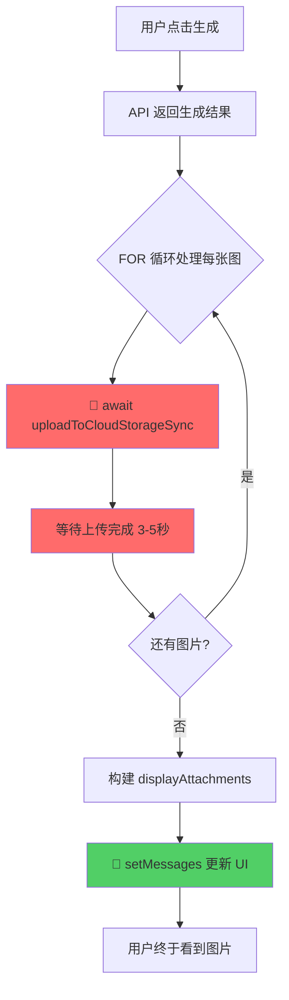
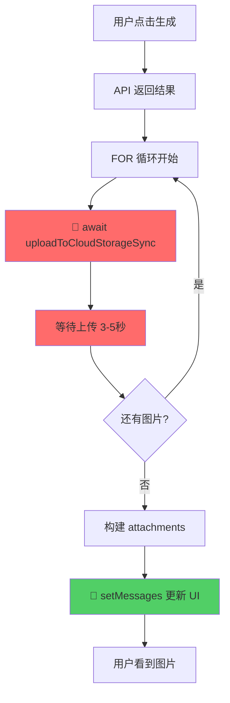
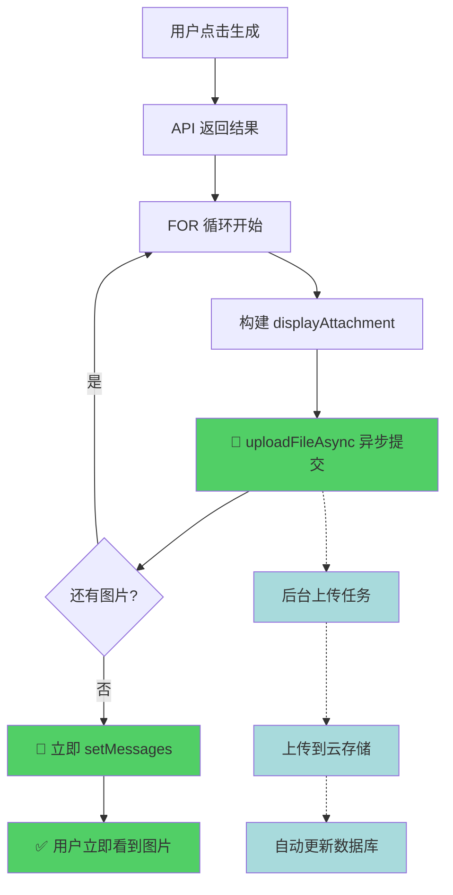

# Gen 模式 UI 阻塞问题分析报告

## 问题概述

在 `image-gen` 和 `image-edit` 模式下，前端 UI 显示被阻塞，用户必须等待文件上传完成后才能看到生成的图片。

## 根本原因

**前端使用了同步上传 `await uploadToCloudStorageSync()`，导致 UI 渲染被阻塞。**

## 详细流程分析

### 当前实现流程（存在阻塞）

```
┌─────────────────────────────────────────────────────────────────────┐
│  useChat.ts (image-gen 模式) - Line 141-239                         │
└─────────────────────────────────────────────────────────────────────┘

1. 用户点击生成 ──> sendMessage() 被调用
                     │
                     ▼
2. 调用 API 生成图片
   llmService.generateImage(text, attachments)
   ✅ 返回结果数组 results[]
                     │
                     ▼
┌────────────────────────────────────────────────────────────────────┐
│  3. FOR 循环处理每个生成结果 (Line 151-199)                        │
│                                                                     │
│    for (let index = 0; index < results.length; index++) {         │
│      const res = results[index];                                   │
│                                                                     │
│      let displayUrl = res.url;  // 设置显示 URL                    │
│      let cloudUrl = '';                                            │
│                                                                     │
│      // 🚨 阻塞点 1: 同步上传 Base64/Blob                          │
│      if (res.url.startsWith('data:') || res.url.startsWith('blob:')) {│
│        console.log(`[useChat] ${mode} 结果图上传到云存储...`);     │
│        ⏸️ cloudUrl = await uploadToCloudStorageSync(res.url, ...); │
│           │                                                         │
│           │ 等待上传完成...（可能需要 3-5 秒）                     │
│           │                                                         │
│           └─> 上传完成后才继续                                     │
│      }                                                              │
│                                                                     │
│      // 🚨 阻塞点 2: 远程 URL 下载并上传                           │
│      else if (res.url.startsWith('http://') || ...) {             │
│        ⏸️ const response = await fetch(res.url);                   │
│        ⏸️ const blob = await response.blob();                      │
│           displayUrl = URL.createObjectURL(blob);                  │
│        ⏸️ cloudUrl = await uploadToCloudStorageSync(file, ...);    │
│      }                                                              │
│                                                                     │
│      // 构建前端显示附件                                           │
│      displayAttachments.push({ url: displayUrl, ... });           │
│      // 构建数据库保存附件                                         │
│      dbAttachments.push({ url: cloudUrl, ... });                  │
│    }                                                                │
│                                                                     │
└────────────────────────────────────────────────────────────────────┘
                     │
                     ▼
4. FOR 循环结束后，设置前端显示
   resultArray = displayAttachments;  (Line 232)
                     │
                     ▼
5. 🎨 更新 UI - 用户终于看到图片！(Line 350)
   setMessages(prev => prev.map(...))
```

### uploadToCloudStorageSync 内部流程

```
┌─────────────────────────────────────────────────────────────────────┐
│  attachmentUtils.ts:uploadToCloudStorageSync (Line 66-112)         │
└─────────────────────────────────────────────────────────────────────┘

1. 接收参数 (imageSource, filename)
                     │
                     ▼
2. 类型检测和转换
   ├─ File 对象 ──> 直接使用
   ├─ Base64 URL ──> ⏸️ await base64ToFile()
   └─ Blob URL ──> ⏸️ await fetch() + blob.arrayBuffer()
                     │
                     ▼
3. 🚨 同步上传文件（最大阻塞点）
   ⏸️ const result = await storageUpload.uploadFile(file);
      │
      │ 等待网络 I/O...
      │ - 上传到云存储服务器
      │ - 等待服务器响应
      │ - 可能需要 2-6 秒（取决于文件大小和网络）
      │
      └─> 返回云存储 URL
                     │
                     ▼
4. 返回结果
   return result.url;  // 或 '' 如果失败
```

## 日志证据

从 `log.md` 可以清楚看到执行顺序（单个图片示例）：

```
Line 3:  [useChat] image-gen 结果图上传到云存储...
Line 4:  [uploadToCloudStorageSync] 开始同步上传: {type: 'Base64', ...}
Line 5:  [uploadToCloudStorageSync] Base64 已转换为 File: ... 397986
Line 6:  ✅ [StorageUpload] 后端 API 可用 - 使用后端上传
Line 7:  [uploadToCloudStorageSync] 上传成功: https://img.dicry.com/...
Line 8:  [useChat] image-gen 结果图 - 显示URL: data:image/jpeg;base64,...
Line 9:  [useChat] image-gen 结果图 - 云存储URL: https://img.dicry.com/...
```

**关键观察**：Line 8-9 的日志在 Line 7（上传成功）之后才打印，说明代码在等待上传完成。

## 时间成本估算

假设生成 4 张图片，每张上传需要 3 秒：

```
┌─────────────────────────────────────────────────────────────────┐
│  阻塞时间线                                                      │
└─────────────────────────────────────────────────────────────────┘

T=0s    : 收到生成结果
T=0-3s  : ⏸️ 上传图片 1（UI 冻结）
T=3-6s  : ⏸️ 上传图片 2（UI 冻结）
T=6-9s  : ⏸️ 上传图片 3（UI 冻结）
T=9-12s : ⏸️ 上传图片 4（UI 冻结）
T=12s   : 🎨 UI 更新，用户看到图片

总阻塞时间: 12 秒
```

## 影响范围

受影响的模式：
- ✅ **image-gen** (Line 141-240)
- ✅ **image-edit** (Line 141-240)
- ✅ **image-outpainting** (Line 241-306) - 也使用同步上传

## 流程图总结



## 关键文件

1. **[useChat.ts](d:\gemini-main\gemini-main\frontend\hooks\useChat.ts)** (Line 141-306)
   - 问题位置：Line 164, 173, 219, 277, 288
   - 所有 `await uploadToCloudStorageSync()` 调用

2. **[attachmentUtils.ts](d:\gemini-main\gemini-main\frontend\hooks\handlers\attachmentUtils.ts)** (Line 66-112)
   - `uploadToCloudStorageSync` 函数实现
   - Line 98: `await storageUpload.uploadFile(file)` - 主要阻塞点

## 解决方案思路（仅分析，不实施）

### 方案 1: Optimistic UI + 后台上传
```
1. 立即显示本地 URL (Base64/Blob)
2. 触发后台异步上传
3. 上传完成后静默更新数据库
```

### 方案 2: 分离显示和持久化
```
1. 前端显示：使用本地 URL (displayUrl)
2. 数据库保存：等待云 URL (cloudUrl)
3. 关键：先更新 UI，再异步更新数据库
```

### 方案 3: 并行上传
```
使用 Promise.all() 同时上传所有图片
减少总等待时间（但仍会阻塞）
```

## 结论

**当前实现使用同步串行上传导致 UI 阻塞。** 每张图片的上传都会阻塞 UI 渲染，用户体验极差。解决方案应该将显示和上传解耦，采用 Optimistic UI 模式立即显示，后台异步持久化。

---

# 第二部分：异步上传系统架构分析

## 重大发现：项目已有完整的异步上传系统！

通过深入探索，发现**项目已经实现了完整的后台异步上传系统**，无需引入 Celery！

### 现有异步上传系统架构

#### 1. 核心组件

```
┌─────────────────────────────────────────────────────────────────┐
│  前端层 (storageUpload.ts)                                      │
├─────────────────────────────────────────────────────────────────┤
│  • uploadFileAsync()      - 提交异步上传任务                    │
│  • getUploadTaskStatus()  - 查询任务状态                        │
│  • pollUploadTask()       - 轮询等待完成                        │
└─────────────────────────────────────────────────────────────────┘
                            ↓ HTTP
┌─────────────────────────────────────────────────────────────────┐
│  后端 API (storage.py)                                           │
├─────────────────────────────────────────────────────────────────┤
│  POST /api/storage/upload-async                                 │
│    ├─ 保存文件到临时目录                                        │
│    ├─ 创建 UploadTask 记录（status='pending'）                  │
│    ├─ 添加 BackgroundTasks: process_upload_task()               │
│    └─ 立即返回 taskId（不阻塞）                                 │
│                                                                  │
│  GET /api/storage/upload-status/{taskId}                        │
│    └─ 返回任务状态和结果 URL                                    │
└─────────────────────────────────────────────────────────────────┘
                            ↓ BackgroundTasks
┌─────────────────────────────────────────────────────────────────┐
│  后台任务 (process_upload_task)                                 │
├─────────────────────────────────────────────────────────────────┤
│  1. 更新状态为 'uploading'                                       │
│  2. 读取临时文件 / 下载 URL                                     │
│  3. 调用 StorageService.upload_file()                           │
│  4. 获取云存储 URL                                              │
│  5. 更新 UploadTask.status = 'completed'                        │
│  6. 🔑 调用 update_session_attachment_url()                     │
│     └─ 更新数据库中会话消息的附件 URL                           │
└─────────────────────────────────────────────────────────────────┘
                            ↓ 存储
┌─────────────────────────────────────────────────────────────────┐
│  数据库 (UploadTask 表)                                          │
├─────────────────────────────────────────────────────────────────┤
│  • id (UUID)           - 任务唯一标识                           │
│  • session_id          - 关联会话                               │
│  • message_id          - 关联消息                               │
│  • attachment_id       - 关联附件                               │
│  • source_file_path    - 临时文件路径                           │
│  • target_url          - 云存储永久 URL                         │
│  • status              - pending/uploading/completed/failed     │
│  • created_at          - 创建时间戳                             │
│  • completed_at        - 完成时间戳                             │
└─────────────────────────────────────────────────────────────────┘
```

#### 2. 关键特性

✅ **无需 Celery**：使用 FastAPI 的 BackgroundTasks 机制
✅ **任务持久化**：UploadTask 表记录所有任务状态
✅ **自动更新数据库**：后台任务完成后自动更新会话消息中的附件 URL
✅ **竞态条件处理**：重试机制等待前端消息保存完成
✅ **错误恢复**：失败任务可重试，支持 /retry-upload 端点
✅ **多源支持**：本地文件、远程 URL（DashScope 临时链接）
✅ **多存储支持**：兰空图床、阿里云 OSS

#### 3. 已实现的 API 端点

| 端点 | 方法 | 功能 | 文件位置 |
|------|------|------|---------|
| `/api/storage/upload-async` | POST | 提交异步上传任务 | storage.py:440-511 |
| `/api/storage/upload-status/{taskId}` | GET | 查询任务状态 | storage.py:567-587 |
| `/api/storage/upload-from-url` | POST | 从 URL 异步上传 | storage.py:514-564 |
| `/api/storage/retry-upload/{taskId}` | POST | 重试失败任务 | storage.py:590-617 |

#### 4. 数据库自动更新机制

**关键函数**：`update_session_attachment_url()` (storage.py:354-437)

```python
async def update_session_attachment_url(
    db: Session,
    session_id: str,
    message_id: str,
    attachment_id: str,
    url: str,
    max_retries: int = 10,
    retry_delay: float = 2.0
):
    """
    后台任务完成后，自动更新会话消息中的附件 URL

    处理竞态条件：
    - 前端并发：提交上传任务 + 保存消息
    - 重试机制：等待消息保存完成（最多 10 次，每次延迟 2 秒）
    - 深拷贝：避免 SQLAlchemy JSON 字段修改检测问题
    - flag_modified：标记字段已修改，确保持久化
    """
```

**工作流程**：
1. 查询会话记录
2. 深拷贝 messages_json（避免 SQLAlchemy 问题）
3. 查找目标消息和附件
4. 更新附件 URL 和 uploadStatus
5. 标记字段已修改 (`flag_modified()`)
6. 提交事务
7. 如果失败则重试（最多 10 次）

---

# 第三部分：优化方案设计

## 方案 2 增强版：利用现有异步上传系统

### 核心思路

**不需要重新造轮，只需改造前端调用方式！**

当前问题：
- useChat.ts 使用 `uploadToCloudStorageSync`（同步阻塞）

优化方案：
- 改用 `uploadFileAsync`（已实现，立即返回）
- 立即显示本地 URL
- 后台自动上传并更新数据库

### 改进后的流程图

```
┌─────────────────────────────────────────────────────────────────┐
│  优化后的 image-gen 流程（无阻塞）                               │
└─────────────────────────────────────────────────────────────────┘

1. 用户点击生成
                     ↓
2. 调用 API 生成图片
   llmService.generateImage()
   ✅ 返回结果数组 results[]
                     ↓
3. FOR 循环处理每个生成结果
   for (const res of results) {
     let displayUrl = res.url;  // Base64/Blob URL

     // 🎨 立即构建显示附件（不等待上传）
     displayAttachments.push({
       id: attachmentId,
       url: displayUrl,        // 本地 URL，立即显示
       uploadStatus: 'pending' // 标记为上传中
     });

     // 🚀 触发异步上传（不阻塞）
     uploadFileAsync(displayUrl, {
       sessionId,
       messageId,
       attachmentId
     }).then(result => {
       console.log('上传任务已提交:', result.taskId);
       // 可选：订阅 SSE 获取实时进度
     });

     // ❌ 不再构建 dbAttachments
     // ❌ 不再 await 上传完成
   }
                     ↓
4. 🎨 立即更新 UI（用户看到图片！）
   resultArray = displayAttachments;
   setMessages(prev => prev.map(...))
                     ↓
5. ⏱️ 后台异步进行
   - 上传到云存储
   - 后端自动更新数据库中的 URL
   - 前端无需参与
```

### 时间对比

#### 当前实现（阻塞）
```
T=0s    : 收到生成结果
T=0-3s  : ⏸️ 同步上传图片 1
T=3-6s  : ⏸️ 同步上传图片 2
T=6-9s  : ⏸️ 同步上传图片 3
T=9-12s : ⏸️ 同步上传图片 4
T=12s   : 🎨 用户终于看到图片

用户等待时间: 12 秒
```

#### 优化后实现（无阻塞）
```
T=0s    : 收到生成结果
T=0s    : 🎨 立即显示所有图片（Base64/Blob）
T=0s    : 🚀 触发 4 个异步上传任务（不阻塞）
T=0-12s : ⏱️ 后台上传进行中（用户可继续操作）
T=12s   : ✅ 数据库自动更新为云存储 URL

用户等待时间: 0 秒！
```

### 详细实现步骤

#### Step 1: 修改 useChat.ts (image-gen/image-edit 模式)

**文件**: [frontend/hooks/useChat.ts](d:\gemini-main\gemini-main\frontend\hooks\useChat.ts) (Line 141-240)

**修改内容**：
```typescript
// 当前代码（阻塞）
for (let index = 0; index < results.length; index++) {
  const res = results[index];
  let displayUrl = res.url;
  let cloudUrl = '';

  // 🚨 阻塞点
  if (res.url.startsWith('data:') || res.url.startsWith('blob:')) {
    cloudUrl = await uploadToCloudStorageSync(res.url, resultFilename);
  }

  displayAttachments.push({ url: displayUrl, ... });
  dbAttachments.push({ url: cloudUrl, ... });
}

// 改为：
for (let index = 0; index < results.length; index++) {
  const res = results[index];
  const resultAttachmentId = uuidv4();
  const resultFilename = `generated-${Date.now()}-${index + 1}.png`;

  let displayUrl = res.url; // 保持本地 URL

  // 🎨 立即显示
  displayAttachments.push({
    id: resultAttachmentId,
    mimeType: res.mimeType,
    name: resultFilename,
    url: displayUrl,
    uploadStatus: 'pending' // 标记为上传中
  });

  // 🚀 触发异步上传（不阻塞）
  if (res.url.startsWith('data:') || res.url.startsWith('blob:')) {
    uploadFileAsync(res.url, {
      sessionId: currentSessionId!,
      messageId: modelMessageId,
      attachmentId: resultAttachmentId,
      filename: resultFilename
    }).catch(err => {
      console.error('[useChat] 异步上传失败:', err);
    });
  }
}

// ❌ 删除 dbAttachments 相关代码
// ❌ 删除 _dbAttachments 临时字段
```

**关键变化**：
1. 移除所有 `await uploadToCloudStorageSync()` 调用
2. 改用 `uploadFileAsync()` 异步提交任务
3. 只构建 `displayAttachments`，不构建 `dbAttachments`
4. 立即更新 UI，不等待上传完成
5. 后端会自动更新数据库中的 URL

#### Step 2: 扩展 uploadFileAsync 支持 Base64/Blob

**文件**: [frontend/services/storage/storageUpload.ts](d:\gemini-main\gemini-main\frontend\hooks\handlers\attachmentUtils.ts)

**当前问题**：`uploadFileAsync` 只接受 `File` 对象

**解决方案**：在调用前转换
```typescript
// 在 useChat.ts 中
let fileToUpload: File;
if (res.url.startsWith('data:')) {
  fileToUpload = await base64ToFile(res.url, resultFilename);
} else if (res.url.startsWith('blob:')) {
  const response = await fetch(res.url);
  const blob = await response.blob();
  fileToUpload = new File([blob], resultFilename, { type: blob.type });
} else {
  continue; // 远程 URL 跳过
}

uploadFileAsync(fileToUpload, {
  sessionId: currentSessionId!,
  messageId: modelMessageId,
  attachmentId: resultAttachmentId
});
```

**优化**：转换是异步的，但不影响 UI 显示（因为 displayUrl 已经是 Base64/Blob）

#### Step 3: 同样优化 image-outpainting 模式

**文件**: [frontend/hooks/useChat.ts](d:\gemini-main\gemini-main\frontend\hooks\useChat.ts) (Line 241-306)

**修改要点**：
- 移除 Line 277, 288 的 `await uploadToCloudStorageSync()`
- 立即显示 Blob URL
- 异步上传原图和结果图

#### Step 4: 简化数据库保存逻辑

**文件**: [frontend/hooks/useChat.ts](d:\gemini-main\gemini-main\frontend\hooks\useChat.ts) (Line 344-374)

**当前代码**：
```typescript
// 分离前端显示和数据库保存
const dbUserAttachments = (userMessage as any)._dbAttachments || userMessage.attachments;
const dbModelAttachments = (initialModelMessage as any)._dbAttachments || resultArray;

const dbUserMessage = { ...userMessage, attachments: dbUserAttachments };
const dbModelMessage = { ...initialModelMessage, content: finalContent, attachments: dbModelAttachments };

updateSessionMessages(currentSessionId, [...messages, dbUserMessage, dbModelMessage]);
```

**改为**：
```typescript
// 直接保存（附件 URL 为本地 URL，后端会自动更新）
const finalModelMessage = { ...initialModelMessage, content: finalContent, attachments: resultArray };
setMessages(prev => prev.map(msg => msg.id === modelMessageId ? finalModelMessage : msg));

const finalMessages = [...updatedMessages, finalModelMessage];
updateSessionMessages(currentSessionId, finalMessages);
```

**说明**：
- 前端保存时，附件 URL 是本地 URL (Base64/Blob)
- 后端的 `process_upload_task()` 完成后会自动调用 `update_session_attachment_url()`
- 数据库中的 URL 会被后台更新为云存储 URL
- 前端无需关心数据库更新

---

## 可选增强：ProgressTracker 实时进度推送

### 当前 ProgressTracker 的用途

**文件**: [backend/app/services/progress_tracker.py](backend/app/services/progress_tracker.py)

目前用于浏览器操作的实时进度推送（SSE），**未用于上传任务**。

### 改造方案

#### 1. 扩展 ProgressTracker 支持上传进度

```python
# backend/app/services/progress_tracker.py

class ProgressTracker:
    # ... 现有代码 ...

    async def send_upload_progress(
        self,
        task_id: str,
        progress: float,      # 0-100
        status: str,          # 'uploading' / 'completed' / 'failed'
        target_url: str = None,
        error: str = None
    ):
        """发送上传进度更新"""
        message = {
            "type": "upload_progress",
            "taskId": task_id,
            "progress": progress,
            "status": status,
            "targetUrl": target_url,
            "error": error,
            "timestamp": int(time.time() * 1000)
        }
        await self.send_progress(task_id, f"Upload {status}", status, message)
```

#### 2. 在上传任务中集成进度推送

```python
# backend/app/routers/storage.py

async def process_upload_task(task_id: str, _db: Session = None):
    from app.main import progress_tracker  # 导入全局实例

    try:
        # 开始上传
        await progress_tracker.send_upload_progress(task_id, 0, 'uploading')

        # 读取文件
        content = await read_source_content(...)
        await progress_tracker.send_upload_progress(task_id, 30, 'uploading')

        # 上传到云存储
        result = await StorageService.upload_file(...)
        await progress_tracker.send_upload_progress(task_id, 80, 'uploading')

        # 更新数据库
        await update_session_attachment_url(...)
        await progress_tracker.send_upload_progress(task_id, 100, 'completed', target_url=result['url'])

    except Exception as e:
        await progress_tracker.send_error(task_id, str(e))
        await progress_tracker.send_upload_progress(task_id, 0, 'failed', error=str(e))
```

#### 3. 添加 SSE 端点

```python
# backend/app/main.py

@app.get("/api/storage/upload-progress/{task_id}")
async def upload_progress_stream(task_id: str, request: Request):
    """实时推送上传进度（SSE）"""
    async def event_generator():
        queue = await progress_tracker.subscribe(task_id)
        try:
            while True:
                if await request.is_disconnected():
                    break
                message = await asyncio.wait_for(queue.get(), timeout=30.0)
                yield f"data: {json.dumps(message)}\n\n"
                if message.get("status") in ["completed", "error", "failed"]:
                    break
        finally:
            await progress_tracker.unsubscribe(task_id, queue)

    return StreamingResponse(event_generator(), media_type="text/event-stream")
```

#### 4. 前端订阅 SSE

```typescript
// frontend/services/storage/storageUpload.ts

async uploadFileAsyncWithProgress(
  file: File,
  options: { sessionId: string; messageId: string; attachmentId: string },
  onProgress?: (progress: number) => void
): Promise<string> {
  // 1. 提交任务
  const { taskId } = await this.uploadFileAsync(file, options);

  // 2. 订阅 SSE 获取实时进度
  const eventSource = new EventSource(`/api/storage/upload-progress/${taskId}`);

  return new Promise((resolve, reject) => {
    eventSource.onmessage = (event) => {
      const data = JSON.parse(event.data);

      if (onProgress && data.progress !== undefined) {
        onProgress(data.progress);
      }

      if (data.status === 'completed') {
        eventSource.close();
        resolve(data.targetUrl);
      } else if (data.status === 'failed') {
        eventSource.close();
        reject(new Error(data.error || '上传失败'));
      }
    };

    eventSource.onerror = () => {
      eventSource.close();
      // 降级为轮询
      this.pollUploadTask(taskId).then(resolve).catch(reject);
    };
  });
}
```

#### 5. UI 显示进度条

```typescript
// frontend/hooks/useChat.ts

uploadFileAsyncWithProgress(fileToUpload, options, (progress) => {
  // 更新消息中的附件上传进度
  setMessages(prev => prev.map(msg => {
    if (msg.id === modelMessageId) {
      return {
        ...msg,
        attachments: msg.attachments.map(att =>
          att.id === resultAttachmentId
            ? { ...att, uploadProgress: progress }
            : att
        )
      };
    }
    return msg;
  }));
});
```

### ProgressTracker 方案的优缺点

#### 优点
✅ 实时反馈：用户看到上传进度条
✅ 更好的体验：知道上传在进行中
✅ 降级支持：SSE 失败自动降级为轮询
✅ 无需轮询：减少 HTTP 请求

#### 缺点
⚠️ 复杂度增加：需要维护 SSE 连接
⚠️ 内存占用：ProgressTracker 保持订阅队列
⚠️ 单机限制：仅适合单进程部署

#### 建议
- **MVP 阶段**：不需要 ProgressTracker，异步上传已足够
- **生产阶段**：可选添加 SSE 进度推送提升体验

---

## 关键文件清单

### 需要修改的文件

1. **[frontend/hooks/useChat.ts](d:\gemini-main\gemini-main\frontend\hooks\useChat.ts)**
   - Line 141-240: image-gen/image-edit 模式
   - Line 241-306: image-outpainting 模式
   - Line 344-374: 数据库保存逻辑
   - 修改内容：
     - 移除所有 `await uploadToCloudStorageSync()` 调用
     - 改用 `uploadFileAsync()` 异步提交
     - 移除 `_dbAttachments` 分离逻辑
     - 立即更新 UI，不等待上传

2. **[frontend/hooks/handlers/attachmentUtils.ts](d:\gemini-main\gemini-main\frontend\hooks\handlers\attachmentUtils.ts)**
   - 可选：添加 `uploadFileAsyncWithProgress()` 方法
   - 可选：集成 SSE 进度订阅

### 无需修改的文件（已完备）

1. **[backend/app/routers/storage.py](backend/app/routers/storage.py)**
   - 已有 `upload_file_async()` 端点 (Line 440-511)
   - 已有 `process_upload_task()` 后台任务 (Line 227-351)
   - 已有 `update_session_attachment_url()` 自动更新 (Line 354-437)
   - 已有 `get_upload_status()` 状态查询 (Line 567-587)

2. **[backend/app/models/db_models.py](backend/app/models/db_models.py)**
   - 已有 `UploadTask` 模型 (Line 145-179)

3. **[frontend/services/storage/storageUpload.ts](frontend/services/storage/storageUpload.ts)**
   - 已有 `uploadFileAsync()` 方法 (Line 388-435)
   - 已有 `pollUploadTask()` 轮询机制 (Line 538-565)
   - 已有 `getUploadTaskStatus()` 状态查询 (Line 499-528)

### 可选增强的文件

1. **[backend/app/services/progress_tracker.py](backend/app/services/progress_tracker.py)**
   - 可选：添加 `send_upload_progress()` 方法
   - 可选：扩展支持上传任务

2. **[backend/app/main.py](backend/app/main.py)**
   - 可选：添加 `/api/storage/upload-progress/{task_id}` SSE 端点

---

## 实施优先级

### Phase 1: 核心优化（必需）
1. ✅ 修改 useChat.ts image-gen/image-edit 模式
2. ✅ 修改 useChat.ts image-outpainting 模式
3. ✅ 简化数据库保存逻辑
4. ✅ 测试异步上传和自动更新

### Phase 2: 可选增强
1. ⭐ 添加 ProgressTracker 上传进度支持
2. ⭐ 添加 SSE 进度端点
3. ⭐ 前端显示上传进度条

---

## 最终流程图对比

### 当前流程（阻塞）


### 优化后流程（无阻塞）


---

## 总结

### 核心优势
1. ✅ **无需引入新依赖**：利用现有 BackgroundTasks 系统
2. ✅ **后端已完备**：只需修改前端调用方式
3. ✅ **自动更新数据库**：后台任务自动更新会话消息
4. ✅ **用户体验极大提升**：从 12 秒等待降至 0 秒
5. ✅ **错误恢复**：支持任务重试和状态查询

### 实施难度
- **前端修改**：中等（需要修改 useChat.ts 核心逻辑）
- **后端修改**：无（已完备）
- **测试难度**：低（逻辑简单，容易验证）

### 风险评估
- **低风险**：利用成熟的异步上传系统
- **无破坏性**：不影响现有功能
- **易回滚**：修改集中在前端，易于回滚

### 建议
**优先实施 Phase 1（核心优化）**，显著提升用户体验，Phase 2（进度条）可作为后续优化。
