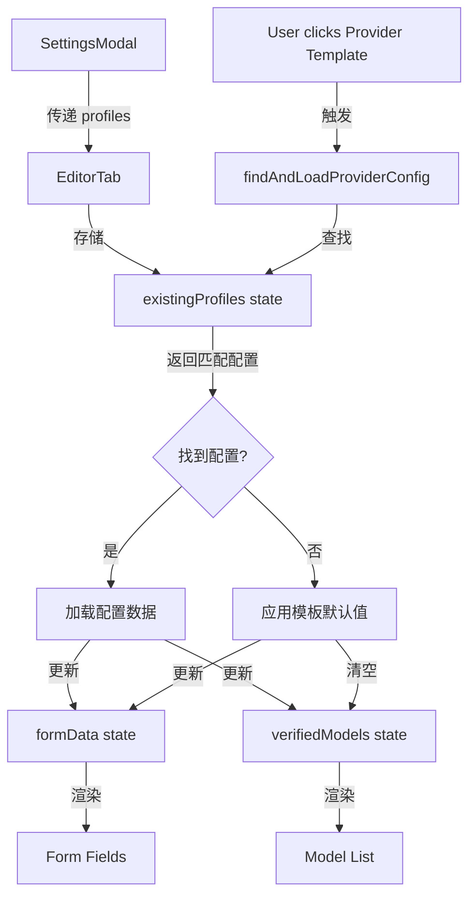

# Design Document: Provider Template Smart Switch

## Overview

实现智能 Provider Template 切换功能，通过在 EditorTab 中访问所有已有配置，当用户切换 Provider Template 时自动查找并加载该 Provider 对应的配置数据，实现快速切换和配置复用。

## Architecture

### 组件关系

```
SettingsModal
  ├─ profiles: ConfigProfile[]  (从 API 加载)
  ├─ EditorTab
  │   ├─ initialData: ConfigProfile | null  (当前编辑的配置)
  │   ├─ existingProfiles: ConfigProfile[]  (所有配置，用于查找)
  │   ├─ formData: ConfigProfile | null  (表单状态)
  │   ├─ verifiedModels: ModelConfig[]  (已验证的模型列表)
  │   └─ Provider Template Buttons
  │       └─ onClick → findAndLoadProviderConfig()
  └─ ProfilesTab
```

### 数据流



## Components and Interfaces

### 1. SettingsModal 修改

**修改位置**: `frontend/components/modals/SettingsModal.tsx`

**变更**:
```typescript
// 传递 profiles 给 EditorTab
<EditorTab
    initialData={editingProfile}
    existingProfiles={profiles}  // ✅ 新增：传递所有配置
    onSave={handleSave}
    onClose={() => setActiveTab('profiles')}
    footerNode={footerNode}
/>
```

### 2. EditorTab Props 修改

**修改位置**: `frontend/components/modals/settings/EditorTab.tsx`

**变更**:
```typescript
interface EditorTabProps {
    initialData?: ConfigProfile | null;
    existingProfiles?: ConfigProfile[];  // ✅ 恢复使用，不再标记为"不再使用"
    onSave: (profile: ConfigProfile) => Promise<void>;
    onClose: () => void;
    footerNode?: HTMLDivElement | null;
}
```

### 3. 配置查找函数

**新增函数**: `findProviderConfig`

```typescript
/**
 * 根据 providerId 查找已有配置
 * 如果存在多个，返回最近更新的
 */
const findProviderConfig = (
    providerId: string,
    profiles: ConfigProfile[],
    excludeId?: string  // 排除当前编辑的配置
): ConfigProfile | null => {
    const matchingProfiles = profiles.filter(
        p => p.providerId === providerId && p.id !== excludeId
    );
    
    if (matchingProfiles.length === 0) {
        return null;
    }
    
    // 返回最近更新的配置
    return matchingProfiles.reduce((latest, current) => 
        current.updatedAt > latest.updatedAt ? current : latest
    );
};
```

### 4. Provider Template 点击处理器修改

**修改位置**: `EditorTab.tsx` Provider Template 按钮的 onClick

**编辑模式逻辑**:
```typescript
onClick={() => {
    // 查找该 Provider 的已有配置
    const existingConfig = existingProfiles 
        ? findProviderConfig(p.id, existingProfiles, formData?.id)
        : null;
    
    if (initialData) {
        // 编辑模式：完全切换到已有配置
        if (existingConfig) {
            // 找到已有配置：加载所有数据
            setFormData({ ...existingConfig });
            setVerifiedModels(existingConfig.savedModels || []);
            
            console.log('[EditorTab] Switched to existing config:', {
                providerId: p.id,
                configId: existingConfig.id.substring(0, 8) + '...',
                configName: existingConfig.name,
                savedModelsCount: existingConfig.savedModels?.length || 0
            });
        } else {
            // 未找到配置：应用模板默认值
            setFormData(prev => ({
                ...prev!,
                providerId: p.id,
                protocol: p.protocol,
                baseUrl: p.baseUrl,
                isProxy: !!p.isCustom,
                name: `${p.name} Config`,
                apiKey: '',
                savedModels: [],
                hiddenModels: [],
                cachedModelCount: 0,
                customHeaders: undefined
            }));
            setVerifiedModels([]);
            
            console.log('[EditorTab] No existing config found, applied template defaults');
        }
    } else {
        // 创建模式：基于已有配置创建
        if (existingConfig) {
            // 找到已有配置：复制数据但保持新 id
            setFormData(prev => ({
                ...prev!,
                id: prev!.id,  // 保持新 id
                name: `${p.name} Config`,  // 使用模板名称
                providerId: p.id,
                protocol: p.protocol,
                baseUrl: existingConfig.baseUrl,
                isProxy: existingConfig.isProxy,
                apiKey: existingConfig.apiKey,
                savedModels: existingConfig.savedModels || [],
                hiddenModels: existingConfig.hiddenModels || [],
                cachedModelCount: existingConfig.cachedModelCount,
                customHeaders: existingConfig.customHeaders
            }));
            setVerifiedModels(existingConfig.savedModels || []);
            
            console.log('[EditorTab] Created new config based on existing:', {
                providerId: p.id,
                sourceConfigId: existingConfig.id.substring(0, 8) + '...',
                newId: prev!.id.substring(0, 8) + '...'
            });
        } else {
            // 未找到配置：应用模板默认值
            setFormData(prev => ({
                ...prev!,
                providerId: p.id,
                protocol: p.protocol,
                baseUrl: p.baseUrl,
                isProxy: !!p.isCustom,
                name: `${p.name} Config`
            }));
            setVerifiedModels([]);
        }
    }
}}
```

## Data Models

### ConfigProfile (已存在)

```typescript
interface ConfigProfile {
    id: string;                    // UUID
    name: string;                  // 配置名称
    providerId: string;            // Provider ID (google, openai, etc.)
    apiKey: string;                // API Key
    baseUrl: string;               // Base URL
    protocol: string;              // API Protocol
    isProxy: boolean;              // 是否为代理/自定义
    hiddenModels: string[];        // 隐藏的模型 ID
    cachedModelCount?: number;     // 缓存的模型数量
    savedModels?: ModelConfig[];   // 保存的模型配置
    customHeaders?: Record<string, string>;  // 自定义请求头
    createdAt: number;             // 创建时间戳
    updatedAt: number;             // 更新时间戳
}
```

### ModelConfig (已存在)

```typescript
interface ModelConfig {
    id: string;                    // 模型 ID
    name: string;                  // 显示名称
    providerId: string;            // 所属 Provider
    contextWindow?: number;        // 上下文窗口大小
    maxOutputTokens?: number;      // 最大输出 token
    supportedFeatures?: string[];  // 支持的功能
}
```

## Correctness Properties

*属性是一个特征或行为，应该在系统的所有有效执行中保持为真——本质上是关于系统应该做什么的正式陈述。属性作为人类可读规范和机器可验证正确性保证之间的桥梁。*

### Property 1: 配置查找的确定性

*For any* providerId 和 profiles 数组，调用 findProviderConfig 两次应该返回相同的配置对象（如果存在）。

**Validates: Requirements 2.1, 2.2**

### Property 2: 编辑模式数据完整性

*For any* 已有配置，当在编辑模式下切换到该配置的 Provider 时，加载后的 formData 应该包含原配置的所有字段值。

**Validates: Requirements 3.1, 3.2, 6.1, 6.2**

### Property 3: 创建模式 ID 独立性

*For any* 已有配置，当在创建模式下基于该配置创建新配置时，新配置的 id 应该与原配置的 id 不同。

**Validates: Requirements 4.2**

### Property 4: 模型列表同步性

*For any* 配置切换操作，切换后的 verifiedModels 状态应该与 formData.savedModels 保持一致。

**Validates: Requirements 3.2, 4.1, 5.2**

### Property 5: 降级行为正确性

*For any* Provider Template 切换操作，当 existingProfiles 为 undefined 或空数组时，系统应该应用模板默认值而不是尝试查找配置。

**Validates: Requirements 8.1**

### Property 6: 最近配置优先性

*For any* providerId，如果存在多个匹配的配置，findProviderConfig 应该返回 updatedAt 值最大的配置。

**Validates: Requirements 2.2**

## Error Handling

### 1. 配置查找失败

**场景**: existingProfiles 为 undefined 或查找过程中出错

**处理**: 
- 捕获异常，记录错误日志
- 降级到模板默认值行为
- 不中断用户操作流程

### 2. 配置数据不完整

**场景**: 找到的配置缺少必需字段

**处理**:
- 验证配置对象的完整性
- 对缺失字段使用默认值
- 记录警告日志

### 3. 状态更新失败

**场景**: setFormData 或 setVerifiedModels 调用失败

**处理**:
- 使用 try-catch 包裹状态更新
- 失败时保持当前状态不变
- 向用户显示错误提示

## Testing Strategy

### Unit Tests

**测试文件**: `EditorTab.test.tsx`

1. **findProviderConfig 函数测试**
   - 测试找到单个匹配配置
   - 测试找到多个匹配配置，返回最新的
   - 测试未找到匹配配置，返回 null
   - 测试排除当前编辑的配置

2. **编辑模式切换测试**
   - 测试切换到已有配置，加载所有数据
   - 测试切换到不存在的 Provider，应用默认值
   - 测试 verifiedModels 正确更新

3. **创建模式切换测试**
   - 测试基于已有配置创建，保持新 id
   - 测试切换到不存在的 Provider，应用默认值
   - 测试 name 字段正确更新

4. **边界情况测试**
   - 测试 existingProfiles 为 undefined
   - 测试 existingProfiles 为空数组
   - 测试配置数据不完整的情况

### Property-Based Tests

**测试文件**: `EditorTab.property.test.tsx`

使用 `fast-check` 库进行属性测试，每个测试运行 100 次迭代。

1. **Property 1 测试**: 配置查找的确定性
   ```typescript
   // Feature: provider-template-smart-switch, Property 1: 配置查找的确定性
   fc.assert(
       fc.property(
           fc.string(), // providerId
           fc.array(configProfileArbitrary), // profiles
           (providerId, profiles) => {
               const result1 = findProviderConfig(providerId, profiles);
               const result2 = findProviderConfig(providerId, profiles);
               return result1 === result2;
           }
       ),
       { numRuns: 100 }
   );
   ```

2. **Property 2 测试**: 编辑模式数据完整性
   ```typescript
   // Feature: provider-template-smart-switch, Property 2: 编辑模式数据完整性
   fc.assert(
       fc.property(
           configProfileArbitrary, // existingConfig
           (existingConfig) => {
               // 模拟切换操作
               const loadedData = { ...existingConfig };
               
               // 验证所有字段都被保留
               return (
                   loadedData.id === existingConfig.id &&
                   loadedData.name === existingConfig.name &&
                   loadedData.apiKey === existingConfig.apiKey &&
                   loadedData.baseUrl === existingConfig.baseUrl &&
                   JSON.stringify(loadedData.savedModels) === JSON.stringify(existingConfig.savedModels)
               );
           }
       ),
       { numRuns: 100 }
   );
   ```

3. **Property 3 测试**: 创建模式 ID 独立性
   ```typescript
   // Feature: provider-template-smart-switch, Property 3: 创建模式 ID 独立性
   fc.assert(
       fc.property(
           configProfileArbitrary, // existingConfig
           fc.string(), // newId
           (existingConfig, newId) => {
               // 模拟创建模式的复制操作
               const newConfig = {
                   ...existingConfig,
                   id: newId
               };
               
               return newConfig.id !== existingConfig.id;
           }
       ),
       { numRuns: 100 }
   );
   ```

4. **Property 4 测试**: 模型列表同步性
   ```typescript
   // Feature: provider-template-smart-switch, Property 4: 模型列表同步性
   fc.assert(
       fc.property(
           configProfileArbitrary, // config
           (config) => {
               const formData = { ...config };
               const verifiedModels = config.savedModels || [];
               
               return JSON.stringify(verifiedModels) === JSON.stringify(formData.savedModels);
           }
       ),
       { numRuns: 100 }
   );
   ```

5. **Property 6 测试**: 最近配置优先性
   ```typescript
   // Feature: provider-template-smart-switch, Property 6: 最近配置优先性
   fc.assert(
       fc.property(
           fc.string(), // providerId
           fc.array(configProfileArbitrary, { minLength: 2 }), // profiles
           (providerId, profiles) => {
               // 设置所有配置为相同 providerId
               const sameProviderProfiles = profiles.map(p => ({
                   ...p,
                   providerId
               }));
               
               const result = findProviderConfig(providerId, sameProviderProfiles);
               
               if (result) {
                   // 验证返回的是 updatedAt 最大的
                   const maxUpdatedAt = Math.max(...sameProviderProfiles.map(p => p.updatedAt));
                   return result.updatedAt === maxUpdatedAt;
               }
               
               return true;
           }
       ),
       { numRuns: 100 }
   );
   ```

### Integration Tests

1. **完整切换流程测试**
   - 渲染 SettingsModal 和 EditorTab
   - 模拟点击 Provider Template 按钮
   - 验证表单字段和模型列表更新

2. **保存后验证测试**
   - 切换 Provider 并修改数据
   - 保存配置
   - 验证保存的数据正确

### Manual Testing Scenarios

1. **场景 1**: 编辑 Google 配置，切换到 OpenAI（已有配置）
   - 预期：加载 OpenAI 配置的所有数据
   - 验证：API Key、模型列表、baseUrl 都正确显示

2. **场景 2**: 编辑 Google 配置，切换到 Anthropic（无配置）
   - 预期：应用 Anthropic 模板默认值，清空用户数据
   - 验证：baseUrl 为模板默认值，API Key 为空

3. **场景 3**: 创建新配置，切换不同 Provider
   - 预期：基于已有配置创建，保持新 id
   - 验证：保存后创建新记录，不覆盖已有配置

4. **场景 4**: 快速连续切换多个 Provider
   - 预期：每次切换都正确加载对应数据
   - 验证：无状态混乱，数据始终一致

## Performance Considerations

### 1. 配置查找优化

- 使用 `Array.filter` 和 `Array.reduce` 的组合，时间复杂度 O(n)
- 对于大量配置（>100），考虑使用 Map 缓存 providerId → ConfigProfile 映射
- 实现示例：
  ```typescript
  const providerConfigCache = useMemo(() => {
      const cache = new Map<string, ConfigProfile>();
      existingProfiles?.forEach(profile => {
          const existing = cache.get(profile.providerId);
          if (!existing || profile.updatedAt > existing.updatedAt) {
              cache.set(profile.providerId, profile);
          }
      });
      return cache;
  }, [existingProfiles]);
  ```

### 2. 状态更新批处理

- 使用 React 18 的自动批处理特性
- 在同一个事件处理器中的多个 setState 调用会自动批处理
- 避免不必要的重渲染

### 3. 日志输出优化

- 仅在开发环境输出详细日志
- 生产环境使用精简日志
- 使用条件编译：`if (process.env.NODE_ENV === 'development')`

## Migration and Rollout

### Phase 1: 基础实现

1. 修改 SettingsModal 传递 profiles
2. 修改 EditorTab 接收 existingProfiles
3. 实现 findProviderConfig 函数
4. 修改 Provider Template 点击处理器

### Phase 2: 测试和优化

1. 编写单元测试和属性测试
2. 进行集成测试
3. 性能优化（如果需要）

### Phase 3: 用户测试

1. 内部测试各种切换场景
2. 收集用户反馈
3. 修复发现的问题

### Rollback Plan

如果发现严重问题，可以快速回滚：
1. 移除 SettingsModal 中的 existingProfiles 传递
2. EditorTab 恢复到之前的实现
3. 用户体验回到"简单模板应用"模式
