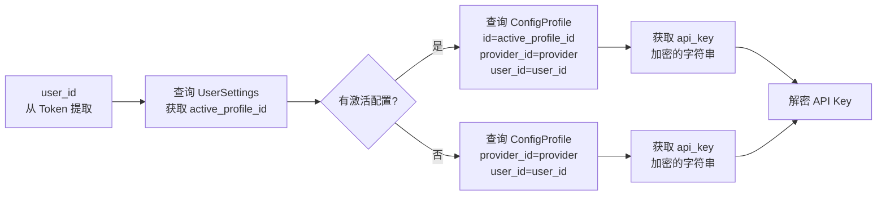
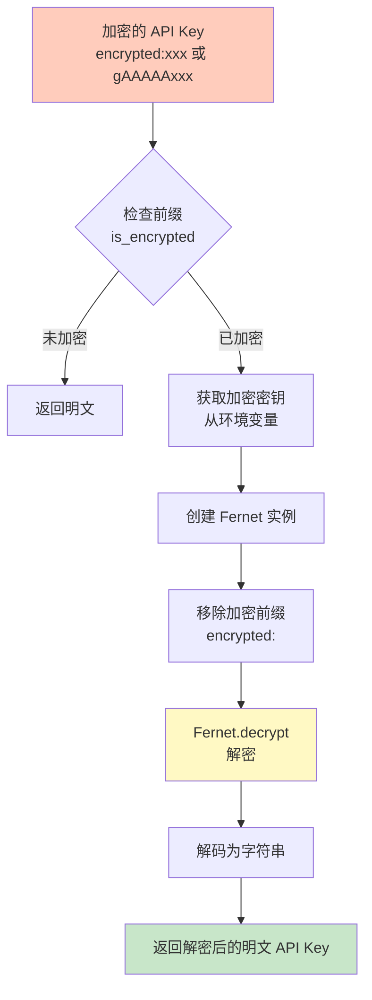
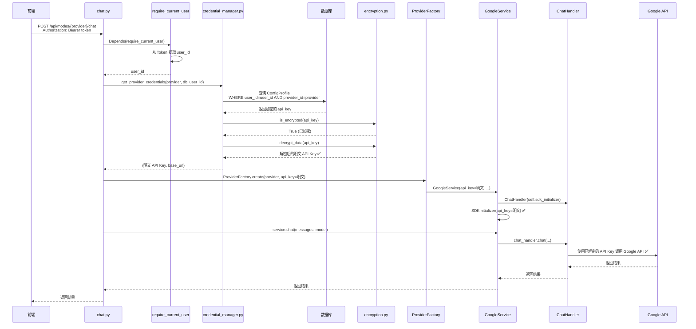
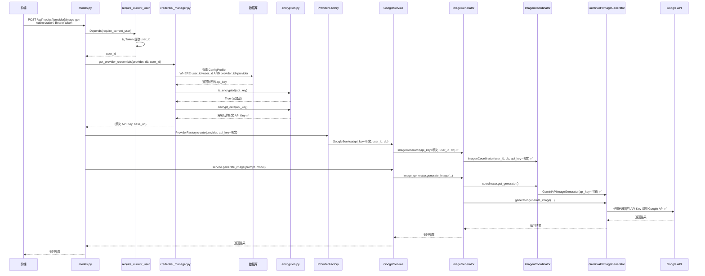

# API Key 解密完整流程图

本文档详细说明从前端 Token 到 API Key 解密的完整流程，包括 Chat 模式和图片生成模式的调用链。

## 📋 目录

1. [整体流程图](#整体流程图)
2. [详细步骤说明](#详细步骤说明)
3. [Chat 模式调用链](#chat-模式调用链)
4. [图片生成模式调用链](#图片生成模式调用链)
5. [关键代码位置](#关键代码位置)

---

## 整体流程图

```mermaid
graph TB
    Start([前端发送请求]) --> Token[携带 JWT Token<br/>Authorization: Bearer token]
    Token --> Route[路由层接收请求<br/>chat.py / modes.py]
    
    Route --> Depends[依赖注入<br/>Depends require_current_user]
    Depends --> ExtractToken[提取 Token<br/>user_context.py]
    
    ExtractToken --> DecodeJWT[解码 JWT Token<br/>jwt_utils.decode_token]
    DecodeJWT --> GetUserID[提取 user_id<br/>payload.sub]
    
    GetUserID --> CredentialMgr[凭证管理器<br/>credential_manager.py]
    CredentialMgr --> QueryDB[查询数据库<br/>ConfigProfile表]
    
    QueryDB --> FindProfile[查找配置<br/>1. 激活配置<br/>2. 任意匹配配置]
    FindProfile --> GetEncryptedKey[获取加密的 API Key<br/>config_profile.api_key]
    
    GetEncryptedKey --> CheckEncrypted{检查是否加密<br/>is_encrypted}
    CheckEncrypted -->|未加密| ReturnPlain[返回明文 API Key]
    CheckEncrypted -->|已加密| Decrypt[解密 API Key<br/>encryption.decrypt_data]
    
    Decrypt --> ReturnDecrypted[返回解密后的明文 API Key]
    ReturnPlain --> ProviderFactory[ProviderFactory.create<br/>创建服务实例]
    ReturnDecrypted --> ProviderFactory
    
    ProviderFactory --> CreateService[创建 GoogleService<br/>或其他服务]
    CreateService --> InitService[初始化服务<br/>传递已解密的 API Key]
    
    InitService --> ChatMode{Chat 模式?}
    ChatMode -->|是| ChatHandler[ChatHandler<br/>使用 SDKInitializer]
    ChatMode -->|否| ImageGen[ImageGenerator<br/>传递 API Key 到 Coordinator]
    
    ChatHandler --> UseDecryptedKey1[使用已解密的 API Key ✅]
    ImageGen --> ImagenCoordinator[ImagenCoordinator<br/>接收已解密的 API Key]
    ImagenCoordinator --> UseDecryptedKey2[使用已解密的 API Key ✅]
    
    UseDecryptedKey1 --> CallAPI[调用 Google API]
    UseDecryptedKey2 --> CallAPI
    CallAPI --> End([返回结果])
    
    style Start fill:#e1f5ff
    style End fill:#c8e6c9
    style Decrypt fill:#fff9c4
    style UseDecryptedKey1 fill:#c8e6c9
    style UseDecryptedKey2 fill:#c8e6c9
    style GetEncryptedKey fill:#ffccbc
```



---

## 详细步骤说明

### 步骤 1: 前端发送请求

**位置**: `frontend/services/providers/UnifiedProviderClient.ts`

```typescript
// 前端自动在请求头中添加 Token
const headers: HeadersInit = {
  'Authorization': `Bearer ${getAccessToken()}`,
  'Content-Type': 'application/json'
};

// 发送请求到后端
fetch(`/api/modes/${provider}/${mode}`, {
  method: 'POST',
  headers,
  body: JSON.stringify(request)
});
```

**关键点**:
- Token 存储在 `localStorage` 中（前端）
- 通过 `Authorization: Bearer <token>` header 发送
- Token 是 JWT 格式，包含 `user_id` 信息

---

### 步骤 2: 路由层接收请求

**位置**: 
- Chat 模式: `backend/app/routers/core/chat.py`
- 图片生成模式: `backend/app/routers/core/modes.py`

```python
@router.post("/{provider}/chat")
async def chat_with_provider(
    provider: str,
    request: ChatRequest,
    user_id: str = Depends(require_current_user),  # ✅ 自动注入 user_id
    db: Session = Depends(get_db)
):
    # user_id 已通过依赖注入自动获取
    ...
```

**关键点**:
- 使用 FastAPI 的 `Depends()` 机制
- `require_current_user` 自动从 Token 提取 `user_id`
- 如果 Token 无效或缺失，自动返回 401 错误

---

### 步骤 3: 依赖注入提取 user_id

**位置**: `backend/app/core/dependencies.py` → `backend/app/core/user_context.py`

#### 3.1 依赖注入函数

```python
# backend/app/core/dependencies.py
def require_current_user(request: Request) -> str:
    """
    统一认证依赖函数 - 要求用户已认证
    
    用于 FastAPI Depends，自动从请求中提取 user_id。
    如果未认证，抛出 401 异常。
    """
    return require_user_id(request)
```

#### 3.2 提取 user_id

```python
# backend/app/core/user_context.py
def get_current_user_id(request: Request) -> Optional[str]:
    """
    从请求中获取当前用户 ID
    
    优先级：
    1. Authorization header（Bearer token 认证）- ✅ 优先使用
    2. Cookie 中的 access_token（向后兼容）
    """
    token = None
    
    # ✅ 1. 优先从 Authorization header 获取 token
    auth_header = request.headers.get("Authorization")
    if auth_header:
        parts = auth_header.split()
        if len(parts) == 2 and parts[0].lower() == "bearer":
            token = parts[1]
    
    # 2. 如果 Authorization header 中没有，尝试从 Cookie 获取
    if not token:
        token = request.cookies.get("access_token")
    
    # 3. 如果都没有 token，返回 None
    if not token:
        return None
    
    # 4. 解码 token
    payload: TokenPayload = decode_token(token)  # ✅ 使用 jwt_utils.decode_token()
    
    # 5. 验证 token 类型
    if payload.type != "access":
        return None
    
    # 6. 返回 user_id (payload.sub)
    return payload.sub  # ✅ user_id 在这里提取
```

**关键点**:
- Token 解码使用 `jwt_utils.decode_token()`
- `user_id` 存储在 JWT payload 的 `sub` 字段中
- 如果 Token 无效，返回 `None`，`require_user_id()` 会抛出 401 异常

---

### 步骤 4: 查询数据库获取加密的 API Key

**位置**: `backend/app/core/credential_manager.py`

```python
async def get_provider_credentials(
    provider: str,
    db: Session,
    user_id: str,  # ✅ 从步骤 3 获取
    request_api_key: Optional[str] = None,
    request_base_url: Optional[str] = None
) -> Tuple[str, Optional[str]]:
    """
    从数据库获取 Provider 的凭证（API Key 和 Base URL）
    
    优先级：
    1. 请求参数（用于测试/覆盖）
    2. 数据库配置
       - 优先使用激活配置（如果匹配 provider）
       - 回退到任意匹配 provider 的配置
    """
    
    # 1. 优先使用请求参数（用于验证连接）
    if request_api_key and request_api_key.strip():
        return request_api_key, request_base_url
    
    # 2. 从数据库获取（正常使用）
    # 2.1 获取当前激活的配置 ID
    settings = db.query(UserSettings).filter(
        UserSettings.user_id == user_id  # ✅ 使用从 Token 提取的 user_id
    ).first()
    active_profile_id = settings.active_profile_id if settings else None
    
    # 2.2 如果有激活配置，检查是否匹配请求的 provider
    if active_profile_id:
        active_profile = db.query(ConfigProfile).filter(
            ConfigProfile.id == active_profile_id,
            ConfigProfile.provider_id == provider,
            ConfigProfile.user_id == user_id  # ✅ 确保配置属于当前用户
        ).first()
        
        if active_profile and active_profile.api_key:
            # ✅ 获取加密的 API Key（从数据库）
            api_key = active_profile.api_key  # 这是加密的字符串
            
            # ✅ 自动解密 API key
            api_key = _decrypt_api_key(active_profile.api_key, silent=True)
            
            return api_key, active_profile.base_url
    
    # 2.3 回退：查找任意匹配 provider 的配置
    any_profile = db.query(ConfigProfile).filter(
        ConfigProfile.provider_id == provider,
        ConfigProfile.user_id == user_id  # ✅ 确保配置属于当前用户
    ).first()
    
    if any_profile and any_profile.api_key:
        # ✅ 获取加密的 API Key（从数据库）
        api_key = any_profile.api_key  # 这是加密的字符串
        
        # ✅ 自动解密 API key
        api_key = _decrypt_api_key(any_profile.api_key, silent=True)
        
        return api_key, any_profile.base_url
    
    # 3. 未找到 API Key，返回 401 错误
    raise HTTPException(
        status_code=401,
        detail=f"API Key not found for provider: {provider}."
    )
```

**数据库查询流程**:



**关键点**:
- 使用 `user_id` 查询 `UserSettings` 表，获取 `active_profile_id`
- 使用 `active_profile_id` 和 `provider` 查询 `ConfigProfile` 表
- 确保 `ConfigProfile.user_id == user_id`（安全隔离）
- `ConfigProfile.api_key` 字段存储的是**加密的字符串**

---

### 步骤 5: 解密 API Key

**位置**: `backend/app/core/credential_manager.py` → `backend/app/core/encryption.py`

#### 5.1 解密函数（credential_manager.py）

```python
def _decrypt_api_key(api_key: str, silent: bool = False) -> str:
    """
    解密 API Key（如果已加密）
    
    Args:
        api_key: API Key（可能是明文或已加密）
        silent: 如果为 True，解密失败时不记录错误
    
    Returns:
        解密后的 API Key（如果未加密则原样返回）
    """
    if not api_key:
        return api_key
    
    # ✅ 检查是否已加密
    if not is_encrypted(api_key):
        return api_key  # 未加密，直接返回
    
    # ✅ 尝试解密
    try:
        return decrypt_data(api_key, silent=silent)  # ✅ 调用 encryption.decrypt_data()
    except Exception as e:
        if not silent:
            logger.warning(f"[CredentialManager] Failed to decrypt API key: {e}")
        # ✅ 解密失败时抛出异常，而不是返回加密的值
        raise
```

#### 5.2 加密检查（encryption.py）

```python
# backend/app/core/encryption.py
def is_encrypted(data: str) -> bool:
    """
    检查字符串是否已加密
    
    加密的字符串通常以特定前缀开头（如 "encrypted:"）
    """
    if not data:
        return False
    # 检查是否以加密前缀开头
    return data.startswith("encrypted:") or data.startswith("gAAAAA")
```

#### 5.3 解密实现（encryption.py）

```python
# backend/app/core/encryption.py
def decrypt_data(encrypted_data: str, silent: bool = False) -> str:
    """
    解密数据
    
    Args:
        encrypted_data: 加密的字符串
        silent: 如果为 True，解密失败时不记录错误
    
    Returns:
        解密后的明文字符串
    
    Raises:
        ValueError: 如果解密失败
    """
    try:
        # 使用 Fernet 对称加密解密
        from cryptography.fernet import Fernet
        
        # 获取加密密钥（从环境变量或配置文件）
        key = get_encryption_key()
        f = Fernet(key)
        
        # 移除加密前缀（如果有）
        if encrypted_data.startswith("encrypted:"):
            encrypted_data = encrypted_data[10:]
        
        # 解密
        decrypted_bytes = f.decrypt(encrypted_data.encode())
        return decrypted_bytes.decode()
        
    except Exception as e:
        if not silent:
            logger.error(f"[Encryption] Failed to decrypt data: {e}")
        raise ValueError(f"Decryption failed: {e}")
```

**解密流程图**:



**关键点**:
- 使用 Fernet 对称加密（`cryptography.fernet`）
- 加密密钥存储在环境变量中（`ENCRYPTION_KEY`）
- 加密的字符串通常以 `"encrypted:"` 或 `"gAAAAA"` 开头
- 解密失败时抛出异常，不会返回加密的值

---

### 步骤 6: 创建服务实例

**位置**: `backend/app/services/common/provider_factory.py`

```python
# 在路由中调用
service = ProviderFactory.create(
    provider=provider,
    api_key=api_key,  # ✅ 已解密的明文 API Key
    api_url=base_url,
    user_id=user_id,
    db=db
)
```

**ProviderFactory.create() 实现**:

```python
# backend/app/services/common/provider_factory.py
@classmethod
def create(
    cls,
    provider: str,
    api_key: str,  # ✅ 接收已解密的明文 API Key
    api_url: Optional[str] = None,
    user_id: Optional[str] = None,
    db: Optional[Session] = None,
    ...
) -> BaseProviderService:
    """
    创建提供商服务实例
    
    Args:
        provider: 提供商标识（google, openai, tongyi 等）
        api_key: 已解密的明文 API Key ✅
        ...
    
    Returns:
        服务实例（如 GoogleService）
    """
    # 检查缓存
    cache_key = f"{provider}:{api_key}"
    if cache_key in cls._client_cache:
        return cls._client_cache[cache_key]
    
    # 创建服务实例
    service_class = cls._providers.get(provider)
    if not service_class:
        raise ValueError(f"Provider '{provider}' not found")
    
    # ✅ 传递已解密的 API Key 给服务
    service = service_class(
        api_key=api_key,  # ✅ 明文 API Key
        api_url=api_url,
        user_id=user_id,
        db=db,
        ...
    )
    
    # 缓存服务实例
    cls._client_cache[cache_key] = service
    return service
```

**关键点**:
- `ProviderFactory` **不负责解密**，它接收的是已解密的明文 API Key
- 解密在 `credential_manager.py` 中统一完成
- 服务实例会被缓存（基于 `provider:api_key` 的键）

---

## Chat 模式调用链



**关键代码位置**:

1. **路由**: `backend/app/routers/core/chat.py:138-185`
2. **凭证获取**: `backend/app/core/credential_manager.py:22-123`
3. **服务创建**: `backend/app/services/common/provider_factory.py:102-180`
4. **GoogleService 初始化**: `backend/app/services/gemini/google_service.py:71-240`
5. **ChatHandler**: `backend/app/services/gemini/chat_handler.py`

---

## 图片生成模式调用链



**关键代码位置**:

1. **路由**: `backend/app/routers/core/modes.py:158-691`
2. **凭证获取**: `backend/app/core/credential_manager.py:22-123`
3. **服务创建**: `backend/app/services/common/provider_factory.py:102-180`
4. **GoogleService 初始化**: `backend/app/services/gemini/google_service.py:203-207`
5. **ImageGenerator**: `backend/app/services/gemini/image_generator.py:32-53`
6. **ImagenCoordinator**: `backend/app/services/gemini/imagen_coordinator.py:61-74`
7. **GeminiAPIImageGenerator**: `backend/app/services/gemini/imagen_gemini_api.py:49-80`

**修复点**:
- ✅ `ImageGenerator.__init__` 现在传递 `api_key` 给 `ImagenCoordinator`
- ✅ `ImagenCoordinator.__init__` 接收 `api_key` 参数，优先使用传入的已解密 API Key
- ✅ 如果未传入 `api_key`，才从数据库加载并解密（作为回退）

---

## 关键代码位置

### 1. Token 提取和 user_id 获取

| 文件 | 函数 | 说明 |
|------|------|------|
| `backend/app/core/dependencies.py` | `require_current_user()` | FastAPI 依赖注入函数 |
| `backend/app/core/user_context.py` | `get_current_user_id()` | 从请求中提取 user_id |
| `backend/app/core/user_context.py` | `require_user_id()` | 强制要求认证 |
| `backend/app/core/jwt_utils.py` | `decode_token()` | 解码 JWT Token |

### 2. 数据库查询和 API Key 获取

| 文件 | 函数 | 说明 |
|------|------|------|
| `backend/app/core/credential_manager.py` | `get_provider_credentials()` | 统一凭证获取入口 |
| `backend/app/core/credential_manager.py` | `_decrypt_api_key()` | 解密 API Key（内部函数） |
| `backend/app/models/db_models.py` | `ConfigProfile` | 配置表模型 |
| `backend/app/models/db_models.py` | `UserSettings` | 用户设置表模型 |

### 3. 加密/解密

| 文件 | 函数 | 说明 |
|------|------|------|
| `backend/app/core/encryption.py` | `is_encrypted()` | 检查是否已加密 |
| `backend/app/core/encryption.py` | `decrypt_data()` | 解密数据 |
| `backend/app/core/encryption.py` | `encrypt_data()` | 加密数据 |

### 4. 服务创建

| 文件 | 函数 | 说明 |
|------|------|------|
| `backend/app/services/common/provider_factory.py` | `ProviderFactory.create()` | 创建服务实例 |
| `backend/app/services/gemini/google_service.py` | `GoogleService.__init__()` | Google 服务初始化 |
| `backend/app/services/gemini/image_generator.py` | `ImageGenerator.__init__()` | 图片生成器初始化 |
| `backend/app/services/gemini/imagen_coordinator.py` | `ImagenCoordinator.__init__()` | 图片生成协调器初始化 |

---

## 总结

### 完整流程总结

1. **前端**: 发送请求，携带 JWT Token（`Authorization: Bearer <token>`）
2. **路由层**: 接收请求，使用 `Depends(require_current_user)` 自动注入 `user_id`
3. **Token 解码**: `user_context.py` 从 Token 提取 `user_id`（`payload.sub`）
4. **数据库查询**: `credential_manager.py` 使用 `user_id` 查询 `ConfigProfile` 表，获取加密的 API Key
5. **解密**: `encryption.py` 使用 Fernet 对称加密解密 API Key
6. **服务创建**: `ProviderFactory` 接收已解密的明文 API Key，创建服务实例
7. **API 调用**: 服务使用已解密的明文 API Key 调用 Google API

### 关键设计原则

1. **统一解密**: 所有 API Key 解密在 `credential_manager.py` 中统一完成
2. **安全隔离**: 使用 `user_id` 确保用户只能访问自己的配置
3. **依赖注入**: 使用 FastAPI 的 `Depends()` 机制，自动注入 `user_id`
4. **传递明文**: `ProviderFactory` 和服务层接收的都是已解密的明文 API Key
5. **回退机制**: 如果传入的 API Key 为空，才从数据库加载并解密

### 修复点

- ✅ **修复前**: `ImagenCoordinator` 从数据库加载加密的 API Key，但没有解密
- ✅ **修复后**: `ImageGenerator` 传递已解密的 API Key 给 `ImagenCoordinator`，优先使用传入的 API Key

---

## 相关文档

- [统一后端认证处理方案.md](../统一后端认证处理方案.md)
- [完整附件处理与存储配置架构设计方案.md](./完整附件处理与存储配置架构设计方案/完整附件处理与存储配置架构设计方案.md)
