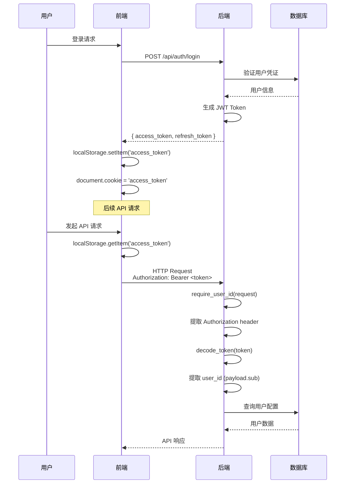
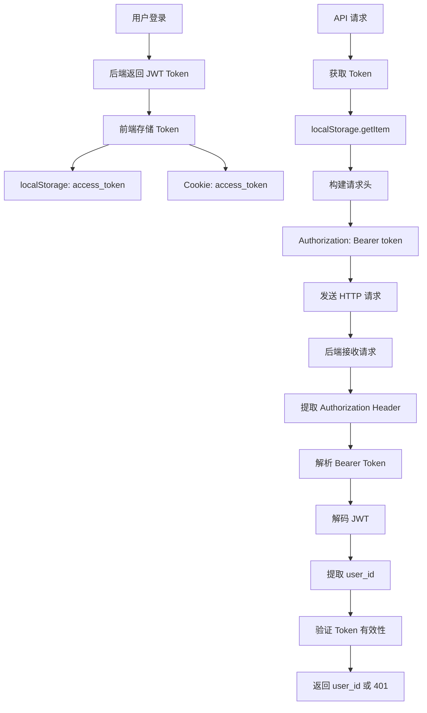
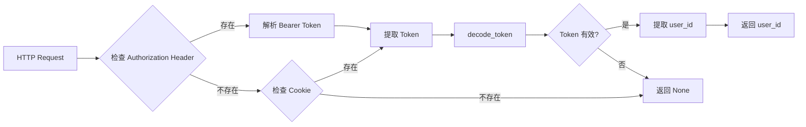

# 前端 Token 传递流程完整文档

## 概述

本文档详细说明前端如何将认证 Token 传递给后端，以及后端如何提取和验证 Token 的完整流程。

## 目录

1. [认证流程概览](#认证流程概览)
2. [前端 Token 管理](#前端-token-管理)
3. [前端 Token 发送](#前端-token-发送)
4. [后端 Token 提取](#后端-token-提取)
5. [后端 Token 验证](#后端-token-验证)
6. [使用示例](#使用示例)
7. [安全机制](#安全机制)
8. [常见问题](#常见问题)

---

## 认证流程概览

### 完整流程图



### 数据流图



---

## 前端 Token 管理

### 1. Token 存储位置

**文件**: `frontend/services/auth.ts`

#### Token 存储函数

```typescript
/**
 * 获取访问令牌
 * @returns JWT token 字符串或 null
 */
function getAccessToken(): string | null {
  return localStorage.getItem('access_token');
}

/**
 * 设置访问令牌
 * @param token JWT token 字符串
 */
function setAccessToken(token: string): void {
  localStorage.setItem('access_token', token);
}

/**
 * 移除访问令牌
 */
function removeAccessToken(): void {
  localStorage.removeItem('access_token');
}
```

#### Token 存储时机

**登录成功后** (`frontend/services/auth.ts` 第 190-198 行):

```typescript
async login(data: LoginData): Promise<LoginResponse> {
  const response = await fetch(`${this.baseUrl}/login`, {
    method: 'POST',
    headers: getHeaders(),
    body: JSON.stringify(data),
  });
  
  const result = await response.json();
  
  // ✅ 保存 access_token 到 localStorage
  if (result.access_token) {
    setAccessToken(result.access_token);
    
    // ✅ 同时设置 Cookie（用于 EventSource 等场景）
    const expiresIn = result.expires_in || 3600; // 默认 1 小时
    const expiresDate = new Date(Date.now() + expiresIn * 1000);
    document.cookie = `access_token=${result.access_token}; expires=${expiresDate.toUTCString()}; path=/; SameSite=Lax`;
  }
  
  return result;
}
```

### 2. Token 存储位置对比

| 存储位置 | 用途 | 优点 | 缺点 |
|---------|------|------|------|
| **localStorage** | 主要存储，所有 API 请求 | 持久化，不受页面刷新影响 | 可能被 XSS 攻击 |
| **Cookie** | 备用存储，EventSource/SSE | 自动发送，支持 httpOnly | 需要后端设置 CORS |

---

## 前端 Token 发送

### 1. 统一请求头构建

**文件**: `frontend/services/auth.ts` 第 88-99 行

```typescript
/**
 * 获取请求头（包含认证信息）
 * @param includeJson 是否包含 Content-Type: application/json
 * @returns 请求头对象
 */
function getHeaders(includeJson = true): HeadersInit {
  const headers: HeadersInit = {};
  
  if (includeJson) {
    headers['Content-Type'] = 'application/json';
  }
  
  // ✅ 使用 Authorization header 发送 token
  const token = getAccessToken();
  if (token) {
    headers['Authorization'] = `Bearer ${token}`;
  }
  
  return headers;
}
```

### 2. UnifiedProviderClient 中的使用

**文件**: `frontend/services/providers/UnifiedProviderClient.ts`

#### 流式聊天请求 (第 170-177 行)

```typescript
async *sendMessageStream(...): AsyncGenerator<StreamUpdate, void, unknown> {
  // ✅ 构建请求头，添加 Authorization header
  const headers: HeadersInit = {
    'Content-Type': 'application/json'
  };
  const token = getAccessToken();
  if (token) {
    headers['Authorization'] = `Bearer ${token}`;
  }
  
  const response = await fetch(`${this.baseUrl}/api/chat/${this.id}`, {
    method: 'POST',
    headers,
    body: JSON.stringify(requestBody),
    credentials: 'include', // 包含 Cookie
  });
  
  // ... 处理响应
}
```

#### 图片生成请求 (第 378-384 行)

```typescript
async generateImage(...): Promise<ImageGenerationResult[]> {
  // ✅ 构建请求头，添加 Authorization header
  const headers: HeadersInit = {
    'Content-Type': 'application/json'
  };
  const token = getAccessToken();
  if (token) {
    headers['Authorization'] = `Bearer ${token}`;
  }
  
  const response = await fetch(`${this.baseUrl}/api/generate/${this.id}/image`, {
    method: 'POST',
    headers,
    body: JSON.stringify(requestBody),
    credentials: 'include',
  });
  
  // ... 处理响应
}
```

### 3. 其他服务中的使用

#### Tongyi Provider (`frontend/services/providers/tongyi/DashScopeProvider.ts`)

```typescript
public async *sendMessageStream(...): AsyncGenerator<StreamUpdate, void, unknown> {
  // 使用 JWT Token 认证
  const token = getAccessToken();
  if (!token) {
    throw new Error('未登录，请先登录');
  }

  const response = await fetch('/api/chat/tongyi', {
    method: 'POST',
    headers: {
      'Content-Type': 'application/json',
      'Authorization': `Bearer ${token}`
    },
    body: JSON.stringify({...}),
  });
  
  // ... 处理响应
}
```

#### Attachment Utils (`frontend/hooks/handlers/attachmentUtils.ts`)

```typescript
export const fetchAttachmentStatus = async (
  sessionId: string, 
  attachmentId: string
): Promise<{ url: string; uploadStatus: string } | null> => {
  const headers: HeadersInit = {};
  const token = getAccessToken();
  if (token) {
    headers['Authorization'] = `Bearer ${token}`;
  }
  
  const response = await fetch(`/api/sessions/${sessionId}/attachments/${attachmentId}`, {
    headers,
    credentials: 'include',
  });
  
  // ... 处理响应
};
```

---

## 后端 Token 提取

### 1. 核心函数：get_current_user_id

**文件**: `backend/app/core/user_context.py` 第 21-65 行

```python
def get_current_user_id(request: Request) -> Optional[str]:
    """
    从请求中获取当前用户 ID（不强制要求认证）
    
    优先级：
    1. Authorization header（Bearer token 认证）- ✅ 优先使用
    2. Cookie 中的 access_token（向后兼容）
    
    Args:
        request: FastAPI 请求对象
        
    Returns:
        用户 ID 或 None（如果未认证）
    """
    token = None
    
    try:
        # ✅ 1. 优先从 Authorization header 获取 token
        auth_header = request.headers.get("Authorization")
        if auth_header:
            parts = auth_header.split()
            if len(parts) == 2 and parts[0].lower() == "bearer":
                token = parts[1]
        
        # 2. 如果 Authorization header 中没有，尝试从 Cookie 获取（向后兼容）
        if not token:
            token = request.cookies.get("access_token")
        
        # 3. 如果都没有 token，返回 None
        if not token:
            return None
        
        # 4. 解码 token
        payload: TokenPayload = decode_token(token)
        
        # 5. 验证 token 类型
        if payload.type != "access":
            return None
        
        # 6. 返回 user_id (payload.sub)
        return payload.sub
        
    except JWTError:
        return None
    except Exception:
        return None
```

### 2. 强制认证函数：require_user_id

**文件**: `backend/app/core/user_context.py` 第 68-90 行

```python
def require_user_id(request: Request) -> str:
    """
    要求用户已认证，否则抛出异常
    
    Args:
        request: FastAPI 请求对象
        
    Returns:
        用户 ID
        
    Raises:
        HTTPException: 401 Unauthorized（未认证或 token 无效）
    """
    user_id = get_current_user_id(request)
    
    if not user_id:
        raise HTTPException(
            status_code=status.HTTP_401_UNAUTHORIZED,
            detail="Authentication required",
            headers={"WWW-Authenticate": "Bearer"}
        )
    
    return user_id
```

### 3. Token 提取流程



---

## 后端 Token 验证

### 1. JWT Token 解码

**文件**: `backend/app/core/jwt_utils.py` (需要查看)

Token 解码过程：
1. 提取 Token 字符串
2. 使用 JWT 密钥验证签名
3. 检查过期时间
4. 提取 Payload 中的 `sub` (user_id) 和 `type` (access/refresh)

### 2. Token 验证检查点

| 检查项 | 位置 | 说明 |
|--------|------|------|
| **Token 存在** | `get_current_user_id()` | 检查 Authorization header 或 Cookie |
| **格式正确** | `get_current_user_id()` | 验证 `Bearer <token>` 格式 |
| **签名有效** | `decode_token()` | 验证 JWT 签名 |
| **未过期** | `decode_token()` | 检查 `exp` 字段 |
| **类型正确** | `get_current_user_id()` | 验证 `type == "access"` |

---

## 使用示例

### 前端示例

#### 示例 1: 使用 getHeaders() 工具函数

```typescript
import { getHeaders } from '../services/auth';

async function fetchUserData() {
  const response = await fetch('/api/user/profile', {
    method: 'GET',
    headers: getHeaders(), // ✅ 自动包含 Authorization header
    credentials: 'include',
  });
  
  if (!response.ok) {
    throw new Error('Failed to fetch user data');
  }
  
  return await response.json();
}
```

#### 示例 2: 手动构建请求头

```typescript
function getAccessToken(): string | null {
  return localStorage.getItem('access_token');
}

async function customApiCall() {
  const token = getAccessToken();
  
  const headers: HeadersInit = {
    'Content-Type': 'application/json',
  };
  
  if (token) {
    headers['Authorization'] = `Bearer ${token}`;
  }
  
  const response = await fetch('/api/custom/endpoint', {
    method: 'POST',
    headers,
    credentials: 'include',
  });
  
  return await response.json();
}
```

#### 示例 3: 使用 UnifiedProviderClient

```typescript
import { UnifiedProviderClient } from '../services/providers/UnifiedProviderClient';

const client = new UnifiedProviderClient('google');

// ✅ 内部自动添加 Authorization header
const results = await client.generateImage(
  'A beautiful sunset',
  modelId,
  options
);
```

### 后端示例

#### 示例 1: 基本使用

```python
from fastapi import APIRouter, Request, Depends
from sqlalchemy.orm import Session
from ..core.database import get_db
from ..core.user_context import require_user_id

router = APIRouter()

@router.get("/user/profile")
async def get_user_profile(
    request: Request,
    db: Session = Depends(get_db)
):
    # ✅ 提取 user_id（自动从 Authorization header 获取）
    user_id = require_user_id(request)
    
    # 使用 user_id 查询数据库
    user = db.query(User).filter(User.id == user_id).first()
    
    return {"user_id": user_id, "profile": user.to_dict()}
```

#### 示例 2: 图片生成端点

```python
@router.post("/{provider}/image")
async def generate_image(
    provider: str,
    request_body: ImageGenerateRequest,
    request: Request,
    db: Session = Depends(get_db)
):
    # ✅ 认证用户
    user_id = require_user_id(request)
    
    logger.info(f"[Generate] User ID: {user_id}")
    
    # ✅ 使用 user_id 获取用户配置
    api_key = await get_api_key(provider, request_body.apiKey, user_id, db)
    
    # ... 继续处理
```

#### 示例 3: 可选认证

```python
from ..core.user_context import get_current_user_id

@router.get("/public/data")
async def get_public_data(
    request: Request
):
    # ✅ 可选认证：如果用户已登录，返回个性化数据
    user_id = get_current_user_id(request)
    
    if user_id:
        # 返回个性化数据
        return {"data": get_personalized_data(user_id)}
    else:
        # 返回公共数据
        return {"data": get_public_data()}
```

---

## 安全机制

### 1. Token 存储安全

- **localStorage**: 前端存储，可能受 XSS 攻击
- **Cookie**: 可设置 `httpOnly` 标志（需要后端支持）
- **双重存储**: 提供冗余，提高可用性

### 2. Token 传输安全

- **HTTPS**: 生产环境必须使用 HTTPS
- **Authorization Header**: 标准 Bearer Token 格式
- **CORS 配置**: 后端限制允许的源

**后端 CORS 配置** (`backend/app/main.py` 第 565-572 行):

```python
CORS_ORIGINS = os.getenv("CORS_ORIGINS", "http://localhost:21573,http://127.0.0.1:21573").split(",")
app.add_middleware(
    CORSMiddleware,
    allow_origins=CORS_ORIGINS,  # 生产环境必须指定具体域名
    allow_credentials=True,  # 允许 Cookie
    allow_methods=["GET", "POST", "PUT", "DELETE", "PATCH", "OPTIONS"],
    allow_headers=["Content-Type", "X-CSRF-Token", "Authorization"],
)
```

### 3. Token 验证安全

- **JWT 签名验证**: 防止 Token 被篡改
- **过期检查**: 自动拒绝过期 Token
- **类型验证**: 区分 access_token 和 refresh_token

### 4. 错误处理

#### 前端错误处理

```typescript
try {
  const response = await fetch('/api/endpoint', {
    headers: getHeaders(),
  });
  
  if (response.status === 401) {
    // Token 无效或过期
    removeAccessToken();
    // 重定向到登录页
    window.location.href = '/login';
  }
} catch (error) {
  console.error('Request failed:', error);
}
```

#### 后端错误处理

```python
@router.get("/protected")
async def protected_endpoint(request: Request):
    try:
        user_id = require_user_id(request)
        # ... 处理逻辑
    except HTTPException as e:
        if e.status_code == 401:
            # Token 无效或缺失
            logger.warning(f"Unauthorized access attempt")
        raise
```

---

## 关键文件位置

### 前端文件

| 文件路径 | 功能 | 关键函数/类 |
|---------|------|------------|
| `frontend/services/auth.ts` | Token 存储和管理 | `getAccessToken()`, `setAccessToken()`, `getHeaders()` |
| `frontend/services/providers/UnifiedProviderClient.ts` | 统一 API 客户端 | `sendMessageStream()`, `generateImage()`, `editImage()` |
| `frontend/hooks/handlers/attachmentUtils.ts` | 附件处理工具 | `fetchAttachmentStatus()`, `getAccessToken()` |
| `frontend/services/apiClient.ts` | API 客户端封装 | `getAccessToken()`, 自动添加 Authorization header |

### 后端文件

| 文件路径 | 功能 | 关键函数 |
|---------|------|---------|
| `backend/app/core/user_context.py` | 用户上下文管理 | `get_current_user_id()`, `require_user_id()` |
| `backend/app/core/jwt_utils.py` | JWT Token 工具 | `decode_token()`, `encode_token()` |
| `backend/app/routers/generate.py` | 图片生成端点 | `require_user_id(request)` |
| `backend/app/routers/chat.py` | 聊天端点 | `require_user_id(request)` |
| `backend/app/main.py` | CORS 配置 | `CORSMiddleware` 配置 |

---

## 常见问题

### Q1: Token 在哪里存储？

**A**: Token 主要存储在 `localStorage` 中，键名为 `access_token`。同时也会设置 Cookie 作为备用。

```typescript
// 存储
localStorage.setItem('access_token', token);

// 获取
const token = localStorage.getItem('access_token');
```

### Q2: 如何确保 Token 安全传输？

**A**: 
1. 使用 HTTPS（生产环境）
2. 通过 `Authorization: Bearer <token>` header 发送
3. 后端配置 CORS，限制允许的源
4. Token 使用 JWT 签名，防止篡改

### Q3: Token 过期后如何处理？

**A**: 前端应该实现 Token 刷新机制：

```typescript
// frontend/services/auth.ts
async function refreshToken() {
  const refreshToken = localStorage.getItem('refresh_token');
  
  const response = await fetch('/api/auth/refresh', {
    method: 'POST',
    headers: {
      'Authorization': `Bearer ${refreshToken}`
    }
  });
  
  const result = await response.json();
  if (result.access_token) {
    setAccessToken(result.access_token);
  }
}
```

### Q4: 为什么同时使用 localStorage 和 Cookie？

**A**: 
- **localStorage**: 主要方式，所有 API 请求使用
- **Cookie**: 备用方式，用于 EventSource/SSE 等场景（浏览器自动发送 Cookie）

### Q5: 后端如何区分不同的用户？

**A**: 后端从 JWT Token 的 `payload.sub` 字段提取 `user_id`：

```python
payload = decode_token(token)
user_id = payload.sub  # JWT 标准：subject 字段存储用户 ID
```

### Q6: 如果 Authorization header 和 Cookie 都有 Token，优先使用哪个？

**A**: 后端优先使用 **Authorization header**，如果不存在才使用 Cookie（向后兼容）。

```python
# 优先级 1: Authorization header
auth_header = request.headers.get("Authorization")
if auth_header:
    token = auth_header.split()[1]  # "Bearer <token>"

# 优先级 2: Cookie (fallback)
if not token:
    token = request.cookies.get("access_token")
```

---

## 最佳实践

### 前端最佳实践

1. **统一使用 getHeaders()**: 所有 API 请求使用统一的 `getHeaders()` 函数
2. **错误处理**: 捕获 401 错误，自动重定向到登录页
3. **Token 刷新**: 实现自动 Token 刷新机制
4. **安全存储**: 避免在代码中硬编码 Token

### 后端最佳实践

1. **统一使用 require_user_id()**: 所有需要认证的端点使用 `require_user_id(request)`
2. **错误信息**: 返回清晰的 401 错误信息
3. **日志记录**: 记录认证失败尝试（用于安全审计）
4. **CORS 配置**: 生产环境限制允许的源

---

## 总结

### Token 传递流程总结

1. **前端存储**: Token 存储在 `localStorage` 和 `Cookie` 中
2. **前端发送**: 通过 `Authorization: Bearer <token>` header 发送
3. **后端提取**: 从 `Authorization` header 或 `Cookie` 提取 Token
4. **后端验证**: 解码 JWT，验证签名和过期时间
5. **用户识别**: 从 Token payload 提取 `user_id`

### 关键要点

- ✅ **标准格式**: 使用标准的 `Bearer Token` 格式
- ✅ **双重存储**: localStorage（主要）+ Cookie（备用）
- ✅ **优先级**: Authorization header > Cookie
- ✅ **安全性**: JWT 签名验证 + HTTPS 传输
- ✅ **统一接口**: 前端使用 `getHeaders()`，后端使用 `require_user_id()`

---

## 相关文档

- [JWT Token 生成和验证](./JWT_TOKEN_GENERATION.md)
- [用户认证系统](./AUTHENTICATION_SYSTEM.md)
- [CORS 配置指南](./CORS_CONFIGURATION.md)
- [API 端点文档](./API_ENDPOINTS.md)

---

**最后更新**: 2026-01-13  
**维护者**: Development Team
