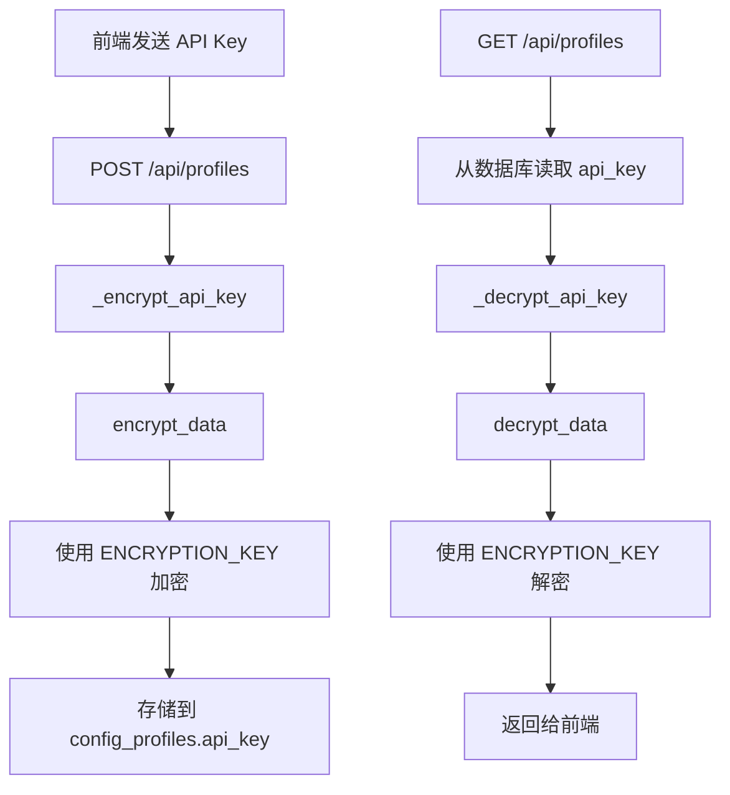
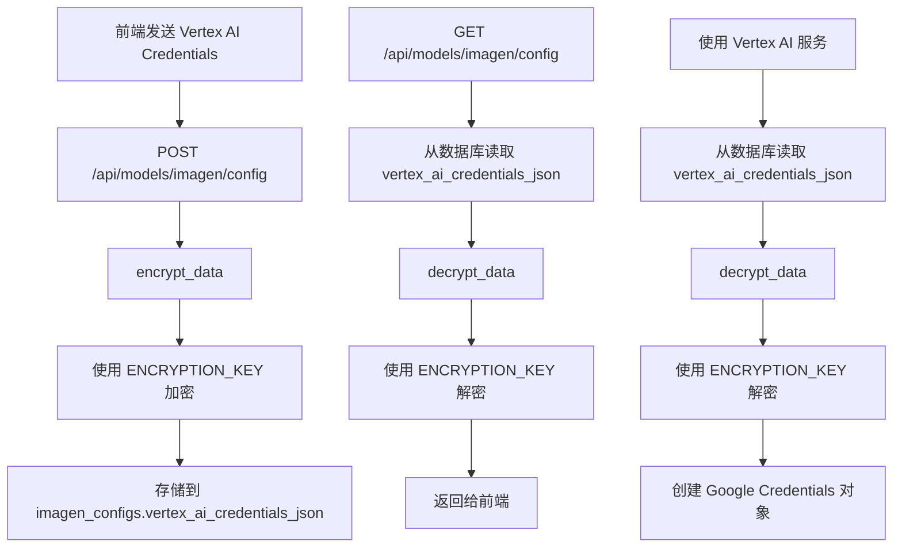

# ENCRYPTION_KEY 使用流程分析

## 概述

本文档详细分析 `ENCRYPTION_KEY` 在项目中的实际使用流程，包括加密/解密的数据类型和使用场景。

## ENCRYPTION_KEY 的作用

`ENCRYPTION_KEY` 是主加密密钥，用于加密/解密存储在数据库中的敏感数据。

**重要特性**：
- ⚠️ **不能随意更换**！
- 如果更换 `ENCRYPTION_KEY`，所有已加密的数据将无法解密
- 只有在数据迁移或安全事件时，才应该更换（需要先解密所有数据，更换密钥后重新加密）

---

## 使用场景

### 1. ConfigProfile 表（config_profiles）

**表结构**：
- 表名：`config_profiles`
- 加密字段：`api_key`（用户配置的 API 密钥）

**加密流程**：

#### 存储时加密（写入数据库）

**文件**：`backend/app/routers/user/profiles.py`

```python
def _encrypt_api_key(api_key: str) -> str:
    """加密 API Key（如果尚未加密）"""
    if not api_key:
        return api_key
    
    # 如果已经加密，直接返回
    if is_encrypted(api_key):
        return api_key
    
    try:
        encrypted = encrypt_data(api_key)  # ✅ 使用 ENCRYPTION_KEY 加密
        return encrypted
    except Exception as e:
        logger.warning(f"[Profiles] API key encryption failed (storing plain): {e}")
        return api_key
```

**调用位置**：
- `create_or_update_profile()` 函数（第 157 行、第 178 行）
  - 创建新配置时：`api_key=_encrypt_api_key(profile_data.apiKey or "")`
  - 更新配置时：`profile.api_key = _encrypt_api_key(update_data["apiKey"])`

#### 读取时解密（从数据库读取）

**文件**：`backend/app/routers/user/profiles.py`

```python
def _decrypt_api_key(api_key: str) -> str:
    """解密 API Key（兼容未加密的历史数据）"""
    if not api_key:
        return api_key
    
    # 如果不是加密格式，直接返回（兼容历史数据）
    if not is_encrypted(api_key):
        return api_key
    
    try:
        decrypted = decrypt_data(api_key, silent=True)  # ✅ 使用 ENCRYPTION_KEY 解密
        return decrypted
    except Exception as e:
        logger.debug(f"[Profiles] API key decryption failed: {e}")
        return api_key
```

**调用位置**：
- `get_profiles()` 函数（第 68 行）
  - 返回给前端前解密：`profile_dict["apiKey"] = _decrypt_api_key(profile_dict.get("apiKey", ""))`
- `get_full_settings()` 函数（第 68 行）
  - 返回给前端前解密：`profile_dict["apiKey"] = _decrypt_api_key(profile_dict.get("apiKey", ""))`

**其他使用位置**：
- `backend/app/core/credential_manager.py`：`get_provider_credentials()` 函数
- `backend/app/routers/models/models.py`：`get_provider_credentials()` 函数
- `backend/app/routers/core/chat.py`：聊天端点中解密 API key

---

### 2. ImagenConfig 表（imagen_configs）

**表结构**：
- 表名：`imagen_configs`
- 加密字段：`vertex_ai_credentials_json`（Vertex AI Service Account JSON 凭证）

**加密流程**：

#### 存储时加密（写入数据库）

**文件**：`backend/app/routers/models/imagen_config.py`

```python
@router.post("/config")
async def update_imagen_config(...):
    # ...
    if request_body.apiMode == 'vertex_ai':
        # Encrypt credentials JSON before storing
        if request_body.vertexAiCredentialsJson:
            try:
                encrypted_json = encrypt_data(request_body.vertexAiCredentialsJson)  # ✅ 使用 ENCRYPTION_KEY 加密
                user_config.vertex_ai_credentials_json = encrypted_json
            except Exception as e:
                logger.error(f"[ImagenConfig] Failed to encrypt credentials: {e}")
                raise HTTPException(status_code=500, detail="Failed to encrypt credentials")
```

**调用位置**：
- `update_imagen_config()` 函数（第 376 行）
  - 更新 Vertex AI 配置时加密：`encrypted_json = encrypt_data(request_body.vertexAiCredentialsJson)`

#### 读取时解密（从数据库读取）

**文件**：`backend/app/routers/models/imagen_config.py`

```python
@router.get("/config")
async def get_imagen_config(...):
    # ...
    if user_config.vertex_ai_credentials_json:
        try:
            if is_encrypted(user_config.vertex_ai_credentials_json):
                vertex_ai_credentials_json = decrypt_data(  # ✅ 使用 ENCRYPTION_KEY 解密
                    user_config.vertex_ai_credentials_json
                )
            else:
                vertex_ai_credentials_json = user_config.vertex_ai_credentials_json
        except Exception as e:
            logger.error(f"[ImagenConfig] Failed to decrypt credentials: {e}")
```

**调用位置**：
- `get_imagen_config()` 函数（第 272 行）
  - 返回给前端前解密：`vertex_ai_credentials_json = decrypt_data(user_config.vertex_ai_credentials_json)`

**其他使用位置**：
- `backend/app/services/gemini/agent/client.py`：`get_vertex_ai_credentials_from_db()` 函数（第 127 行）
  - 使用 Vertex AI 时解密凭证：`credentials_json = decrypt_data(imagen_config.vertex_ai_credentials_json)`
- `backend/app/services/gemini/imagen_coordinator.py`：解密凭证用于图像生成
- `backend/app/services/gemini/image_edit_coordinator.py`：解密凭证用于图像编辑

---

## 数据流图

### ConfigProfile API Key 加密/解密流程



### ImagenConfig Credentials 加密/解密流程



---

## 核心函数调用链

### encrypt_data() 调用链

```
encrypt_data()
  └─> _get_encryption_key()
      └─> EncryptionKeyManager.get_or_create_key()
          └─> 从 .env 文件读取 ENCRYPTION_KEY
```

**使用位置**：
1. `backend/app/routers/user/profiles.py`：`_encrypt_api_key()` → 加密 `config_profiles.api_key`
2. `backend/app/routers/models/imagen_config.py`：`update_imagen_config()` → 加密 `imagen_configs.vertex_ai_credentials_json`

### decrypt_data() 调用链

```
decrypt_data()
  └─> _get_encryption_key()
      └─> EncryptionKeyManager.get_or_create_key()
          └─> 从 .env 文件读取 ENCRYPTION_KEY
```

**使用位置**：
1. `backend/app/routers/user/profiles.py`：`_decrypt_api_key()` → 解密 `config_profiles.api_key`
2. `backend/app/core/credential_manager.py`：`_decrypt_api_key()` → 解密 `config_profiles.api_key`
3. `backend/app/routers/models/imagen_config.py`：`get_imagen_config()` → 解密 `imagen_configs.vertex_ai_credentials_json`
4. `backend/app/services/gemini/agent/client.py`：`get_vertex_ai_credentials_from_db()` → 解密 `imagen_configs.vertex_ai_credentials_json`
5. `backend/app/services/gemini/imagen_coordinator.py`：解密 `imagen_configs.vertex_ai_credentials_json`
6. `backend/app/services/gemini/image_edit_coordinator.py`：解密 `imagen_configs.vertex_ai_credentials_json`

---

## 数据库表结构

### config_profiles 表

| 字段名 | 类型 | 说明 | 是否加密 |
|--------|------|------|---------|
| `id` | String | 配置 ID | ❌ |
| `user_id` | String | 用户 ID | ❌ |
| `name` | String | 配置名称 | ❌ |
| `provider_id` | String | Provider ID | ❌ |
| **`api_key`** | **String** | **API 密钥** | **✅ 加密存储** |
| `base_url` | String | Base URL | ❌ |
| `protocol` | String | 协议 | ❌ |
| `is_proxy` | Boolean | 是否代理 | ❌ |
| `hidden_models` | JSON | 隐藏的模型 | ❌ |
| `saved_models` | JSON | 保存的模型配置 | ❌ |

### imagen_configs 表

| 字段名 | 类型 | 说明 | 是否加密 |
|--------|------|------|---------|
| `id` | Integer | 配置 ID | ❌ |
| `user_id` | String | 用户 ID | ❌ |
| `api_mode` | String | API 模式 | ❌ |
| `vertex_ai_project_id` | String | Vertex AI 项目 ID | ❌ |
| `vertex_ai_location` | String | Vertex AI 位置 | ❌ |
| **`vertex_ai_credentials_json`** | **Text** | **Vertex AI 凭证 JSON** | **✅ 加密存储** |
| `hidden_models` | JSON | 隐藏的模型 | ❌ |
| `saved_models` | JSON | 保存的模型配置 | ❌ |

---

## 关键代码位置

### 加密操作

| 文件路径 | 函数/方法 | 加密的字段 | 行号 |
|---------|----------|-----------|------|
| `backend/app/routers/user/profiles.py` | `_encrypt_api_key()` | `config_profiles.api_key` | 22-46 |
| `backend/app/routers/user/profiles.py` | `create_or_update_profile()` | `config_profiles.api_key` | 157, 178 |
| `backend/app/routers/models/imagen_config.py` | `update_imagen_config()` | `imagen_configs.vertex_ai_credentials_json` | 376 |

### 解密操作

| 文件路径 | 函数/方法 | 解密的字段 | 行号 |
|---------|----------|-----------|------|
| `backend/app/routers/user/profiles.py` | `_decrypt_api_key()` | `config_profiles.api_key` | 49-85 |
| `backend/app/routers/user/profiles.py` | `get_profiles()` | `config_profiles.api_key` | 68 |
| `backend/app/routers/user/profiles.py` | `get_full_settings()` | `config_profiles.api_key` | 68 |
| `backend/app/core/credential_manager.py` | `_decrypt_api_key()` | `config_profiles.api_key` | 18-54 |
| `backend/app/routers/models/imagen_config.py` | `get_imagen_config()` | `imagen_configs.vertex_ai_credentials_json` | 272 |
| `backend/app/services/gemini/agent/client.py` | `get_vertex_ai_credentials_from_db()` | `imagen_configs.vertex_ai_credentials_json` | 127 |
| `backend/app/services/gemini/imagen_coordinator.py` | - | `imagen_configs.vertex_ai_credentials_json` | 158 |
| `backend/app/services/gemini/image_edit_coordinator.py` | - | `imagen_configs.vertex_ai_credentials_json` | 164 |

---

## 影响分析

### 如果更换 ENCRYPTION_KEY 会发生什么？

1. **config_profiles 表**：
   - 所有已加密的 `api_key` 字段将无法解密
   - 用户无法使用已配置的 API keys
   - 系统无法调用外部 API（Google、OpenAI 等）

2. **imagen_configs 表**：
   - 所有已加密的 `vertex_ai_credentials_json` 字段将无法解密
   - Vertex AI 功能将无法使用
   - 图像生成、编辑等功能将失败

3. **系统影响**：
   - 用户需要重新配置所有 API keys
   - 用户需要重新配置 Vertex AI 凭证
   - 系统功能严重受限

---

## 总结

### ENCRYPTION_KEY 的实际用途

1. **加密存储**：
   - `config_profiles.api_key`：用户配置的 API 密钥
   - `imagen_configs.vertex_ai_credentials_json`：Vertex AI Service Account JSON 凭证

2. **解密读取**：
   - 从数据库读取时，使用 `decrypt_data()` 解密
   - 返回给前端前解密（确保前端收到明文）
   - 使用服务时解密（如调用 Vertex AI API）

### 关键结论

- ✅ **ENCRYPTION_KEY 用于加密/解密数据库中的敏感数据**
- ✅ **包括 `config_profiles.api_key` 和 `imagen_configs.vertex_ai_credentials_json`**
- ⚠️ **不能随意更换**，更换后无法解密已加密的数据
- ⚠️ **只有在数据迁移或安全事件时，才应该更换**（需要先解密所有数据，更换密钥后重新加密）

---

## 相关文档

- [密钥管理说明](./密钥管理说明.md)
- [JWT Token 传递流程](./AUTHENTICATION_TOKEN_FLOW.md)
- [统一后端认证处理方案](./统一后端认证处理方案.md)

---

**最后更新**: 2026-01-15  
**维护者**: Development Team
