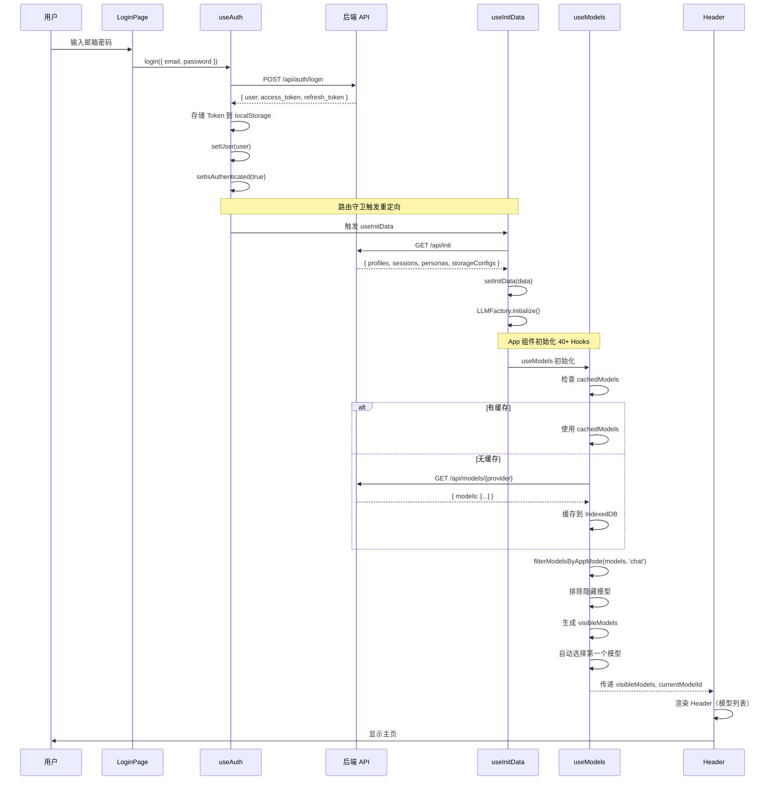
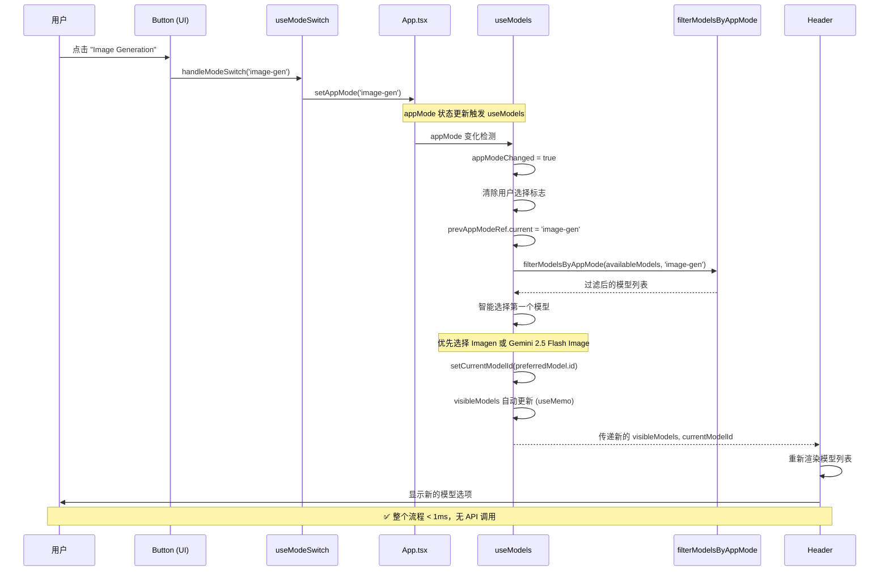
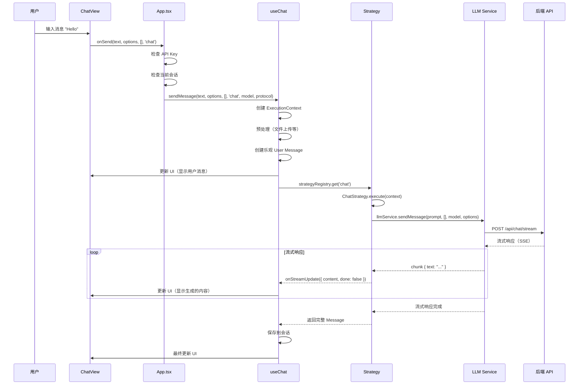
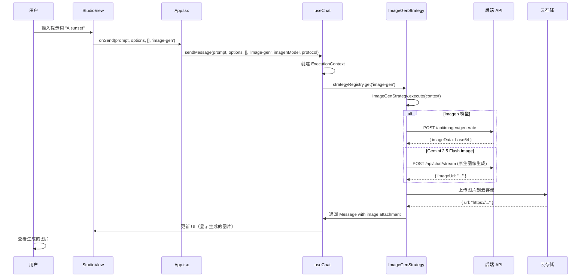
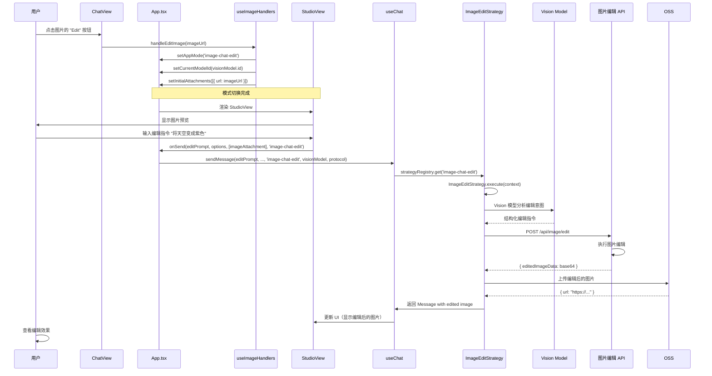
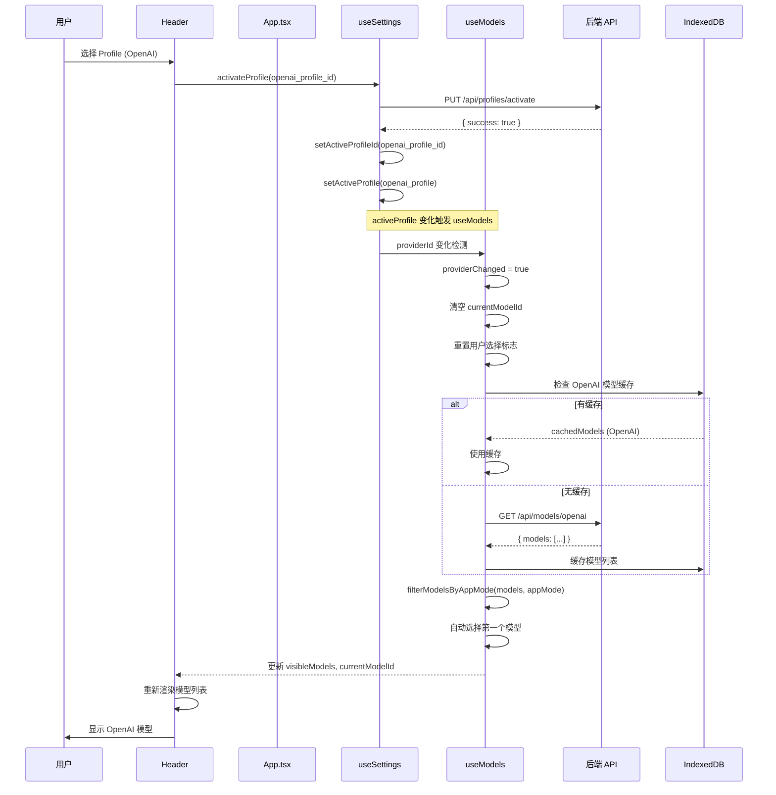
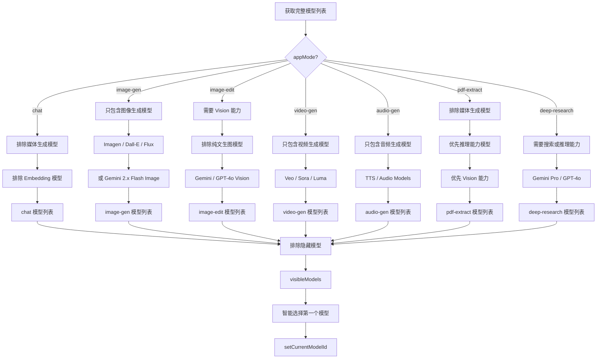
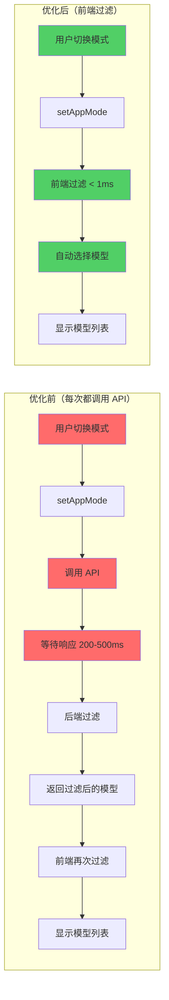

# 可视化流程图

**日期：** 2026-01-15  
**说明：** 使用 Mermaid 图表展示关键流程

---

## 🔐 登录到主页加载完整流程



---

## 🔄 模式切换联动流程（优化后）



---

## 🎨 Chat 消息发送流程



---

## 🖼️ 图片生成流程



---

## ✂️ 图片编辑流程



---

## 📊 Provider 切换流程



---

## 🔍 模型过滤决策树



---

## ⚡ 性能优化对比



**性能对比：**
- 优化前：200-500ms（API 调用 + 网络延迟）
- 优化后：< 1ms（纯前端操作）
- 提升：200-500x

---

## 🎯 关键数据流总结

### 登录流程
```
LoginPage → useAuth → API (POST /api/auth/login)
    ↓
存储 Token → setIsAuthenticated(true)
    ↓
路由重定向到主页
```

### 初始化流程
```
useInitData → API (GET /api/init)
    ↓
{ profiles, sessions, personas, storageConfigs }
    ↓
useSettings / useSessions / usePersonas / useStorageConfigs
    ↓
LLMFactory.initialize()
```

### 模型加载流程
```
useModels → 检查 cachedModels
    ↓
有缓存 → 使用缓存
无缓存 → API (GET /api/models/{provider})
    ↓
filterModelsByAppMode(models, appMode)  // 前端过滤
    ↓
排除隐藏模型 → visibleModels
    ↓
自动选择第一个模型 → currentModelId
```

### 模式切换流程
```
useModeSwitch → setAppMode('image-gen')
    ↓
useModels 检测 appModeChanged
    ↓
前端过滤 (< 1ms)
    ↓
自动选择新模式下的第一个模型
    ↓
Header 重新渲染
```

### 消息发送流程
```
onSend → useChat.sendMessage
    ↓
创建 ExecutionContext
    ↓
预处理（文件上传等）
    ↓
策略模式执行（ChatStrategy / ImageGenStrategy / ...）
    ↓
LLM Service 流式响应
    ↓
更新 UI（实时显示生成内容）
```

---

**文档创建时间：** 2026-01-15  
**工具：** Mermaid Diagrams
