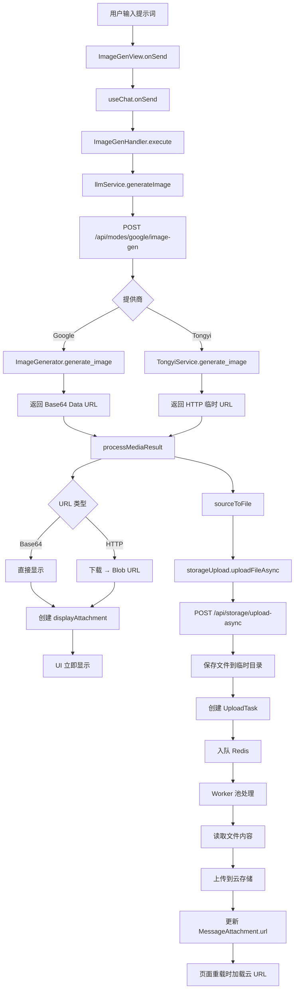
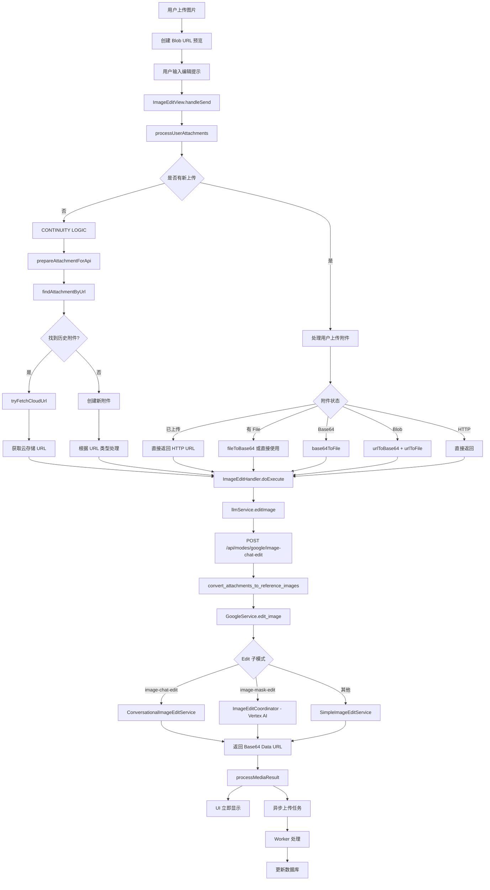
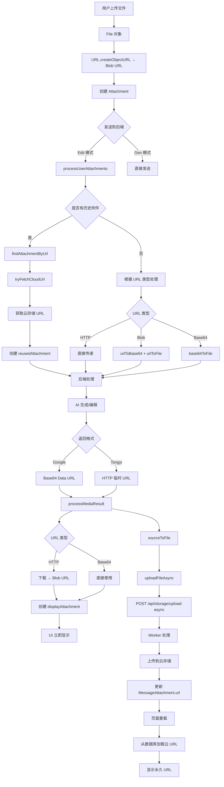

# 完整附件处理流程分析文档（含附件处理）

> **版本**: v2.0  
> **创建日期**: 2026-01-18  
> **文档类型**: 完整流程分析（Gen 模式 + Edit 模式 + 附件处理完整生命周期）  
> **验证状态**: 基于当前正常运行代码验证  

---

## 📋 目录

1. [文档说明](#文档说明)
2. [附件处理核心概念](#附件处理核心概念)
3. [Gen 模式完整流程（含附件处理）](#gen-模式完整流程含附件处理)
4. [Edit 模式完整流程（含附件处理）](#edit-模式完整流程含附件处理)
5. [附件处理完整生命周期](#附件处理完整生命周期)
6. [不同提供商的附件处理差异](#不同提供商的附件处理差异)
7. [函数调用链分析（含附件处理）](#函数调用链分析含附件处理)
8. [数据库加载流程（含附件）](#数据库加载流程含附件)
9. [完整流程图](#完整流程图)

---

## 文档说明

### 1.1 分析范围

本文档涵盖：

1. **Gen 模式**（图片生成）
   - 用户操作 → 后端处理 → AI 生成图片 → 附件处理 → 显示 → 异步上传 → 数据库更新

2. **Edit 模式**（图片编辑）
   - 用户上传附件 → 附件处理（continuity logic）→ 后端处理 → AI 编辑图片 → 附件处理 → 显示 → 异步上传 → 数据库更新

3. **附件处理完整生命周期**
   - 用户上传文件 → Blob URL 创建
   - 附件在不同模式间的传递（continuity logic）
   - 附件 URL 的转换链（Blob → Base64 → HTTP → 云存储）
   - 附件在数据库中的存储和加载
   - 页面重载时的附件恢复

4. **函数调用链**
   - 前端附件处理函数调用关系（A → B → C）
   - 后端附件处理函数调用关系
   - 数据流转路径

### 1.2 验证方法

本流程基于**当前正常运行代码**验证：

- ✅ 代码静态分析
- ✅ 函数调用链追踪
- ✅ 数据流转路径验证
- ✅ 与现有功能一致性检查

---

## 附件处理核心概念

### 2.1 URL 类型

| URL 类型 | 格式 | 生命周期 | 用途 |
|---------|------|---------|------|
| **Blob URL** | `blob:http://localhost:3000/xxx` | 页面关闭后失效 | 用户上传文件的临时预览 |
| **Base64 Data URL** | `data:image/png;base64,iVBORw0KGgo...` | 永久有效（内存中） | AI 生成图片（Google）、跨模式传递 |
| **HTTP 临时 URL** | `https://dashscope.oss-cn-beijing.aliyuncs.com/...` | 会过期 | AI 生成图片（Tongyi） |
| **HTTP 云存储 URL** | `https://storage.example.com/...` | 永久有效 | 上传到云存储后的永久 URL |

### 2.2 附件状态（uploadStatus）

| 状态 | 说明 | url 字段内容 |
|------|------|------------|
| `pending` | 待上传 | Base64/Blob URL 或空 |
| `uploading` | 上传中 | 临时 URL 或空 |
| `completed` | 已上传 | 云存储 HTTP URL |
| `failed` | 上传失败 | 临时 URL 或空 |

### 2.3 附件字段说明

| 字段 | 说明 | 示例 |
|------|------|------|
| `id` | 附件唯一标识 | `"uuid-xxx"` |
| `url` | 主要 URL（权威来源） | 云存储 URL 或临时 URL |
| `tempUrl` | 临时 URL（用于跨模式查找） | Base64/Blob/HTTP 临时 URL |
| `file` | File 对象（不可序列化） | `File` 对象 |
| `base64Data` | Base64 数据（不可序列化） | `"data:image/png;base64,..."` |
| `uploadStatus` | 上传状态 | `'completed'` |
| `uploadTaskId` | 上传任务 ID | `"task-xxx"` |

---

## Gen 模式完整流程（含附件处理）

### 3.1 用户操作阶段

```
用户输入提示词
  ↓
ImageGenView.onSend(text, options, attachments, 'image-gen')
  ↓
useChat.onSend()
  ↓
HandlerRegistry.getHandler('image-gen').execute(context)
```

**代码位置**：
- `frontend/components/views/ImageGenView.tsx` - 用户界面
- `frontend/hooks/useChat.ts` - 聊天钩子

### 3.2 Handler 处理阶段

```
ImageGenHandler.execute(context)
  ↓
BaseHandler.validateContext(context)
  ↓
BaseHandler.validateAttachments(context.attachments)
  ↓
ImageGenHandler.doExecute(context)
  ↓
llmService.generateImage(prompt, attachments)
```

**代码位置**：
- `frontend/hooks/handlers/ImageGenHandlerClass.ts:8-48`
- `frontend/hooks/handlers/BaseHandler.ts:28-35`

### 3.3 API 请求阶段

```
llmService.generateImage()
  ↓
UnifiedProviderClient.generateImage()
  ↓
POST /api/modes/{provider}/image-gen
  Body: {
    modelId: "...",
    prompt: "...",
    attachments: []  // Gen 模式通常无附件
  }
```

**代码位置**：
- `frontend/services/llmService.ts:237-279`
- `frontend/services/providers/UnifiedProviderClient.ts`

### 3.4 后端处理阶段

```
POST /api/modes/{provider}/image-gen
  ↓
modes.handle_mode(provider, 'image-gen', request)
  ↓
get_provider_credentials()  [获取凭证]
  ↓
ProviderFactory.create(provider, ...)  [创建服务]
  ↓
get_service_method('image-gen') → 'generate_image'
  ↓
service.generate_image(prompt, model, **kwargs)
  ├─ Google: ImageGenerator.generate_image()
  │   ↓
  │   ImagenCoordinator.get_generator()
  │   ↓
  │   GeminiAPIGenerator.generate_image()
  │   ↓
  │   返回 Base64 Data URL
  │
  └─ Tongyi: TongyiService.generate_image()
      ↓
      ImageGenerationService.generate()
      ↓
      返回 HTTP 临时 URL
  ↓
返回 ModeResponse {
  images: [{
    url: "data:image/png;base64,..."  // Google
    // 或
    url: "https://dashscope.oss-cn-beijing.aliyuncs.com/..."  // Tongyi
    mimeType: "image/png"
  }]
}
```

**代码位置**：
- `backend/app/routers/core/modes.py:150-300`
- `backend/app/services/gemini/image_generator.py:55-95`
- `backend/app/services/tongyi/tongyi_service.py`

### 3.5 附件处理阶段（AI 生成图片）

```
后端返回 results
  ↓
ImageGenHandler.doExecute() 接收 results
  ↓
对每个 result 调用 processMediaResult(res, context, 'generated')
  ↓
processMediaResult() 内部处理：
  ├─ 1. 创建 attachmentId
  ├─ 2. 判断 URL 类型
  │   ├─ 如果是 HTTP URL（Tongyi）
  │   │   ↓
  │   │   fetch(res.url) 下载图片
  │   │   ↓
  │   │   response.blob() 获取 Blob
  │   │   ↓
  │   │   URL.createObjectURL(blob) → displayUrl (Blob URL)
  │   │
  │   └─ 如果是 Base64 URL（Google）
  │       ↓
  │       displayUrl = res.url (直接使用 Base64)
  │
  ├─ 3. 创建 displayAttachment（立即显示）
  │   {
  │     id: attachmentId,
  │     url: displayUrl,  // Blob URL 或 Base64 URL
  │     tempUrl: originalUrl,  // 保存原始 URL（用于跨模式查找）
  │     uploadStatus: 'pending'
  │   }
  │
  └─ 4. 创建 dbAttachmentPromise（异步上传）
      ↓
      sourceToFile(res.url, filename, res.mimeType)
      ├─ 如果是 Base64 URL
      │   ↓
      │   fetch(base64Url) → blob → File
      │
      ├─ 如果是 Blob URL
      │   ↓
      │   fetch(blobUrl) → blob → File
      │
      └─ 如果是 HTTP URL
          ↓
          fetch(proxyUrl) → blob → File
      ↓
      storageUpload.uploadFileAsync(file, options)
      ↓
      POST /api/storage/upload-async
      ↓
      返回 { taskId, status: 'pending' }
      ↓
      返回 Attachment {
        id: attachmentId,
        url: isHttpUrl(originalUrl) ? originalUrl : '',  // 保存 AI 临时 URL
        tempUrl: isHttpUrl(originalUrl) ? originalUrl : undefined,
        uploadStatus: 'pending',
        uploadTaskId: taskId
      }
  ↓
返回 { displayAttachment, dbAttachmentPromise }
```

**代码位置**：
- `frontend/hooks/handlers/attachmentUtils.ts:960-1016` - `processMediaResult`
- `frontend/hooks/handlers/attachmentUtils.ts:291-450` - `sourceToFile`
- `frontend/services/storage/storageUpload.ts:404-462` - `uploadFileAsync`

### 3.6 UI 显示阶段

```
ImageGenHandler 返回 HandlerResult
  {
    content: "Generated images for: ...",
    attachments: displayAttachments[],  // 立即显示
    uploadTask: Promise  // 后台处理
  }
  ↓
useChat 更新 messages 状态
  ↓
ImageGenView 渲染
  ├─ 显示 displayAttachments[].url（立即可见）
  └─ 显示上传状态（pending/uploading/completed）
```

**代码位置**：
- `frontend/components/views/ImageGenView.tsx:66-136` - 显示附件

### 3.7 异步上传阶段

```
uploadTask() 执行
  ↓
dbAttachmentPromise 完成
  ↓
POST /api/storage/upload-async 已创建任务
  ↓
Worker 池处理（后台）
  ├─ Redis BRPOP 获取任务
  ├─ Worker._process_task(task_id)
  │   ├─ 查询 UploadTask（数据库）
  │   ├─ 更新状态：pending → uploading
  │   ├─ _get_file_content(task)
  │   │   ├─ source_file_path → 读取本地文件
  │   │   └─ source_url → httpx.get() 下载
  │   ├─ StorageService.upload_file()  [上传到云存储]
  │   ├─ _handle_success()
  │   │   ├─ 更新 UploadTask: status → 'completed', target_url
  │   │   └─ update_session_attachment_url()
  │   │       ↓
  │   │       更新 MessageAttachment.url = 云存储 URL
  │   │       更新 MessageAttachment.upload_status = 'completed'
  │   └─ 删除临时文件
  └─ 完成
```

**代码位置**：
- `backend/app/services/common/upload_worker_pool.py:381-490` - `_process_task`
- `backend/app/routers/storage/storage.py:523-573` - `update_session_attachment_url`

---

## Edit 模式完整流程（含附件处理）

### 4.1 用户上传附件阶段

```
用户选择文件
  ↓
InputArea.handleFileSelect(e)
  ↓
对每个文件：
  ├─ URL.createObjectURL(file) → blobUrl (Blob URL)
  ├─ 创建 Attachment {
  │     id: uuidv4(),
  │     file: file,
  │     mimeType: file.type,
  │     name: file.name,
  │     url: blobUrl,  // Blob URL（临时）
  │     tempUrl: blobUrl,  // 保存用于查找
  │     uploadStatus: 'pending'
  │   }
  └─ 添加到 attachments 数组
  ↓
ImageEditView 显示预览（使用 blobUrl）
```

**代码位置**：
- `frontend/components/chat/InputArea.tsx:95-124` - `handleFileSelect`
- `frontend/components/views/ImageEditView.tsx` - 显示预览

### 4.2 用户发送请求阶段

```
用户输入编辑提示 + 点击发送
  ↓
ImageEditView.handleSend(text, attachments)
  ↓
processUserAttachments(attachments, activeImageUrl, messages, sessionId, 'canvas')
  ↓
处理逻辑：
  ├─ 情况 1: 无新上传，但有 activeImageUrl（CONTINUITY LOGIC）
  │   ↓
  │   prepareAttachmentForApi(activeImageUrl, messages, sessionId, 'canvas')
  │   ↓
  │   步骤 1: findAttachmentByUrl(activeImageUrl, messages)
  │   ├─ 精确匹配 url 或 tempUrl
  │   └─ 如果未找到且是 Blob URL，查找最近的有效云端图片附件（兜底）
  │   ↓
  │   步骤 2: 如果找到历史附件
  │   ├─ tryFetchCloudUrl(sessionId, attachmentId, url, status)
  │   │   ↓
  │   │   fetchAttachmentStatus(sessionId, attachmentId)
  │   │   ↓
  │   │   GET /api/sessions/{sessionId}/attachments/{attachmentId}
  │   │   ↓
  │   │   返回 { url: 云存储 URL, uploadStatus: 'completed' }
  │   │
  │   └─ 创建 reusedAttachment {
  │       id: uuidv4(),
  │       url: finalUrl,  // 云存储 URL 或原始 URL
  │       uploadStatus: finalUploadStatus
  │     }
  │
  └─ 情况 2: 有用户上传的附件
      ↓
      对每个附件处理：
      ├─ 如果 uploadStatus === 'completed' && isHttpUrl(url)
      │   ↓
      │   直接返回（后端会自己下载）
      │
      ├─ 如果已有 file 对象
      │   ├─ 如果 url 无效或 Blob URL
      │   │   ↓
      │   │   fileToBase64(file) → Base64 URL
      │   │   ↓
      │   │   返回 { ...att, url: base64Url }
      │   │
      │   └─ 如果 url 有效
      │       ↓
      │       直接返回
      │
      ├─ 如果是 Base64 URL
      │   ↓
      │   base64ToFile(base64Url) → File 对象
      │   ↓
      │   返回 { ...att, file, uploadStatus: 'completed' }
      │
      ├─ 如果是 Blob URL
      │   ↓
      │   urlToBase64(blobUrl) → Base64 URL（用于显示）
      │   urlToFile(blobUrl) → File 对象（用于上传）
      │   ↓
      │   返回 { ...att, url: base64Url, file, uploadStatus: 'pending' }
      │
      ├─ 如果是 HTTP URL
      │   ↓
      │   直接返回（后端会自己下载）
      │
      └─ 如果无法确定，查询后端
          ↓
          tryFetchCloudUrl(sessionId, attachmentId, url, status)
          ↓
          返回云存储 URL
  ↓
返回处理后的 attachments[]
```

**代码位置**：
- `frontend/hooks/handlers/attachmentUtils.ts:786-942` - `processUserAttachments`
- `frontend/hooks/handlers/attachmentUtils.ts:653-758` - `prepareAttachmentForApi`
- `frontend/hooks/handlers/attachmentUtils.ts:524-584` - `findAttachmentByUrl`
- `frontend/hooks/handlers/attachmentUtils.ts:378-411` - `tryFetchCloudUrl`

### 4.3 Handler 处理阶段

```
ImageEditHandler.doExecute(context)
  ↓
准备 referenceImages { raw: Attachment, mask?: Attachment }
  ├─ 如果有 File 且有 HTTP URL → 直接使用 URL（后端下载）
  └─ 如果只有 File 无 HTTP URL → 转换为 Base64
  ↓
llmService.editImage(prompt, referenceImages, mode, options)
  ↓
POST /api/modes/{provider}/image-chat-edit
```

**代码位置**：
- `frontend/hooks/handlers/ImageEditHandlerClass.ts:10-147`

### 4.4 后端处理阶段

```
POST /api/modes/{provider}/image-chat-edit
  ↓
modes.handle_mode(provider, 'image-chat-edit', request)
  ↓
convert_attachments_to_reference_images(attachments)
  ├─ 提取 url / tempUrl / fileUri / base64Data
  └─ 转换为 { raw: image_data, mask?: image_data }
  ↓
service.edit_image(prompt, reference_images, mode='image-chat-edit', **kwargs)
  ├─ Google: GoogleService.edit_image()
  │   ↓
  │   ImageEditCoordinator.edit_image()
  │   ↓
  │   路由逻辑（根据 mode）：
  │   ├─ mode='image-chat-edit' → ConversationalImageEditService
  │   ├─ mode='image-mask-edit' → ImageEditCoordinator (Vertex AI)
  │   └─ 其他 → SimpleImageEditService 或 Vertex AI
  │   ↓
  │   ConversationalImageEditService.send_edit_message()
  │   ├─ _convert_reference_images(reference_images)
  │   │   ├─ 如果是 HTTP URL → 直接传递（后端会下载）
  │   │   ├─ 如果是 Base64 URL → 直接使用
  │   │   └─ 如果是纯 Base64 → 添加 data URL 前缀
  │   │
  │   └─ 处理 reference_images_list
  │       ├─ HTTP URL → aiohttp.get() 下载 → image_bytes
  │       ├─ Base64 URL → base64.b64decode() → image_bytes
  │       └─ Part.from_bytes(image_bytes, mime_type)
  │   ↓
  │   返回 Base64 Data URL
  │
  └─ Tongyi: TongyiService.edit_image()
      ↓
      ImageEditService.edit()
      ↓
      返回 HTTP 临时 URL
  ↓
返回 ModeResponse { images: [{ url, mimeType, ... }] }
```

**代码位置**：
- `backend/app/routers/core/modes.py:102-145` - `convert_attachments_to_reference_images`
- `backend/app/services/gemini/conversational_image_edit_service.py:355-424` - `send_edit_message`
- `backend/app/services/gemini/conversational_image_edit_service.py:711-783` - `_convert_reference_images`

### 4.5 附件处理阶段（AI 编辑图片）

```
后端返回 results
  ↓
ImageEditHandler.doExecute() 接收 results
  ↓
processMediaResult(res, context, 'edited')  [对每个结果]
  ↓
[同 Gen 模式的附件处理流程]
  ↓
返回 { displayAttachment, dbAttachmentPromise }
  ↓
ImageEditHandler 返回 HandlerResult
  ├─ content: "Edited images for: ..." + thoughts + textResponse
  ├─ attachments: displayAttachments[]
  └─ uploadTask: Promise
      ├─ dbAttachments（AI 生成图片）
      └─ dbUserAttachments（用户上传附件）
```

**代码位置**：
- `frontend/hooks/handlers/ImageEditHandlerClass.ts:75-136`

### 4.6 异步上传阶段

```
[同 Gen 模式的异步上传流程]
  ↓
用户上传的附件也会异步上传
  ├─ ImageEditHandler.uploadTask()
  │   ├─ dbAttachments（AI 生成图片）
  │   └─ dbUserAttachments（用户上传附件）
  │       ↓
  │       对每个用户附件：
  │       ├─ 如果已上传（uploadStatus === 'completed'）
  │       │   ↓
  │       │   直接返回
  │       │
  │       └─ 如果有 File 对象
  │           ↓
  │           storageUpload.uploadFileAsync(file, options)
  │           ↓
  │           [同 Gen 模式的异步上传流程]
```

**代码位置**：
- `frontend/hooks/handlers/ImageEditHandlerClass.ts:97-136`

---

## 附件处理完整生命周期

### 5.1 附件 URL 转换链

```
[用户上传]
File 对象
  ↓
URL.createObjectURL(file) → Blob URL
  ↓
[跨模式传递]
findAttachmentByUrl(blobUrl, messages)
  ↓
找到历史附件 → 获取云存储 URL（如果已上传）
  ↓
[发送到后端]
prepareAttachmentForApi()
  ├─ 如果是 HTTP URL → 直接传递（后端下载）
  ├─ 如果是 Blob URL → urlToBase64() → Base64 URL
  └─ 如果是 Base64 URL → 直接使用
  ↓
[后端处理]
convert_attachments_to_reference_images()
  ├─ HTTP URL → 后端下载 → image_bytes
  ├─ Base64 URL → base64.b64decode() → image_bytes
  └─ 转换为 API 格式
  ↓
[AI 生成/编辑]
返回结果 URL（Base64 或 HTTP 临时 URL）
  ↓
[前端处理]
processMediaResult()
  ├─ HTTP URL → fetch() → Blob → Blob URL（显示）
  └─ Base64 URL → 直接使用（显示）
  ↓
[异步上传]
sourceToFile() → File 对象
  ↓
uploadFileAsync() → 上传到云存储
  ↓
[Worker 处理]
上传完成 → 更新 MessageAttachment.url = 云存储 URL
  ↓
[页面重载]
从数据库加载 → 使用云存储 URL（永久有效）
```

### 5.2 Continuity Logic 详细流程

```
[Edit 模式：无新上传，但有 activeImageUrl]
  ↓
processUserAttachments([], activeImageUrl, messages, sessionId)
  ↓
prepareAttachmentForApi(activeImageUrl, messages, sessionId)
  ↓
步骤 1: findAttachmentByUrl(activeImageUrl, messages)
  ├─ 策略 1: 精确匹配 url 或 tempUrl
  │   ├─ 遍历 messages（从新到旧）
  │   └─ 匹配 att.url === targetUrl || att.tempUrl === targetUrl
  │
  └─ 策略 2: Blob URL 兜底策略
      ├─ 如果是 Blob URL 且未精确匹配
      └─ 查找最近的有效云端图片附件
          ├─ mimeType.startsWith('image/')
          ├─ uploadStatus === 'completed'
          └─ isHttpUrl(url)
  ↓
步骤 2: 如果找到历史附件
  ├─ tryFetchCloudUrl(sessionId, attachmentId, url, status)
  │   ├─ 检查是否需要查询（pending 或非 HTTP URL）
  │   ├─ fetchAttachmentStatus(sessionId, attachmentId)
  │   │   ↓
  │   │   GET /api/sessions/{sessionId}/attachments/{attachmentId}
  │   │   ↓
  │   │   后端查询：
  │   │   ├─ 查询 UploadTask（如果 upload_task_id 存在）
  │   │   ├─ 查询 MessageAttachment
  │   │   └─ 返回 { url, uploadStatus, taskId, taskStatus }
  │   │
  │   └─ 如果返回有效云 URL → 使用云 URL
  │
  └─ 创建 reusedAttachment
      ├─ url: finalUrl（云存储 URL 或原始 URL）
      ├─ uploadStatus: finalUploadStatus
      └─ 如果是 HTTP URL → 直接传递（后端下载）
  ↓
步骤 3: 如果未找到历史附件
  ├─ 如果是 Base64/Blob URL
  │   ↓
  │   创建新附件 {
  │     url: '',  // 本地数据没有永久 URL
  │     uploadStatus: 'pending',
  │     base64Data: base64Data
  │   }
  │
  └─ 如果是 HTTP URL
      ↓
      创建新附件 {
        url: imageUrl,  // 直接传递 HTTP URL
        uploadStatus: 'completed'
      }
```

**代码位置**：
- `frontend/hooks/handlers/attachmentUtils.ts:653-758` - `prepareAttachmentForApi`
- `frontend/hooks/handlers/attachmentUtils.ts:524-584` - `findAttachmentByUrl`
- `frontend/hooks/handlers/attachmentUtils.ts:378-411` - `tryFetchCloudUrl`
- `frontend/hooks/handlers/attachmentUtils.ts:590-630` - `fetchAttachmentStatus`

---

## 不同提供商的附件处理差异

### 6.1 Gen 模式差异

| 差异点 | Google | Tongyi |
|-------|--------|--------|
| **返回格式** | Base64 Data URL | HTTP 临时 URL |
| **前端显示** | 直接使用 Base64 | 下载后创建 Blob URL |
| **异步上传** | Base64 → File → 上传 | HTTP URL → 后端下载 → 上传 |
| **processMediaResult** | `displayUrl = res.url` | `fetch(res.url) → Blob → Blob URL` |

### 6.2 Edit 模式差异

| 差异点 | Google | Tongyi |
|-------|--------|--------|
| **返回格式** | Base64 Data URL | HTTP 临时 URL |
| **对话式编辑** | `ConversationalImageEditService` | 不支持 |
| **子模式支持** | 多种子模式（mask, inpainting 等） | 通用编辑 |
| **附件处理** | 后端下载 HTTP URL → Base64 → API | 后端下载 HTTP URL → API |

### 6.3 后端附件处理差异

| 差异点 | Google | Tongyi |
|-------|--------|--------|
| **HTTP URL 处理** | `aiohttp.get()` 下载 → `Part.from_bytes()` | 直接使用 URL 或下载 |
| **Base64 处理** | `base64.b64decode()` → `Part.from_bytes()` | Base64 解码 → API 格式 |
| **API 格式** | `genai_types.Part` | DashScope API 格式 |

---

## 函数调用链分析（含附件处理）

### 7.1 Gen 模式完整调用链

```
[前端]
ImageGenView.onSend()
  → useChat.onSend()
    → HandlerRegistry.getHandler('image-gen').execute()
      → ImageGenHandler.execute()
        → BaseHandler.validateContext()
        → BaseHandler.validateAttachments()
        → ImageGenHandler.doExecute()
          → llmService.generateImage()
            → UnifiedProviderClient.generateImage()
              → POST /api/modes/{provider}/image-gen

[后端]
POST /api/modes/{provider}/image-gen
  → modes.handle_mode()
    → get_provider_credentials()
    → ProviderFactory.create()
    → get_service_method('image-gen') → 'generate_image'
    → service.generate_image()
      ├─ Google: ImageGenerator.generate_image()
      │   → ImagenCoordinator.get_generator()
      │     → GeminiAPIGenerator.generate_image()
      └─ Tongyi: TongyiService.generate_image()
          → ImageGenerationService.generate()

[前端处理结果]
processMediaResult(res, context, 'generated')
  → 判断 URL 类型
    ├─ HTTP URL → fetch(res.url) → Blob → URL.createObjectURL()
    └─ Base64 URL → 直接使用
  → 创建 displayAttachment
  → sourceToFile(res.url)
    ├─ Base64 URL → fetch() → blob → File
    ├─ Blob URL → fetch() → blob → File
    └─ HTTP URL → fetch(proxyUrl) → blob → File
  → storageUpload.uploadFileAsync()
    → POST /api/storage/upload-async

[后端异步上传]
POST /api/storage/upload-async
  → upload_file_async()
    → 保存文件到临时目录
    → 创建 UploadTask
    → Redis.enqueue(task_id)

[Worker 处理]
Worker._process_task(task_id)
  → _get_file_content()
  → StorageService.upload_file()
  → _handle_success()
    → update_session_attachment_url()
      → 更新 MessageAttachment.url
```

### 7.2 Edit 模式完整调用链

```
[前端]
ImageEditView.handleSend()
  → processUserAttachments(attachments, activeImageUrl, messages, sessionId)
    → prepareAttachmentForApi(activeImageUrl, messages, sessionId)
      → findAttachmentByUrl(activeImageUrl, messages)
        → 精确匹配 url 或 tempUrl
        → 或查找最近的有效云端图片附件（兜底）
      → tryFetchCloudUrl(sessionId, attachmentId, url, status)
        → fetchAttachmentStatus(sessionId, attachmentId)
          → GET /api/sessions/{sessionId}/attachments/{attachmentId}
    → 处理用户上传的附件
      ├─ 已完成上传 → 直接返回
      ├─ 有 File 对象 → fileToBase64() 或直接使用
      ├─ Base64 URL → base64ToFile()
      ├─ Blob URL → urlToBase64() + urlToFile()
      └─ HTTP URL → 直接返回
  → useChat.onSend()
    → ImageEditHandler.execute()
      → ImageEditHandler.doExecute()
        → llmService.editImage()
          → POST /api/modes/{provider}/image-chat-edit

[后端]
POST /api/modes/{provider}/image-chat-edit
  → modes.handle_mode()
    → convert_attachments_to_reference_images(attachments)
      → 提取 url / tempUrl / fileUri / base64Data
      → 转换为 { raw: image_data, mask?: image_data }
    → service.edit_image(mode='image-chat-edit')
      ├─ Google: GoogleService.edit_image()
      │   → ImageEditCoordinator.edit_image()
      │     → ConversationalImageEditService.send_edit_message()
      │       → _convert_reference_images(reference_images)
      │         → 处理 HTTP URL / Base64 URL
      │       → 处理 reference_images_list
      │         ├─ HTTP URL → aiohttp.get() 下载
      │         └─ Base64 URL → base64.b64decode()
      │       → Part.from_bytes(image_bytes, mime_type)
      └─ Tongyi: TongyiService.edit_image()
          → ImageEditService.edit()

[前端处理结果]
processMediaResult(res, context, 'edited')
  → [同 Gen 模式的附件处理流程]

[后端异步上传]
[同 Gen 模式的异步上传流程]
```

---

## 数据库加载流程（含附件）

### 8.1 页面重载时加载历史消息

```
用户刷新页面
  ↓
useSessions.loadSession(sessionId)
  ↓
GET /api/sessions/{sessionId}
  ↓
sessions.get_session_by_id(sessionId)
  ↓
查询 ChatSession
  ↓
查询 MessageAttachment（关联附件）
  ↓
MessageAttachment.to_dict()
  ├─ url: 云存储 URL（持久化）
  ├─ temp_url: 临时 URL（兼容旧数据）
  └─ upload_status: 'completed' | 'pending' | 'failed'
  ↓
返回消息列表（包含 attachments）
  ↓
前端渲染
  ├─ ImageGenView: 显示附件 URL
  └─ ImageEditView: 加载附件到画布
    ├─ 如果 url 是云存储 URL → 直接使用
    └─ 如果 url 是 Base64 URL → 直接使用
```

**代码位置**：
- `backend/app/routers/user/sessions.py:496-600` - `get_session_by_id`
- `backend/app/models/db_models.py:621-637` - `MessageAttachment.to_dict()`

### 8.2 会话保存时的附件处理

```
前端保存会话
  ↓
POST /api/sessions
  ↓
sessions.create_or_update_session(session_data)
  ↓
处理每个消息的附件
  ├─ 查询已完成的上传任务（completed_tasks）
  ├─ 查询已有附件记录（existing_attachments）
  └─ 确定权威 URL（优先级：UploadTask > 旧附件 > 前端）
  ↓
保存 MessageAttachment
  ├─ url: 云存储 URL 或临时 URL
  ├─ temp_url: 临时 URL（兼容）
  └─ upload_task_id: 关联上传任务 ID
  ↓
cleanAttachmentsForDb(attachments)
  ├─ 清除 Blob URL（临时）
  ├─ 清除 Base64 URL（太大）
  ├─ 保留 HTTP URL（如果 uploadStatus === 'completed'）
  └─ 删除 File 对象和 base64Data（不可序列化）
```

**代码位置**：
- `backend/app/routers/user/sessions.py:222-492` - `create_or_update_session`
- `frontend/hooks/handlers/attachmentUtils.ts:98-168` - `cleanAttachmentsForDb`

---

## 完整流程图

### 9.1 Gen 模式完整流程图（Mermaid）



### 9.2 Edit 模式完整流程图（Mermaid）



### 9.3 附件处理完整生命周期流程图（Mermaid）



---

**文档状态**: ✅ 完整流程已分析（含附件处理）  
**验证状态**: ✅ 与当前代码一致  
**最后更新**: 2026-01-18