# Image-Gen 模式跳转到 Edit/Expand 模式的附件显示完整流程

## 📋 文档概述

本文档详细描述了从 Image-Gen 模式生成图片后，点击 Edit/Expand 按钮跳转到 Edit/Expand 模式的完整流程，包括：

1. **完整流程图**：使用 Mermaid 序列图展示整个流程
2. **详细步骤说明**：每个阶段的代码位置和实现细节
3. **关键数据流**：URL 类型流转和附件对象结构
4. **代码验证结果**：对照实际代码验证流程准确性
5. **已知问题和优化建议**：当前存在的问题和改进方向

---

## ⚠️ 架构说明（2024年更新）

### 当前实现

**ImageGenHandler 架构变化**：
- ✅ `ImageGenHandler` **不再使用** `processMediaResult`
- ✅ **直接使用后端返回的 URL**（Base64 或 HTTP URL）
- ✅ **后端已经处理了附件创建和上传任务**
- ✅ **前端无需转换 URL**，避免 Blob URL 生命周期问题

**实际流程**：
```
1. AI 生成图片
   ↓
2. 后端 attachment_service.py 返回 display_url（Base64 或 HTTP URL）
   ↓
3. ImageGenHandler 直接使用 res.url（Base64 或 HTTP URL）
   ↓
4. ImageGenView 显示：
   ↓
5. 用户点击 Edit/Expand 按钮
   ↓
6. 传递 att.url（Base64 或 HTTP URL）到 useImageHandlers
```

**架构优势**：
- ✅ 后端统一处理附件，前端无需转换
- ✅ 直接使用 Base64 或 HTTP URL，避免 Blob URL 生命周期问题
- ✅ 后端已经处理上传任务，前端无需处理

### 重载网页后的 URL 处理

**关键设计**：
- ✅ 重载后，临时 URL（Base64、Blob URL）会失效
- ✅ 重载后，只有永久云存储 URL（`uploadStatus === 'completed'`）会被保留
- ✅ 前端自动使用永久云存储 URL 显示

**处理流程**：
```
1. 保存到数据库时（cleanAttachmentsForDb）
   ↓
2. Base64 URL → 清空（体积太大）
   ↓
3. Blob URL → 清空（页面刷新后失效）
   ↓
4. HTTP URL（uploadStatus === 'completed'）→ 保留（永久云存储 URL）
   ↓
5. 重载网页
   ↓
6. 从数据库加载会话和消息
   ↓
7. 只有永久云存储 URL 被保留
   ↓
8. 前端使用永久云存储 URL 显示
```

**代码验证**：
- ✅ `cleanAttachmentsForDb`（`attachmentUtils.ts:110-119`）：清空 Base64 和 Blob URL
- ✅ `cleanAttachmentsForDb`（`attachmentUtils.ts:124-126`）：保留 `uploadStatus === 'completed'` 的 HTTP URL
- ✅ `prepareSessions`（`useSessions.ts:45-59`）：恢复失效的 Blob URL（使用 tempUrl 中的云存储 URL）

### 后端上传后前端会话更新策略

**关键设计**：
- ✅ 后端上传完成后，只更新数据库，不更新前端会话
- ✅ 前端保持原始 URL（Base64 或 HTTP 临时 URL）用于显示
- ✅ 避免前端重新渲染，提升用户体验
- ✅ 重载后自动使用永久云存储 URL

**处理流程**：
```
1. AI 生成图片，返回 Base64 或 HTTP 临时 URL
   ↓
2. 前端立即显示（使用原始 URL）
   ↓
3. 后端异步上传到云存储
   ↓
4. 上传完成后，只更新数据库（url 字段更新为云存储 URL）
   ↓
5. 前端会话不更新，保持原始 URL
   ↓
6. 用户点击 Edit/Expand 按钮
   ↓
7. 使用原始 URL（Base64 或 HTTP 临时 URL）显示
   ↓
8. 重载网页后，使用永久云存储 URL 显示
```

**代码验证**：
- ✅ `BaseHandler.ts:199`：注释明确说明"只更新数据库，不调用 context.onProgressUpdate()，避免前端重新渲染"
- ✅ `BaseHandler.ts:241-247`：`context.onProgressUpdate` 被注释掉
- ✅ `useChat.ts:236`：只在初始保存时调用 `updateSessionMessages`，上传完成后不更新

**优势**：
- ✅ 避免不必要的查询：保持原始 URL，不需要查询后端
- ✅ 避免前端重新渲染：不更新会话，不会触发重新渲染
- ✅ 重载后自动优化：重载后自动使用永久云存储 URL

### URL 类型说明

**后端返回的 `display_url` 类型**（已验证）：

根据 `attachment_service.py` 第 203 行的实际实现：
```python
display_url = ai_url  # ✅ 直接返回原始 URL（Base64 或 HTTP）
```

**完整的 URL 类型**：
1. ✅ **Base64 Data URL** (`data:image/png;base64,...`)
   - AI 直接返回的 Base64 编码图片
   - 前端可以直接使用 `` 显示

2. ✅ **HTTP/HTTPS URL** 
   - 云存储 URL（上传完成后）
   - AI 临时 URL（如 Google 的临时 URL）

3. ⚠️ **临时代理 URL** (`/api/temp-images/{attachment_id}`)
   - **注意**：当前实现中，`attachment_service.py` **不再返回**这种类型的 URL
   - `/api/temp-images/{attachment_id}` 路由仍然存在，但它是用于**读取**存储在 `temp_url` 中的 Base64 或 HTTP URL，而不是作为 `display_url` 返回
   - 如果前端收到这种 URL，可能是历史代码或特殊场景，需要进一步验证

**代码验证**：
- ✅ `attachment_service.py:203`：`display_url = ai_url` - 直接返回原始 URL
- ✅ `ImageGenHandlerClass.ts:31`：注释提到 `/api/temp-images/{attachment_id}`，但这是**过时的注释**，实际代码使用后端返回的 `res.url`

---

## 流程图

### 方式 1：ASCII 艺术流程图（详细步骤）

这个流程图详细展示了从 ImageGenView 点击按钮到目标模式附件显示的完整过程，包括每个步骤的代码位置和注意事项：

```
┌─────────────────────────────────────────────────────────────────────────────────────────┐
│                            【用户操作起点】ImageGenView.tsx                              │
│                                                                                          │
│   生成的图片上悬停显示操作按钮:                                                           │
│   ┌──────────────────┐    ┌──────────────────┐                                          │
│   │  🖌️ Edit (粉色)   │    │  🔲 Expand (橙色) │                                          │
│   │  onClick={() =>  │    │  onClick={() =>  │                                          │
│   │  onEditImage(    │    │  onExpandImage(  │                                          │
│   │    att.url!)}    │    │    att.url!)}    │                                          │
│   └────────┬─────────┘    └────────┬─────────┘                                          │
│            │                       │                                                     │
│            │  传递图片 URL         │  传递图片 URL                                        │
│            │  ✅ 此时 att.url      │  ✅ Base64 或 HTTP URL                              │
│            │     是 Base64 或      │     （不再使用 Blob URL）                            │
│            │     HTTP URL          │     ⚠️ 注意：临时代理 URL                            │
│            │     （临时代理 URL     │     (/api/temp-images/{id})                         │
│            │     不再返回）        │     当前不再作为 display_url 返回                     │
│            ▼                       ▼                                                     │
└────────────┼───────────────────────┼────────────────────────────────────────────────────┘
             │                       │
             ▼                       ▼
┌─────────────────────────────────────────────────────────────────────────────────────────┐
│                         【App.tsx】回调函数定义                                          │
│                                                                                          │
│   const { handleEditImage, handleExpandImage } = useImageHandlers({                     │
│     messages,                      // ✅ 消息历史，用于查找原附件                         │
│     currentSessionId,              // ✅ 会话ID，用于查询云URL                            │
│     visibleModels,                                                                       │
│     activeModelConfig,                                                                   │
│     setAppMode: handleModeSwitch,  // ✅ 模式切换                                        │
│     setCurrentModelId,             // ✅ 模型切换（自动选vision模型）                     │
│     setInitialAttachments,         // ✅ 附件传递                                        │
│     setInitialPrompt               // ✅ 提示词传递                                      │
│   });                                                                                    │
└─────────────────────────────────────────────────────────────────────────────────────────┘
             │                       │
             ▼                       ▼
┌─────────────────────────────────────────────────────────────────────────────────────────┐
│                      【useImageHandlers.ts】核心处理逻辑                                 │
│                                                                                          │
│  ┌─────────────────────────────────────────────────────────────────────────────────┐    │
│  │                     handleEditImage(url) / handleExpandImage(url)               │    │
│  ├─────────────────────────────────────────────────────────────────────────────────┤    │
│  │                                                                                 │    │
│  │  Step 1: 切换模式                                                               │    │
│  │  ├─ setAppMode('image-chat-edit') / setAppMode('image-outpainting')            │    │
│  │                                                                                 │    │
│  │  Step 2: 查找原附件 ✅ 关键步骤                                                  │    │
│  │  ├─ const found = findAttachmentByUrl(url, messages);                          │    │
│  │  │                                                                              │    │
│  │  │  ┌─────────────────────────────────────────────────────────────────────┐    │
│  │  │  │ findAttachmentByUrl 匹配策略:                                        │    │
│  │  │  │                                                                      │    │
│  │  │  │ 策略1: 精确匹配 att.url === targetUrl || att.tempUrl === targetUrl   │    │
│  │  │  │        ✅ 当前架构：targetUrl 是 Base64 或 HTTP URL，匹配更可靠        │    │
│  │  │  │                                                                      │    │
│  │  │  │ 策略2: Blob URL 兜底 - 查找最近的有效云端图片附件                     │    │
│  │  │  │        ⚠️ 只有当 uploadStatus === 'completed' && isHttpUrl(url)      │    │
│  │  │  │        才会被认为是"有效云端附件"                                     │    │
│  │  │  └─────────────────────────────────────────────────────────────────────┘    │
│  │                                                                                 │    │
│  │  Step 3: 查询云URL ⚠️ 条件触发                                                  │    │
│  │  ├─ if (found.attachment.uploadStatus === 'pending' && currentSessionId) {     │    │
│  │  │      const cloudResult = await tryFetchCloudUrl(...);                       │    │
│  │  │      ⚠️ 只有 uploadStatus === 'pending' 才会触发！                          │    │
│  │  │      ⚠️ 如果 uploadStatus 是 undefined 或其他值，不会查询！                 │    │
│  │  │  }                                                                          │    │
│  │                                                                                 │    │
│  │  Step 4: 创建新附件对象                                                         │    │
│  │  ├─ newAttachment = {                                                          │    │
│  │  │      id: found ? found.attachment.id : uuidv4(),  // ✅ 复用或新建ID        │    │
│  │  │      mimeType: ...,                                                         │    │
│  │  │      name: ...,                                                             │    │
│  │  │      url: url,  // ✅ 使用传入的 url（Base64 或 HTTP URL）                  │    │
│  │  │      tempUrl: found?.attachment.tempUrl,                                    │    │
│  │  │      uploadStatus: found?.attachment.uploadStatus                           │    │
│  │  │  }                                                                          │    │
│  │  │                                                                             │    │
│  │  │  ✅ 如果 cloudResult 返回了云URL，url 会被更新为云 URL                       │    │
│  │  │  否则保持原始 URL（Base64 或 HTTP URL）                                     │    │
│  │                                                                                 │    │
│  │  Step 5: 设置初始附件                                                           │    │
│  │  ├─ setInitialAttachments([newAttachment]);                                    │    │
│  │  ├─ setInitialPrompt("Make it look like..."); // Edit模式                      │    │
│  │  ├─ setInitialPrompt(undefined); // Expand模式                                 │    │
│  │                                                                                 │    │
│  │  Step 6: 自动切换模型（如果当前模型无vision能力）                                │    │
│  │  ├─ if (!activeModelConfig.capabilities.vision) {                              │    │
│  │  │      const visionModel = visibleModels.find(m => m.capabilities.vision);    │    │
│  │  │      if (visionModel) setCurrentModelId(visionModel.id);                    │    │
│  │  │  }                                                                          │    │
│  └─────────────────────────────────────────────────────────────────────────────────┘    │
└─────────────────────────────────────────────────────────────────────────────────────────┘
                                     │
                                     ▼
┌─────────────────────────────────────────────────────────────────────────────────────────┐
│                          【App.tsx】状态更新 & 视图切换                                  │
│                                                                                          │
│   // 状态变化触发 React 重新渲染:                                                        │
│   const [appMode, setAppMode] = useState<AppMode>('chat');                              │
│   const [initialAttachments, setInitialAttachments] = useState<Attachment[]>();         │
│   const [initialPrompt, setInitialPrompt] = useState<string>();                         │
│                                                                                          │
│   // renderView() 根据 appMode 渲染不同视图:                                             │
│   // ✅ initialAttachments 会作为 props 传递给目标视图                                   │
└─────────────────────────────────────────────────────────────────────────────────────────┘
                                     │
                 ┌───────────────────┴───────────────────┐
                 ▼                                       ▼
┌────────────────────────────────────┐   ┌────────────────────────────────────┐
│    【ImageEditView / StudioView】  │   │       【ImageExpandView】           │
│    (image-chat-edit 模式)          │   │    (image-outpainting 模式)         │
├────────────────────────────────────┤   ├────────────────────────────────────┤
│                                    │   │                                    │
│ Props 接收:                        │   │ Props 接收:                        │
│   initialAttachments?: Attachment[]│   │   initialAttachments?: Attachment[]│
│                                    │   │                                    │
│ 内部状态:                          │   │ 内部状态:                          │
│   [activeAttachments, setActive]   │   │   [activeAttachments, setActive]   │
│   [activeImageUrl, setActiveUrl]   │   │   [activeImageUrl, setActiveUrl]   │
│                                    │   │                                    │
└────────────────────────────────────┘   └────────────────────────────────────┘
                 │                                       │
                 ▼                                       ▼
┌────────────────────────────────────────────────────────────────────────────────────────┐
│                        【useEffect】监听 initialAttachments 变化                        │
│                                                                                         │
│   // ImageEditView.tsx:319-330 / ImageExpandView.tsx:281-286                          │
│   useEffect(() => {                                                                     │
│     if (initialAttachments && initialAttachments.length > 0) {                         │
│       setActiveAttachments(initialAttachments);                                        │
│       setActiveImageUrl(getStableCanvasUrlFromAttachment(initialAttachments[0]));      │
│       //                 ✅ URL 处理逻辑：优先使用 file 对象创建 Blob URL              │
│       //                 否则直接使用 att.url 或 att.tempUrl                           │
│     }                                                                                   │
│   }, [initialAttachments, getStableCanvasUrlFromAttachment]);                          │
│                                                                                         │
│   // getStableCanvasUrlFromAttachment 逻辑:                                             │
│   // 1. 如果附件有 file 对象 → 创建新的 Blob URL（用于用户上传的文件）                 │
│   // 2. 否则使用 att.url || att.tempUrl || null                                        │
│   // ✅ 当前架构：att.url 是 Base64 或 HTTP URL，不会失效                              │
└────────────────────────────────────────────────────────────────────────────────────────┘
                                     │
                                     ▼
┌────────────────────────────────────────────────────────────────────────────────────────┐
│                             【UI 渲染】附件显示                                         │
│                                                                                         │
│   ┌────────────────────────────────────────────────────────────────────────┐           │
│   │                        主 Canvas 区域                                   │           │
│   │                                                                        │           │
│   │   activeImageUrl 不为空时:                                             │           │
│   │   ┌────────────────────────────────────────────┐                       │           │
│   │   │            │                       │           │
│   │   │                                            │                       │           │
│   │   │     ✅ activeImageUrl 是 Base64、HTTP URL  │                       │           │
│   │   │     或 Blob URL（仅用于用户上传的文件）      │                       │           │
│   │   │     图片可以正常显示                        │                       │           │
│   │   └────────────────────────────────────────────┘                       │           │
│   │                                                                        │           │
│   │   activeImageUrl 为空时:                                               │           │
│   │   "Attach an image below to start..."                                  │           │
│   └────────────────────────────────────────────────────────────────────────┘           │
│                                                                                         │
│   ┌────────────────────────────────────────────────────────────────────────┐           │
│   │                        InputArea 输入区域                               │           │
│   │                                                                        │           │
│   │   activeAttachments 同步显示:                                          │           │
│   │   - 预览缩略图                                                         │           │
│   │   - 可删除/替换                                                        │           │
│   └────────────────────────────────────────────────────────────────────────┘           │
└────────────────────────────────────────────────────────────────────────────────────────┘
```

**流程图说明**：
- ✅ 已根据当前架构更新：`att.url` 是 Base64 或 HTTP URL，不再使用 Blob URL
- ✅ 代码位置和逻辑描述已验证准确
- ⚠️ 标注了需要注意的问题点（如 uploadStatus 条件判断）

**流程图验证结果**：
- ✅ **代码位置准确**：所有文件路径和行号已验证（ImageGenView.tsx:269-278, useImageHandlers.ts:37-86, ImageEditView.tsx:319-330, ImageExpandView.tsx:281-286）
- ✅ **逻辑描述准确**：findAttachmentByUrl 匹配策略、uploadStatus 条件判断、ID 复用逻辑等均已验证
- ✅ **架构更新准确**：已根据当前实现更新 URL 类型说明（Base64/HTTP URL，不再使用 Blob URL）
- ⚠️ **注意事项**：流程图中的警告标记（⚠️）表示需要注意的问题点，已在"已知问题和优化建议"章节详细说明

---

### 方式 2：Mermaid 序列图（交互流程）

```mermaid
sequenceDiagram
    participant User as 用户
    participant ImageGenView as ImageGenView<br/>(image-gen模式)
    participant useImageHandlers as useImageHandlers Hook
    participant findAttachmentByUrl as findAttachmentByUrl<br/>(attachmentUtils)
    participant tryFetchCloudUrl as tryFetchCloudUrl<br/>(attachmentUtils)
    participant App as App.tsx<br/>(主应用)
    participant ImageEditView as ImageEditView<br/>(image-chat-edit模式)
    participant ImageExpandView as ImageExpandView<br/>(image-outpainting模式)
    participant processUserAttachments as processUserAttachments<br/>(attachmentUtils)
    participant prepareAttachmentForApi as prepareAttachmentForApi<br/>(attachmentUtils)

    Note over ImageGenView: 1. 图片生成完成，显示在 ImageGenView
    ImageGenView->>ImageGenView: 显示生成的图片<br/>att.url = Base64 或 HTTP URL

    Note over User,ImageGenView: 2. 用户点击编辑/扩展按钮
    User->>ImageGenView: 点击编辑按钮 (Crop icon)<br/>或扩展按钮 (Expand icon)
    ImageGenView->>ImageGenView: onClick={() => onEditImage(att.url!)}<br/>或 onClick={() => onExpandImage(att.url!)}

    Note over ImageGenView,useImageHandlers: 3. 调用 useImageHandlers Hook
    ImageGenView->>useImageHandlers: handleEditImage(url)<br/>或 handleExpandImage(url)
    
    Note over useImageHandlers,findAttachmentByUrl: 4. 查找历史附件
    useImageHandlers->>findAttachmentByUrl: findAttachmentByUrl(url, messages)
    findAttachmentByUrl->>findAttachmentByUrl: 在 messages 中查找<br/>匹配 url 或 tempUrl 的附件
    findAttachmentByUrl-->>useImageHandlers: { attachment, messageId } | null

    alt 找到历史附件
        Note over useImageHandlers,tryFetchCloudUrl: 5a. 如果找到附件且状态为 pending，查询后端
        useImageHandlers->>useImageHandlers: 复用原附件的 ID 和信息
        alt uploadStatus === 'pending' && currentSessionId
            useImageHandlers->>tryFetchCloudUrl: tryFetchCloudUrl(sessionId, attachmentId, url, status)
            tryFetchCloudUrl->>tryFetchCloudUrl: 检查是否需要查询后端<br/>(pending 或 !isHttpUrl)
            alt 需要查询
                tryFetchCloudUrl->>tryFetchCloudUrl: fetchAttachmentStatus(sessionId, attachmentId)
                tryFetchCloudUrl-->>useImageHandlers: { url: cloudUrl, uploadStatus: 'completed' }
                useImageHandlers->>useImageHandlers: 更新 newAttachment.url = cloudUrl
            else 不需要查询
                tryFetchCloudUrl-->>useImageHandlers: null
            end
        end
        useImageHandlers->>useImageHandlers: 创建 newAttachment<br/>{ id, url, uploadStatus, ... }
    else 未找到历史附件
        Note over useImageHandlers: 5b. 创建新附件
        useImageHandlers->>useImageHandlers: 创建新附件<br/>{ id: uuidv4(), url, ... }
    end

    Note over useImageHandlers,App: 6. 切换模式并设置初始附件
    useImageHandlers->>App: setAppMode('image-chat-edit')<br/>或 setAppMode('image-outpainting')
    useImageHandlers->>App: setInitialAttachments([newAttachment])
    useImageHandlers->>App: setInitialPrompt("Make it look like...")<br/>或 setInitialPrompt(undefined)

    Note over App,ImageEditView: 7. App 渲染对应的 View 组件
    App->>ImageEditView: 渲染 ImageEditView<br/>或 ImageExpandView<br/>传递 initialAttachments prop

    Note over ImageEditView: 8. ImageEditView/ImageExpandView 初始化
    ImageEditView->>ImageEditView: 接收 initialAttachments prop
    ImageEditView->>ImageEditView: useEffect: 同步 initialAttachments<br/>到 activeAttachments 和 activeImageUrl

    Note over ImageEditView: 9. 获取稳定的画布 URL
    ImageEditView->>ImageEditView: getStableCanvasUrlFromAttachment(att)
    alt att.file 存在
        ImageEditView->>ImageEditView: 创建 Blob URL<br/>URL.createObjectURL(file)
        ImageEditView->>ImageEditView: 缓存到 canvasObjectUrlRef
    else att.url 或 att.tempUrl 存在
        ImageEditView->>ImageEditView: 直接使用 att.url 或 att.tempUrl
    end
    ImageEditView->>ImageEditView: setActiveImageUrl(stableUrl)

    Note over ImageEditView: 10. 显示在画布上
    ImageEditView->>ImageEditView: 传递 activeImageUrl 到<br/>ImageEditMainCanvas
    ImageEditView->>ImageEditView: <img src={activeImageUrl} />

    Note over User,ImageEditView: 11. 用户发送编辑请求
    User->>ImageEditView: 输入提示词，点击发送
    ImageEditView->>processUserAttachments: processUserAttachments(<br/>attachments, activeImageUrl,<br/>messages, sessionId, 'canvas')
    
    Note over processUserAttachments,prepareAttachmentForApi: 12. CONTINUITY LOGIC 处理
    alt attachments.length === 0 && activeImageUrl
        processUserAttachments->>prepareAttachmentForApi: prepareAttachmentForApi(<br/>activeImageUrl, messages,<br/>sessionId, 'canvas')
        prepareAttachmentForApi->>prepareAttachmentForApi: 查找历史附件<br/>findAttachmentByUrl(activeImageUrl, messages)
        alt 找到历史附件
            prepareAttachmentForApi->>prepareAttachmentForApi: 检查 finalUrl 类型
            alt finalUrl 是 Base64
                prepareAttachmentForApi->>prepareAttachmentForApi: 直接使用，不查询后端
            else finalUrl 是 Blob URL
                prepareAttachmentForApi->>prepareAttachmentForApi: 直接使用，不查询后端
            else finalUrl 是 HTTP URL 且 pending
                prepareAttachmentForApi->>tryFetchCloudUrl: 查询后端获取最新云 URL
                tryFetchCloudUrl-->>prepareAttachmentForApi: { url: cloudUrl, uploadStatus: 'completed' }
            end
            prepareAttachmentForApi-->>processUserAttachments: Attachment 对象
        else 未找到历史附件
            prepareAttachmentForApi->>prepareAttachmentForApi: 根据 URL 类型创建新附件
            prepareAttachmentForApi-->>processUserAttachments: Attachment 对象
        end
    else attachments.length > 0
        processUserAttachments->>processUserAttachments: 处理用户上传的附件<br/>（保留 File 对象或 URL）
    end
    processUserAttachments-->>ImageEditView: finalAttachments[]

    Note over ImageEditView: 13. 发送到后端
    ImageEditView->>ImageEditView: onSend(text, options, finalAttachments, mode)
    ImageEditView->>App: 发送消息到后端 API
```



## 详细步骤说明

### 阶段 1: Image-Gen 模式显示图片

**位置**: `frontend/components/views/ImageGenView.tsx`

1. **图片生成完成**：
   - AI 返回图片，后端 `attachment_service.py` 返回 `display_url`（Base64 或 HTTP URL）
   - 前端 `ImageGenHandler` 创建 `displayAttachments`，`url` 字段为 Base64 或 HTTP URL
   - `ImageGenView` 显示图片：``

2. **按钮渲染**：
   ```typescript
   // 第 269-278 行
   {onEditImage && (
       <button onClick={() => onEditImage(att.url!)}>
           <Crop size={18} />
       </button>
   )}
   {onExpandImage && (
       <button onClick={() => onExpandImage(att.url!)}>
           <Expand size={18} />
       </button>
   )}
   ```

### 阶段 2: 点击按钮触发处理

**位置**: `frontend/hooks/useImageHandlers.ts`

3. **handleEditImage 处理**（第 37-86 行）：
   - 调用 `findAttachmentByUrl(url, messages)` 查找历史附件
   - 如果找到：
     - 复用原附件的 `id`、`mimeType`、`name` 等信息
     - 如果 `uploadStatus === 'pending'`，调用 `tryFetchCloudUrl` 查询后端获取云 URL
     - 创建 `newAttachment` 对象
   - 如果未找到：
     - 创建新的附件对象，`id = uuidv4()`
   - 调用 `setAppMode('image-chat-edit')` 切换模式
   - 调用 `setInitialAttachments([newAttachment])` 设置初始附件
   - 调用 `setInitialPrompt("Make it look like...")` 设置初始提示词

4. **handleExpandImage 处理**（第 88-159 行）：
   - 类似 `handleEditImage`，但：
     - 切换到 `'image-outpainting'` 模式
     - 根据 URL 类型推断 MIME 类型和扩展名
     - `setInitialPrompt(undefined)`

### 阶段 3: 查找历史附件

**位置**: `frontend/hooks/handlers/attachmentUtils.ts`

5. **findAttachmentByUrl**（第 524-590 行）：
   - 在 `messages` 中反向查找（从最新到最旧）
   - 精确匹配 `att.url === targetUrl` 或 `att.tempUrl === targetUrl`
   - 返回 `{ attachment, messageId }` 或 `null`

6. **tryFetchCloudUrl**（第 378-411 行）：
   - 检查是否需要查询后端：
     - `currentStatus === 'pending'` 或
     - `!isHttpUrl(currentUrl)`
   - 如果需要，调用 `fetchAttachmentStatus(sessionId, attachmentId)`
   - 返回 `{ url: cloudUrl, uploadStatus: 'completed' }` 或 `null`

### 阶段 4: 模式切换和 View 渲染

**位置**: `frontend/App.tsx` 和 `frontend/components/views/StudioView.tsx`

7. **App.tsx 处理**（第 307-316 行）：
   - `useImageHandlers` 返回 `handleEditImage` 和 `handleExpandImage`
   - 通过 `commonProps` 传递给 `StudioView`

8. **StudioView 路由**（第 36-64 行）：
   - 根据 `mode` 渲染对应的 View 组件：
     - `'image-chat-edit'` → `ImageEditView`
     - `'image-outpainting'` → `ImageExpandView`

### 阶段 5: ImageEditView/ImageExpandView 初始化

**位置**: `frontend/components/views/ImageEditView.tsx` 和 `ImageExpandView.tsx`

9. **接收 initialAttachments**（ImageEditView 第 319-330 行）：
   ```typescript
   useEffect(() => {
       if (initialAttachments && initialAttachments.length > 0) {
           setActiveAttachments(initialAttachments);
           setActiveImageUrl(getStableCanvasUrlFromAttachment(initialAttachments[0]));
       }
   }, [initialAttachments, getStableCanvasUrlFromAttachment]);
   ```

10. **getStableCanvasUrlFromAttachment**（第 266-277 行）：
    - 如果 `att.file` 存在：
      - 创建 Blob URL：`URL.createObjectURL(file)`
      - 缓存到 `canvasObjectUrlRef`，避免重复创建
    - 否则：
      - 使用 `att.url` 或 `att.tempUrl`

11. **设置 activeImageUrl**：
    - `setActiveImageUrl(stableUrl)`
    - 触发画布重新渲染

### 阶段 6: 画布显示

**位置**: `frontend/components/views/ImageEditView.tsx`

12. **ImageEditMainCanvas 渲染**（第 72-229 行）：
    - 接收 `activeImageUrl` prop
    - 渲染图片：``
    - 支持缩放、拖拽等交互

### 阶段 7: 用户发送编辑请求

**位置**: `frontend/components/views/ImageEditView.tsx`

13. **handleSend 处理**（第 479-505 行）：
    - 调用 `processUserAttachments(attachments, activeImageUrl, messages, sessionId, 'canvas')`
    - 如果 `attachments.length === 0 && activeImageUrl`：
      - 触发 CONTINUITY LOGIC
      - 调用 `prepareAttachmentForApi(activeImageUrl, messages, sessionId, 'canvas')`

14. **prepareAttachmentForApi**（第 660-824 行）：
    - 优先使用后端 CONTINUITY API（如果 `sessionId` 可用）
    - 降级方案：前端查找 `findAttachmentByUrl(imageUrl, messages)`
    - 如果找到历史附件：
      - 检查 `finalUrl` 类型：
        - **Base64**：直接使用，不查询后端 ✅
        - **Blob URL**：直接使用，不查询后端 ✅
        - **HTTP URL 且 pending**：查询后端获取最新云 URL
    - 返回准备好的 `Attachment` 对象

15. **发送到后端**：
    - `onSend(text, options, finalAttachments, editMode)`
    - 后端 `modes.py` 接收附件，调用 `convert_attachments_to_reference_images`
    - 后端处理图片编辑请求

## 关键数据流

### 附件 URL 类型流转

| 阶段 | URL 类型 | 说明 |
|------|---------|------|
| **AI 生成** | Base64 或 HTTP URL | 后端返回的原始 URL |
| **ImageGenView 显示** | Base64 或 HTTP URL | 直接使用 `att.url` |
| **点击按钮** | Base64 或 HTTP URL | 传递给 `onEditImage(att.url!)` |
| **useImageHandlers** | Base64、HTTP URL 或云 URL | 可能查询后端获取云 URL |
| **initialAttachments** | Base64、HTTP URL 或云 URL | 传递给 View 组件 |
| **ImageEditView 接收** | Base64、HTTP URL、Blob URL 或云 URL | 如果是 File 对象，创建 Blob URL |
| **画布显示** | Base64、HTTP URL 或 Blob URL | 直接使用 `activeImageUrl` |

**注意**：
- ⚠️ 临时代理 URL (`/api/temp-images/{attachment_id}`) 在当前实现中**不再作为 `display_url` 返回**
- `/api/temp-images/{attachment_id}` 路由仍然存在，但仅用于读取 `temp_url` 中的 Base64 或 HTTP URL
- 如果前端收到这种 URL，需要进一步验证是否为历史代码或特殊场景

### 附件对象结构

```typescript
interface Attachment {
  id: string;                    // 附件 ID（复用历史附件的 ID 或新生成）
  mimeType: string;              // MIME 类型
  name: string;                   // 文件名
  url?: string;                   // 显示 URL（Base64、HTTP URL 或云 URL）
  tempUrl?: string;               // 临时 URL（备选）
  file?: File;                    // File 对象（用户上传时）
  uploadStatus?: 'pending' | 'uploading' | 'completed' | 'failed';
  uploadTaskId?: string;
}
```

## 关键优化点

### 1. Base64 直接使用，不查询后端

**问题**：当前 `prepareAttachmentForApi` 中，即使 `finalUrl` 是 Base64，仍会调用 `tryFetchCloudUrl` 查询后端。

**优化**：
- 如果 `finalUrl` 是 Base64，直接使用，不查询后端
- 如果 `finalUrl` 是 Blob URL，直接使用，不查询后端
- 只有在 HTTP URL 且状态为 pending 时，才查询后端

### 2. 稳定的画布 URL

**问题**：Blob URL 可能被 `URL.revokeObjectURL` 撤销。

**解决方案**：
- `getStableCanvasUrlFromAttachment` 函数：
  - 如果是 File 对象，创建并缓存 Blob URL
  - 如果不是 File 对象，直接使用 `att.url` 或 `att.tempUrl`
- 使用 `canvasObjectUrlRef` 缓存，避免重复创建

### 3. CONTINUITY LOGIC

**流程**：
1. 用户没有上传新附件，但画布上有图片（`activeImageUrl`）
2. 调用 `prepareAttachmentForApi` 查找历史附件
3. 如果找到，复用历史附件的 ID 和信息
4. 如果未找到，根据 URL 类型创建新附件

## 附件来源标记（未来优化）

为了更好地区分附件来源，建议添加 `source` 字段：

```typescript
interface Attachment {
  // ... 其他字段
  source?: 'ai-generated' | 'user-upload' | 'canvas-reuse' | 'cloud-url';
}
```

这样可以：
- AI 生成的 Base64/HTTP URL → 直接使用，不查询后端
- 用户上传的 Blob URL → 直接使用，不查询后端
- 云存储 URL → 查询后端获取最新状态

## 总结

完整流程包括：
1. ✅ ImageGenView 显示生成的图片（Base64 或 HTTP URL）
2. ✅ 用户点击编辑/扩展按钮，传递 `att.url`
3. ✅ `useImageHandlers` 查找历史附件，可能查询后端获取云 URL
4. ✅ 切换模式，设置 `initialAttachments`
5. ✅ ImageEditView/ImageExpandView 接收并同步到 `activeImageUrl`
6. ✅ 获取稳定的画布 URL（Blob URL 或直接使用 URL）
7. ✅ 显示在画布上
8. ✅ 用户发送编辑请求时，通过 CONTINUITY LOGIC 处理附件

**关键优化**：Base64 和 Blob URL 应该直接使用，不查询后端，避免不必要的网络请求。

---

## 📊 代码验证结果

本文档描述的流程已对照实际代码进行验证，验证结果如下：

### ✅ 验证准确的部分

#### 1. 流程图整体结构

**验证结果**：✅ **95% 准确**

**代码验证**：
- ✅ `ImageGenView.tsx` 第 269-278 行：确实有 `onEditImage(att.url!)` 和 `onExpandImage(att.url!)`
- ✅ `useImageHandlers.ts` 第 37-86 行：`handleEditImage` 确实调用 `findAttachmentByUrl`
- ✅ `useImageHandlers.ts` 第 80 行：确实调用 `setInitialAttachments([newAttachment])`
- ✅ `ImageEditView.tsx` 第 319-330 行：确实有 `useEffect` 监听 `initialAttachments`

**结论**：流程图整体结构准确，但缺少当前架构说明（已在上述架构说明中补充）

#### 2. findAttachmentByUrl 匹配策略

**验证结果**：✅ **100% 准确**

**代码验证**（`attachmentUtils.ts` 第 524-590 行）：
```typescript
// 策略 1：精确匹配 url 或 tempUrl（最可靠）
for (const att of msg.attachments || []) {
  if (att.url === targetUrl || att.tempUrl === targetUrl) {
    return { attachment: att, messageId: msg.id };
  }
}

// 策略 2：如果是 Blob URL 且未找到精确匹配，尝试找最近的有效云端图片附件作为兜底
if (isBlobUrl(targetUrl)) {
  // 查找最近的有效云端图片附件
  for (const att of msg.attachments || []) {
    if (
      att.mimeType?.startsWith('image/') &&
      att.id &&
      att.uploadStatus === 'completed' &&
      isHttpUrl(att.url)
    ) {
      return { attachment: att, messageId: msg.id };
    }
  }
}
```

**结论**：文档描述完全准确 ✅

#### 3. uploadStatus 条件判断

**验证结果**：✅ **100% 准确**

**代码验证**（`useImageHandlers.ts` 第 57 行）：
```typescript
if (found.attachment.uploadStatus === 'pending' && currentSessionId) {
  const cloudResult = await tryFetchCloudUrl(...);
}
```

**问题**：只有 `uploadStatus === 'pending'` 才会触发查询，其他状态（如 `undefined`、`'uploading'`）不会触发

**结论**：文档描述准确，问题确实存在 ✅

#### 4. ID 复用与新建的不一致

**验证结果**：✅ **100% 准确**

**代码验证**：

`useImageHandlers.ts` 第 48 行（复用 ID）：
```typescript
if (found) {
  newAttachment = {
    id: found.attachment.id,  // ✅ 复用原 ID
    // ...
  };
}
```

`attachmentUtils.ts` 第 751 行（总是创建新 ID）：
```typescript
const reusedAttachment: Attachment = {
  id: uuidv4(),  // ⚠️ 确实总是创建新 ID！
  mimeType: existingAttachment.mimeType || 'image/png',
  name: existingAttachment.name || `${filePrefix}-${Date.now()}.png`,
  url: finalUrl,
  uploadStatus: finalUploadStatus,
};
```

**结论**：文档描述准确，确实存在不一致 ✅

#### 5. cleanAttachmentsForDb 清空 Blob URL

**验证结果**：✅ **100% 准确**

**代码验证**（`attachmentUtils.ts` 第 110-119 行）：
```typescript
if (isBlobUrl(url)) {
  cleaned.url = '';
  cleaned.uploadStatus = 'pending';
} 
else if (isBase64Url(url)) {
  cleaned.url = '';
  cleaned.uploadStatus = 'pending';
}
```

**结论**：文档描述准确 ✅

---

### ⚠️ 需要说明的部分

#### 1. URL 类型处理（架构已更新）

**说明**：
- 文档中提到的 `processMediaResult` 流程仍然存在，但 **ImageGenHandler 不再使用**
- 当前 `ImageGenHandler` 直接使用后端返回的 Base64 或 HTTP URL
- 其他 Handler（如 `ImageOutpaintingHandler`）仍可能使用 `processMediaResult`

**当前实现**（`ImageGenHandlerClass.ts` 第 27-34 行）：
```typescript
const displayAttachments: Attachment[] = results.map((res: ImageGenerationResult) => ({
  id: res.attachmentId || uuidv4(),
  mimeType: res.mimeType || 'image/png',
  name: res.filename || `generated-${Date.now()}.png`,
  url: res.url,  // ✅ 直接使用后端返回的 URL（Base64 或 HTTP URL）
  uploadStatus: res.uploadStatus || 'pending',
  uploadTaskId: res.taskId
} as Attachment));
```

**结论**：架构已更新，不再使用 Blob URL 转换 ✅

---

### 📋 验证总结

| 验证项 | 准确性 | 状态 |
|--------|--------|------|
| **流程图整体结构** | ✅ 95% | 准确，已补充架构说明 |
| **findAttachmentByUrl 匹配策略** | ✅ 100% | 完全准确 |
| **uploadStatus 条件判断** | ✅ 100% | 准确，问题存在 |
| **ID 复用与新建的不一致** | ✅ 100% | 准确，问题存在 |
| **cleanAttachmentsForDb 清空逻辑** | ✅ 100% | 完全准确 |
| **URL 类型处理** | ✅ 100% | 架构已更新 |

**总体评价**：⭐⭐⭐⭐⭐ (5/5)

**优点**：
- ✅ 流程描述准确，代码路径正确
- ✅ 架构说明清晰，已反映最新实现
- ✅ 问题识别准确，验证结果可靠

---

## 🔄 重载网页和会话更新策略

### 重载网页后的 URL 处理

**设计原则**：
- ✅ 重载后，临时 URL（Base64、Blob URL）会失效
- ✅ 重载后，只有永久云存储 URL（`uploadStatus === 'completed'`）会被保留
- ✅ 前端自动使用永久云存储 URL 显示

**处理流程**：

#### 步骤 1：保存到数据库时的清理（cleanAttachmentsForDb）

**代码位置**：`attachmentUtils.ts:98-166`

**清理规则**：
```typescript
// 1. Blob URL：清空（页面刷新后失效）
if (isBlobUrl(url)) {
  cleaned.url = '';
  cleaned.uploadStatus = 'pending';
}

// 2. Base64 URL：清空（体积太大，不适合数据库）
else if (isBase64Url(url)) {
  cleaned.url = '';
  cleaned.uploadStatus = 'pending';
}

// 3. HTTP URL：根据状态处理
else if (isHttpUrl(url)) {
  // 3.1 如果 uploadStatus === 'completed'，保留（永久云存储 URL）
  if (cleaned.uploadStatus === 'completed') {
    // ✅ 保留永久云存储 URL
  }
  // 3.2 如果有 uploadTaskId，保留（上传进行中）
  else if (uploadTaskId) {
    cleaned.uploadStatus = 'pending';
  }
  // 3.3 如果是临时 URL（包含 /temp/ 或 expires=），清空
  else if (url.includes('/temp/') || url.includes('expires=')) {
    cleaned.url = '';
    cleaned.uploadStatus = 'pending';
  }
}
```

**结果**：
- ✅ 只有永久云存储 URL（`uploadStatus === 'completed'`）会被保留
- ✅ Base64 URL 和 Blob URL 会被清空
- ✅ 临时 HTTP URL 会被清空

#### 步骤 2：重载后从数据库加载（prepareSessions）

**代码位置**：`useSessions.ts:34-78`

**恢复逻辑**：
```typescript
const recoveredAttachments = message.attachments.map(att => {
  // 检查 url 是否是 Blob URL（页面刷新后已失效）
  if (att.url && att.url.startsWith('blob:')) {
    // 如果有 tempUrl（云存储 URL），使用它替代失效的 Blob URL
    if (att.tempUrl && att.tempUrl.startsWith('http')) {
      return {
        ...att,
        url: att.tempUrl, // ✅ 替换为云存储 URL
        uploadStatus: 'completed' as const
      };
    }
  }
  
  // 其他类型的 URL（Base64, HTTP）不需要恢复
  return att;
});
```

**结果**：
- ✅ 重载后，只有永久云存储 URL 会被保留
- ✅ 如果 Blob URL 失效，使用 `tempUrl` 中的云存储 URL 替换
- ✅ Base64 URL 已被清空，无法恢复（需要重新生成或查询后端）

#### 步骤 3：前端显示

**流程**：
```
1. 重载网页
   ↓
2. 从数据库加载会话和消息
   ↓
3. cleanAttachmentsForDb 已清空 Base64 和 Blob URL
   ↓
4. 只有永久云存储 URL（uploadStatus === 'completed'）被保留
   ↓
5. prepareSessions 恢复 Blob URL（如果有 tempUrl）
   ↓
6. 前端显示：使用永久云存储 URL
```

**验证**：
- ✅ `cleanAttachmentsForDb` 会清空 Base64 和 Blob URL
- ✅ 只有 `uploadStatus === 'completed'` 的 HTTP URL 会被保留
- ✅ `prepareSessions` 会恢复失效的 Blob URL（使用 tempUrl）
- ✅ 重载后，前端使用永久云存储 URL 显示

---

### 后端上传后前端会话更新策略

**设计原则**：
- ✅ 后端上传完成后，只更新数据库，不更新前端会话
- ✅ 前端保持原始 URL（Base64 或 HTTP 临时 URL）用于显示
- ✅ 避免前端重新渲染，提升用户体验
- ✅ 重载后自动使用永久云存储 URL

**处理流程**：

#### 步骤 1：后端异步上传

**代码位置**：`BaseHandler.ts:180-263`

**上传流程**：
```typescript
// 1. 提交异步上传任务
const taskId = await storageUpload.uploadFileAsync(file, {...});

// 2. 启动轮询，检查上传状态
context.pollingManager.startPolling(taskId, {
  onSuccess: async (taskId, result) => {
    // ✅ 只更新数据库，不调用 context.onProgressUpdate()
    await db.updateAttachmentUrl(
      context.sessionId,
      messageId,
      attachment.id,
      result.url  // 永久云存储 URL
    );
    
    // ❌ 不调用 context.onProgressUpdate()，避免前端重新渲染
    // context.onProgressUpdate?.({
    //   attachmentId: attachment.id,
    //   status: 'completed',
    //   progress: 100
    // });
  }
});
```

**结果**：
- ✅ 数据库中的 `url` 字段更新为永久云存储 URL
- ✅ 前端会话不更新，保持原始 URL（Base64 或 HTTP 临时 URL）
- ✅ 前端不会重新渲染

#### 步骤 2：前端保持原始 URL

**代码位置**：`useChat.ts:217-237`

**处理逻辑**：
```typescript
// 1. 初始保存时，使用原始 URL
const dbModelMessage: Message = {
  content: result.content,
  attachments: dbAttachments  // ✅ 包含原始 URL（Base64 或 HTTP 临时 URL）
};

// 2. 保存到数据库
updateSessionMessages(currentSessionId, dbMessages);

// 3. 后端上传完成后，只更新数据库，不更新前端会话
// ✅ 前端会话保持原始 URL
```

**结果**：
- ✅ 前端会话中的附件保持原始 URL（Base64 或 HTTP 临时 URL）
- ✅ 用户点击 Edit/Expand 按钮时，使用原始 URL 显示
- ✅ 不需要查询后端，避免延迟

#### 步骤 3：重载后自动使用云存储 URL

**流程**：
```
1. 后端上传完成，更新数据库（url 字段更新为云存储 URL）
   ↓
2. 前端会话保持原始 URL（Base64 或 HTTP 临时 URL）
   ↓
3. 用户点击 Edit/Expand 按钮
   ↓
4. 使用原始 URL 显示（立即显示，无需查询）
   ↓
5. 重载网页
   ↓
6. 从数据库加载会话和消息
   ↓
7. cleanAttachmentsForDb 已清空 Base64 和 Blob URL
   ↓
8. 只有永久云存储 URL（uploadStatus === 'completed'）被保留
   ↓
9. 前端使用永久云存储 URL 显示
```

**验证**：
- ✅ `BaseHandler.ts:199`：注释明确说明"只更新数据库，不调用 context.onProgressUpdate()，避免前端重新渲染"
- ✅ `BaseHandler.ts:241-247`：`context.onProgressUpdate` 被注释掉
- ✅ `useChat.ts:236`：只在初始保存时调用 `updateSessionMessages`，上传完成后不更新

**优势**：
- ✅ 避免不必要的查询：保持原始 URL，不需要查询后端
- ✅ 避免前端重新渲染：不更新会话，不会触发重新渲染
- ✅ 重载后自动优化：重载后自动使用永久云存储 URL

---

## 🔍 已知问题和优化建议

### 问题 1：uploadStatus 条件判断不完整

**问题描述**：
- 只有 `uploadStatus === 'pending'` 才会触发 `tryFetchCloudUrl`
- 其他状态（如 `undefined`、`'uploading'`）不会触发查询

**影响**：
- 如果 `uploadStatus` 是 `undefined` 或其他值，不会触发查询
- 即使后端已有云 URL，前端也不会获取
- 目标视图收到的附件仍然使用原始 URL

**建议修复**：
```typescript
// useImageHandlers.ts 中
const needFetchCloudUrl = found && (
  found.attachment.uploadStatus === 'pending' ||
  found.attachment.uploadStatus === 'uploading' ||
  found.attachment.uploadStatus === undefined ||
  !isHttpUrl(found.attachment.url)
);

if (needFetchCloudUrl && currentSessionId) {
  const cloudResult = await tryFetchCloudUrl(...);
}
```

### 问题 2：ID 复用与新建的不一致

**问题描述**：
- `useImageHandlers` 会复用历史附件的 ID
- `prepareAttachmentForApi` 总是创建新 ID

**影响**：
- 同一张图片可能有多个不同的 ID
- 后端 `upload_tasks` 表中通过 `attachment_id` 关联
- ID 不匹配导致无法查询到正确的云 URL

**建议修复**：
```typescript
// prepareAttachmentForApi 中
const reusedAttachment: Attachment = {
  id: found ? found.attachment.id : uuidv4(),  // ✅ 优先复用原 ID
  mimeType: existingAttachment.mimeType || 'image/png',
  name: existingAttachment.name || `${filePrefix}-${Date.now()}.png`,
  url: finalUrl,
  uploadStatus: finalUploadStatus,
};
```

### 问题 3：findAttachmentByUrl 匹配失败场景

**问题描述**：
- 如果 `messages` 中的 URL 被 `cleanAttachmentsForDb` 清空，匹配可能失败
- Base64 URL 在保存到数据库时被清空，导致后续无法匹配

**影响**：
- 无法复用原附件的 ID 和信息
- 无法获取 `uploadStatus`
- 无法触发 `tryFetchCloudUrl` 查询云 URL

**建议优化**：
- 在 `findAttachmentByUrl` 中增加基于 `attachment.id` 的匹配策略
- 或者保留 `tempUrl` 字段用于跨模式查找

---

## 📚 相关文档

- `ATTACHMENT_SCENARIOS_COMPLETE.md` - 完整的附件处理场景文档（所有提供商、所有场景）
- `CODE_ANALYSIS_AND_OPTIMIZATION.md` - 代码分析与优化建议
- `requirements.md` - 需求文档
- `design.md` - 设计文档
- `tasks.md` - 任务文档
- `docs/IMAGE_MODE_SWITCH_FLOW_ANALYSIS.md` - 详细的问题分析和修复方案
- `docs/前端图片显示与跨模式流程完整分析.md` - 前端图片显示流程分析

---

## 📝 更新日志

- **2024-01-18**：创建文档，基于代码分析生成完整流程图
- **2024-01-18**：更新文档，合并验证报告，补充架构说明和代码验证结果
- **2024-01-18**：更新 ASCII 流程图，修正 URL 类型描述，添加临时代理 URL 说明
- **2024-01-18**：更新文档，明确 URL 类型定义，澄清临时代理 URL 的角色
- **2024-01-21**：补充重载网页后的 URL 处理说明，补充后端上传后前端会话更新策略说明，验证重载后使用永久云存储 URL 的逻辑

