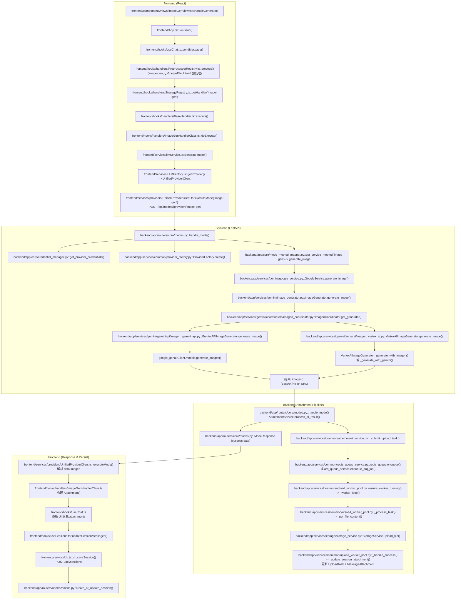
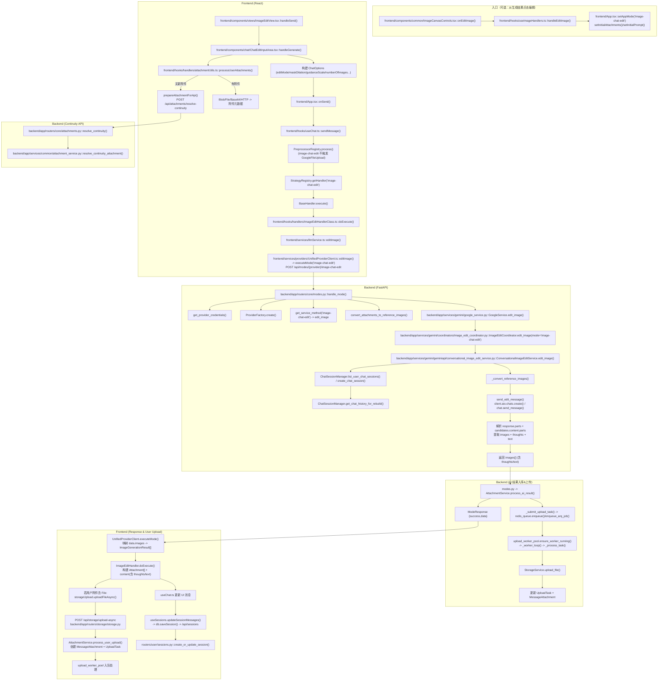

# Gen（image-gen）与 Chat Edit（image-chat-edit）完整流程（基于代码）

> 说明  
> - **来源**：仅基于仓库代码路径与函数调用链梳理（未引用 docs 中的设计文档）。  
> - **范围**：当前产品内的 **image-gen** 与 **image-chat-edit** 两条主流程（含附件处理、异步上传、会话持久化）。  
> - **命名**：均写明 `文件路径::函数/方法`。  
> - **外部 SDK**：对 Google GenAI/Vertex AI SDK 仅标注为外部调用点。

---

## 一、image-gen（图片生成）完整链路

### 1.1 总体流程图（前端 → 后端 → 上传 → 持久化）

### 1.2 逐步细节（逐函数/逐文件）
1. **ImageGenView 触发生成**  
   - `frontend/components/views/ImageGenView.tsx::handleGenerate()`  
   - 组装 `ChatOptions`（aspectRatio/resolution/numberOfImages/negativePrompt/seed/outputMimeType/enhancePrompt 等）  
2. **App 统一入口**  
   - `frontend/App.tsx::onSend()` 统一校验配置与模型  
3. **useChat 生成流程**  
   - `frontend/hooks/useChat.ts::sendMessage()`  
   - 构建 `ExecutionContext`，进入策略系统  
4. **策略选择 image-gen**  
   - `frontend/hooks/handlers/StrategyRegistry.ts::getHandler('image-gen')`  
   - `frontend/hooks/handlers/BaseHandler.ts::execute()`  
   - `frontend/hooks/handlers/ImageGenHandlerClass.ts::doExecute()`  
5. **LLMService 发起**  
   - `frontend/services/llmService.ts::generateImage()`  
   - 使用缓存模型与 options  
6. **统一 Provider 客户端**  
   - `frontend/services/LLMFactory.ts::getProvider()`  
   - `frontend/services/providers/UnifiedProviderClient.ts::executeMode('image-gen')`  
   - **HTTP**：`POST /api/modes/{provider}/image-gen`  
7. **Backend 路由分发**  
   - `backend/app/routers/core/modes.py::handle_mode()`  
   - `backend/app/core/credential_manager.py::get_provider_credentials()`  
   - `backend/app/services/common/provider_factory.py::ProviderFactory.create()`  
   - `backend/app/core/mode_method_mapper.py::get_service_method()` → `generate_image`  
8. **GoogleService 协调**  
   - `backend/app/services/gemini/google_service.py::GoogleService.generate_image()`  
   - 转交 `ImageGenerator`  
9. **ImagenCoordinator 决策 API 模式**  
   - `backend/app/services/gemini/image_generator.py::ImageGenerator.generate_image()`  
   - `backend/app/services/gemini/coordinators/imagen_coordinator.py::ImagenCoordinator.get_generator()`  
   - **Gemini API**：`backend/app/services/gemini/geminiapi/imagen_gemini_api.py::generate_image()`  
   - **Vertex AI**：`backend/app/services/gemini/vertexai/imagen_vertex_ai.py::generate_image()`  
10. **SDK 调用（外部）**  
   - Gemini API：`google_genai.Client.models.generate_images()`  
   - Vertex AI：`_generate_with_imagen()` 或 `_generate_with_gemini()`  
11. **AI 结果 → 统一附件处理**  
   - `backend/app/routers/core/modes.py` 在结果返回前调用  
   - `backend/app/services/common/attachment_service.py::process_ai_result()`  
12. **异步上传入队**  
   - `AttachmentService._submit_upload_task()`  
   - `redis_queue.enqueue()` 或 `arq_queue_service.enqueue_arq_job()`  
   - `upload_worker_pool.ensure_worker_running()`  
13. **Worker 上传**  
   - `upload_worker_pool._worker_loop()` → `_process_task()` → `_get_file_content()`  
   - `StorageService.upload_file()` 统一云存储  
   - `_handle_success()` → `_update_session_attachment()` 回写 `MessageAttachment` + `UploadTask`  
14. **前端结果渲染 + 持久化**  
   - `UnifiedProviderClient.executeMode()` 解析 `data.images`  
   - `ImageGenHandlerClass` 将图片转 `Attachment[]`  
   - `useChat` 更新 UI 消息  
   - `useSessions.updateSessionMessages()` → `db.saveSession()` → `/api/sessions`  
   - `backend/app/routers/user/sessions.py::create_or_update_session()` 持久化

---

## 二、image-chat-edit（对话式编辑）完整链路

### 2.1 总体流程图（前端 → 连续性 → 后端 → AI → 上传 → 持久化）

### 2.2 逐步细节（逐函数/逐文件）
1. **ImageEditView + ChatEditInputArea 触发编辑**  
   - `frontend/components/views/ImageEditView.tsx::handleSend()`  
   - `frontend/components/chat/ChatEditInputArea.tsx::handleGenerate()`  
2. **附件连续性（核心差异点）**  
   - `frontend/hooks/handlers/attachmentUtils.ts::processUserAttachments()`  
   - 若无新上传：`prepareAttachmentForApi()`  
     - `POST /api/attachments/resolve-continuity`  
     - `backend/app/routers/core/attachments.py::resolve_continuity()`  
     - `AttachmentService.resolve_continuity_attachment()`  
3. **参数构建**  
   - `ChatOptions` 中含 `editMode/maskDilation/guidanceScale/numberOfImages` 等  
4. **统一入口**  
   - `frontend/App.tsx::onSend()`  
   - `frontend/hooks/useChat.ts::sendMessage()`  
5. **策略系统**  
   - `StrategyRegistry.getHandler('image-chat-edit')`  
   - `BaseHandler.execute()`  
   - `ImageEditHandlerClass.doExecute()`  
6. **LLMService 发起**  
   - `frontend/services/llmService.ts::editImage()`  
   - `UnifiedProviderClient.editImage()` → `executeMode('image-chat-edit')`  
7. **后端统一 mode 路由**  
   - `backend/app/routers/core/modes.py::handle_mode()`  
   - `credential_manager.get_provider_credentials()`  
   - `ProviderFactory.create()`  
   - `mode_method_mapper.get_service_method()` → `edit_image`  
   - `convert_attachments_to_reference_images()`  
8. **GoogleService 统一编辑入口**  
   - `backend/app/services/gemini/google_service.py::edit_image()`  
   - `ImageEditCoordinator.edit_image(mode='image-chat-edit')`  
9. **对话式编辑专用服务**  
   - `backend/app/services/gemini/geminiapi/conversational_image_edit_service.py::edit_image()`  
   - `ChatSessionManager.list_user_chat_sessions()`  
   - `ChatSessionManager.create_chat_session()`  
   - `ChatSessionManager.get_chat_history_for_rebuild()`  
   - `_convert_reference_images()`  
   - `send_edit_message()` → `client.aio.chats.create()` / `chat.send_message()`  
   - 解析 `response.parts` 与 `response.candidates[0].content.parts` → `images + thoughts + text`  
10. **AI 结果附件处理（统一）**  
   - `AttachmentService.process_ai_result()` → `_submit_upload_task()`  
   - `upload_worker_pool` 入队处理  
11. **用户上传附件处理（仅 edit 有）**  
   - `storageUpload.uploadFileAsync()`  
   - `POST /api/storage/upload-async`  
   - `AttachmentService.process_user_upload()`  
12. **UI 与会话持久化**  
   - `useChat` 更新 messages  
   - `useSessions.updateSessionMessages()` → `db.saveSession()` → `/api/sessions`

---

## 三、共同基础设施（两者共享）

### 3.1 统一路由与方法映射
- `backend/app/routers/core/modes.py::handle_mode()`  
- `backend/app/core/mode_method_mapper.py::MODE_METHOD_MAP`  
- `backend/app/services/common/provider_factory.py::ProviderFactory.create()`  
- `backend/app/core/credential_manager.py::get_provider_credentials()`  

### 3.2 统一附件服务与异步上传
- `backend/app/services/common/attachment_service.py`  
  - `process_ai_result()` / `process_user_upload()` / `resolve_continuity_attachment()`  
  - `_submit_upload_task()`  
- `backend/app/services/common/upload_worker_pool.py`  
  - `ensure_worker_running()` / `_worker_loop()` / `_process_task()`  
  - `_get_file_content()` / `_handle_success()` / `_update_session_attachment()`  
- `backend/app/services/storage/storage_service.py::StorageService.upload_file()`  

### 3.3 会话持久化
- `frontend/services/db.ts::db.saveSession()`  
  → `POST /api/sessions`  
  → `backend/app/routers/user/sessions.py::create_or_update_session()`  

---

## 四、差异汇总（高层对比）

| 维度 | image-gen | image-chat-edit |
|---|---|---|
| 前端入口 | `ImageGenView` | `ImageEditView` + `ChatEditInputArea` |
| 是否要求附件 | 否 | 是（用户上传或连续性） |
| 连续性逻辑 | 无 | `processUserAttachments` + `resolve-continuity` |
| Handler | `ImageGenHandlerClass` | `ImageEditHandlerClass` |
| 后端 service | `ImageGenerator + ImagenCoordinator` | `ImageEditCoordinator + ConversationalImageEditService` |
| SDK 模式 | Gemini API / Vertex AI（生成） | Google Chat SDK 多轮对话式编辑 |
| 返回结构 | images[] | images[] + thoughts/text |

---

## 五、文件清单（本流程涉及）

**前端**
- `frontend/components/views/ImageGenView.tsx`
- `frontend/components/views/ImageEditView.tsx`
- `frontend/components/chat/ChatEditInputArea.tsx`
- `frontend/hooks/useChat.ts`
- `frontend/hooks/useSessions.ts`
- `frontend/hooks/handlers/StrategyRegistry.ts`
- `frontend/hooks/handlers/BaseHandler.ts`
- `frontend/hooks/handlers/ImageGenHandlerClass.ts`
- `frontend/hooks/handlers/ImageEditHandlerClass.ts`
- `frontend/hooks/handlers/attachmentUtils.ts`
- `frontend/services/llmService.ts`
- `frontend/services/LLMFactory.ts`
- `frontend/services/providers/UnifiedProviderClient.ts`
- `frontend/services/storage/storageUpload.ts`
- `frontend/services/db.ts`
- `frontend/App.tsx`

**后端**
- `backend/app/routers/core/modes.py`
- `backend/app/routers/core/attachments.py`
- `backend/app/routers/storage/storage.py`
- `backend/app/routers/user/sessions.py`
- `backend/app/core/mode_method_mapper.py`
- `backend/app/core/credential_manager.py`
- `backend/app/services/common/provider_factory.py`
- `backend/app/services/common/attachment_service.py`
- `backend/app/services/common/upload_worker_pool.py`
- `backend/app/services/storage/storage_service.py`
- `backend/app/services/gemini/google_service.py`
- `backend/app/services/gemini/image_generator.py`
- `backend/app/services/gemini/coordinators/imagen_coordinator.py`
- `backend/app/services/gemini/coordinators/image_edit_coordinator.py`
- `backend/app/services/gemini/geminiapi/imagen_gemini_api.py`
- `backend/app/services/gemini/vertexai/imagen_vertex_ai.py`
- `backend/app/services/gemini/geminiapi/conversational_image_edit_service.py`
- `backend/app/services/gemini/common/chat_session_manager.py`

---

如果你还需要 **mask/inpainting/background/recontext** 的完整链路（这些会进入 `ImageEditCoordinator` 的不同分支，如 `MaskEditService` / `VertexAIImageEditor`），告诉我 mode 名称，我会继续补齐并更新该文档。  
