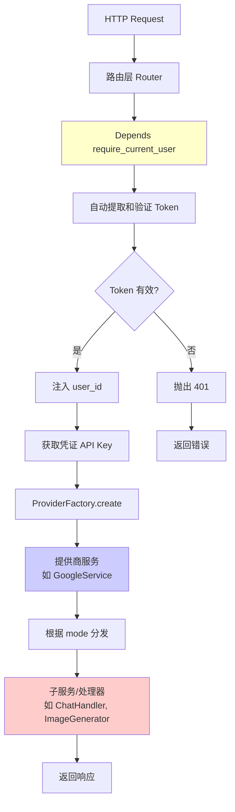
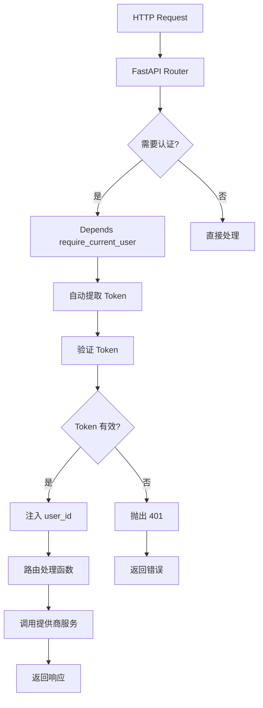

# 统一后端认证处理方案

## 问题分析

当前后端存在以下问题：

1. **代码重复**：在 122+ 个位置都需要手动调用 `require_user_id(request)`
2. **不一致的导入**：有些文件在顶部导入，有些在函数内部导入（如 `generate.py`）
3. **未使用依赖注入**：虽然使用了 `Depends(get_db)` 处理数据库，但没有使用依赖注入处理认证
4. **维护困难**：如果需要修改认证逻辑，需要修改所有 122+ 个位置

## 解决方案

使用 FastAPI 的依赖注入系统，创建统一的认证依赖函数。

### 架构设计

#### 认证在整体架构中的位置



#### 认证流程



### 架构说明

**认证在整个流程中的位置**：

1. **路由层**：统一使用 `Depends(require_current_user)` 进行认证
2. **获取凭证**：使用 `user_id` 从数据库获取 API Key
3. **创建服务**：通过 `ProviderFactory.create()` 创建提供商服务（如 `GoogleService`）
4. **服务分发**：提供商服务内部根据 `mode` 参数分发到子服务（如 `ChatHandler`、`ImageGenerator`）

**关键点**：
- 认证在路由层统一处理，不涉及业务逻辑
- 认证后的 `user_id` 传递给提供商服务
- 提供商服务（如 `GoogleService`）负责分发到子服务

### 实施步骤

#### 1. 创建统一的认证依赖函数

**文件**: `backend/app/core/dependencies.py` (新建)

创建两个依赖函数：

- `require_current_user(request: Request) -> str`: 强制认证，未认证抛出 401
- `get_current_user_optional(request: Request) -> Optional[str]`: 可选认证，未认证返回 None
```python
from fastapi import Depends, Request, HTTPException, status
from typing import Optional
from ..core.user_context import require_user_id, get_current_user_id

def require_current_user(request: Request) -> str:
    """
    FastAPI 依赖：要求用户已认证
    
    使用方式：
    @router.get("/endpoint")
    async def my_endpoint(user_id: str = Depends(require_current_user)):
        # user_id 已自动注入
        pass
    """
    return require_user_id(request)

def get_current_user_optional(request: Request) -> Optional[str]:
    """
    FastAPI 依赖：可选认证（用户可能未登录）
    
    使用方式：
    @router.get("/endpoint")
    async def my_endpoint(user_id: Optional[str] = Depends(get_current_user_optional)):
        if user_id:
            # 已登录用户
        else:
            # 未登录用户
    """
    return get_current_user_id(request)
```


#### 2. 重构路由文件

需要重构以下路由文件（按优先级）：

**高优先级**（使用频率高）：

- `backend/app/routers/generate.py` - 5 个端点
- `backend/app/routers/chat.py` - 1 个端点
- `backend/app/routers/google_modes.py` - 4 个端点
- `backend/app/routers/qwen_modes.py` - 3 个端点
- `backend/app/routers/storage.py` - 10 个端点

**中优先级**：

- `backend/app/routers/sessions.py` - 5 个端点
- `backend/app/routers/profiles.py` - 6 个端点
- `backend/app/routers/memory_bank.py` - 10 个端点
- `backend/app/routers/code_execution.py` - 8 个端点

**低优先级**（其他路由文件）：

- 剩余约 20+ 个路由文件

#### 3. 重构示例

**重构前** (`backend/app/routers/generate.py`):

```python
@router.post("/{provider}/image")
async def generate_image(
    provider: str,
    request_body: ImageGenerateRequest,
    request: Request,
    db: Session = Depends(get_db)
):
    # ❌ 手动调用认证
    from ..core.user_context import require_user_id
    user_id = require_user_id(request)
    
    # 获取凭证
    api_key = await get_api_key(provider, request_body.apiKey, user_id, db)
    
    # 创建提供商服务
    service = ProviderFactory.create(
        provider=provider,
        api_key=api_key,
        user_id=user_id,
        db=db
    )
    
    # 调用服务方法（服务内部会分发到子服务）
    result = await service.generate_image(
        prompt=request_body.prompt,
        model=request_body.modelId,
        **kwargs
    )
    
    return result
```

**重构后**:

```python
from ..core.dependencies import require_current_user

@router.post("/{provider}/image")
async def generate_image(
    provider: str,
    request_body: ImageGenerateRequest,
    user_id: str = Depends(require_current_user),  # ✅ 自动注入
    db: Session = Depends(get_db)
):
    # user_id 已自动注入，无需手动调用
    
    # 获取凭证
    api_key = await get_api_key(provider, request_body.apiKey, user_id, db)
    
    # 创建提供商服务（如 GoogleService）
    service = ProviderFactory.create(
        provider=provider,
        api_key=api_key,
        user_id=user_id,
        db=db
    )
    
    # 调用服务方法
    # 注意：服务内部会根据 mode 分发到子服务
    # 例如：GoogleService.generate_image() → ImageGenerator.generate_image()
    result = await service.generate_image(
        prompt=request_body.prompt,
        model=request_body.modelId,
        **kwargs
    )
    
    return result
```

**架构说明**：
- 路由层只负责：认证（通过依赖注入）、获取凭证、创建服务、调用服务方法
- 提供商服务（如 `GoogleService`）负责：根据 mode 分发到子服务（如 `ImageGenerator`、`ChatHandler`）
- 子服务负责：具体的业务逻辑实现

#### 4. 处理特殊情况

**情况 1**: 需要 `Request` 对象的端点

- 如果端点需要 `Request` 对象（如流式响应），保留 `request: Request` 参数
- 认证依赖仍然可以正常工作

**情况 2**: 可选认证的端点

- 使用 `get_current_user_optional` 依赖
- 在函数内部检查 `user_id` 是否为 `None`

**情况 3**: 函数内部导入

- 移除所有函数内部的 `from ..core.user_context import require_user_id`
- 在文件顶部统一导入 `from ..core.dependencies import require_current_user`

### 实施计划

#### 阶段 1: 创建依赖函数（1 个文件）

1. 创建 `backend/app/core/dependencies.py`
2. 实现 `require_current_user` 和 `get_current_user_optional`
3. 添加文档字符串和使用示例

#### 阶段 2: 重构核心路由（5 个文件）

1. `backend/app/routers/generate.py` - 5 个端点
2. `backend/app/routers/chat.py` - 1 个端点
3. `backend/app/routers/google_modes.py` - 4 个端点
4. `backend/app/routers/qwen_modes.py` - 3 个端点
5. `backend/app/routers/storage.py` - 10 个端点

#### 阶段 3: 重构其他路由（逐步进行）

- 按使用频率和重要性逐步重构剩余路由文件
- 每次重构后测试相关功能

### 优势

1. **代码简洁**：从 3 行代码减少到 1 行参数声明
2. **统一管理**：所有认证逻辑集中在一个地方
3. **易于维护**：修改认证逻辑只需修改依赖函数
4. **符合最佳实践**：使用 FastAPI 推荐的依赖注入模式
5. **易于测试**：可以轻松 mock 依赖函数
6. **类型安全**：FastAPI 自动进行类型检查
7. **架构清晰**：认证在路由层统一处理，业务逻辑在服务层

### 与提供商服务架构的关系

**重要说明**：本方案只涉及认证的统一处理，不涉及服务分发逻辑。

**完整的请求流程**：
1. **路由层**：统一认证（使用 `Depends(require_current_user)`）
2. **路由层**：获取凭证（使用 `user_id`）
3. **路由层**：创建提供商服务（通过 `ProviderFactory.create()`）
4. **路由层**：调用服务方法（如 `service.generate_image()`）
5. **提供商服务**（如 `GoogleService`）：根据 mode 分发到子服务
6. **子服务**（如 `ImageGenerator`）：执行具体业务逻辑

**示例**：
- 路由层调用 `google_service.generate_image()` 
- `GoogleService.generate_image()` 内部调用 `self.image_generator.generate_image()`
- `ImageGenerator` 执行具体的图片生成逻辑

### 注意事项

1. **向后兼容**：保持 `user_context.py` 中的函数不变，确保其他代码不受影响
2. **测试覆盖**：重构后需要测试所有相关端点
3. **逐步迁移**：可以分阶段进行，不需要一次性重构所有文件
4. **文档更新**：更新相关文档说明新的使用方式

### 文件清单

**新建文件**:

- `backend/app/core/dependencies.py`

**需要重构的文件**（约 30+ 个）:

- `backend/app/routers/generate.py`
- `backend/app/routers/chat.py`
- `backend/app/routers/google_modes.py`
- `backend/app/routers/qwen_modes.py`
- `backend/app/routers/storage.py`
- `backend/app/routers/sessions.py`
- `backend/app/routers/profiles.py`
- `backend/app/routers/memory_bank.py`
- `backend/app/routers/code_execution.py`
- `backend/app/routers/a2a.py`
- `backend/app/routers/interactions.py`
- `backend/app/routers/research_stream.py`
- `backend/app/routers/imagen_config.py`
- `backend/app/routers/personas.py`
- `backend/app/routers/init.py`
- `backend/app/routers/models.py`
- `backend/app/routers/adk.py`
- `backend/app/routers/live_api.py`
- `backend/app/routers/multi_agent.py`
- `backend/app/routers/google_chat.py`
- `backend/app/routers/tongyi_image.py`
- ... (其他路由文件)

### 验证方法

1. **单元测试**：测试依赖函数是否正确提取和验证 Token
2. **集成测试**：测试重构后的端点是否正常工作
3. **手动测试**：使用 Postman 或前端测试各个端点
4. **代码审查**：检查是否还有遗漏的手动调用